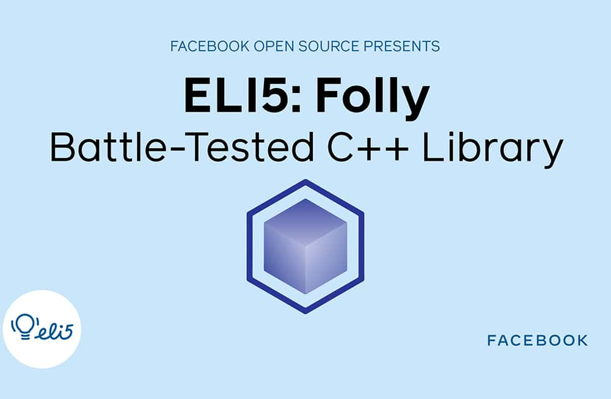

*By Dmitry Vinnik*

*Originally posted [here](https://developers.facebook.com/blog/post/2021/05/24/eli5-folly-battle-tested-c-plus-plus-library/).*

In this blog post, we explore a popular open source project called Folly, a C++ library that provides core components used extensively at Facebook. We cover this open source project using the [ELI5](https://l.facebook.com/l.php?u=https%3A%2F%2Fwww.dictionary.com%2Fe%2Fslang%2Feli5%2F&h=AT3wBm10bvEy4EvretqtyIxLo6BN4wBiD1ch2udnyxSaQ2tsa96onz_7IFZAKfg4n3I1sm2g-Ubd3xjw0yM_pqGjsIawV3X_ho_bRhZYD_R5CSpCDE6jThrlllJgy8OR1NzDf-_nkJ4gZSYKHhsmDFdl38Vr6xLYiliAd3XZ0yo) style of explaining things in simple terms in the shortest amount of time.

If you prefer to learn by watching, we also have an accompanying [video about Folly](https://l.facebook.com/l.php?u=https%3A%2F%2Fyoutu.be%2FWr_IfOICYSs&h=AT0pA9-VQa-BLIdUiB3YBJZepZnTT0rY7xykXG3S0jMHmsh7eEKNj5jBhBPI9vZywUfWJjbfm2EtLUk1jA4xISRIKzk_BYL1qC2O6klS0GoLp_wFt33ie6FUqkkB-yn8qeqBPVmo5djqKLL-yHwQHSEPP8OFvmIx9ZzIGvOhwNk) on our [Facebook Open Source YouTube channel](https://www.youtube.com/c/FacebookOpenSource).

**Why Folly?**

Here at Facebook, we use, contribute and release a number of open source projects. Unfortunately, when it came to C++, we couldn't share any of our code with the community because we had several internal, unreleased dependencies. Folly was created to fix this gap and share our open source in C++ with the world.

[Watch the video](https://l.facebook.com/l.php?u=https%3A%2F%2Fyoutu.be%2FWr_IfOICYSs&h=AT0WeyQoxveTj2JcJJEW7PzPPBSxUZxGf1PLxjqcGh0ZXk2UbKnPCBHbDbAA8B8rYCP8B8uxtvQpdmbdTqJbgcbzzgmAp0Zt7MVczbLbWWg10qBC7yGYYub8Juj_RcE6YwCgr7cX3de4Cgq2LhbMUgTs2mFEtYrD_dWJYtxiiHs)

Folly (acronymed loosely after Facebook Open Source Library) is a library of C++14 [components](https://l.facebook.com/l.php?u=https%3A%2F%2Fgithub.com%2Ffacebook%2Ffolly%2Fblob%2Fmaster%2Ffolly%2Fdocs%2FOverview.md&h=AT2gdWBbIzgBmxuSK6hxThTmG1grrmtIzgTI_qyM_6vFexgRTnCVGu-GtuKGkjlavQn8Cq9UbyPQvpUKhHzMfm8G8N1SRNVRGrkIBFXwI0ZhdwXC3FPe4iI6vfxh-e3Yvh3uAwD9nsZzqSaJosc6Q6l6Idg9qTb6qJl6O2h8190) designed with practicality and efficiency in mind, including drop-in, optimized replacements for parts of the C++ STL.

With Folly, we emphasize speed as well as stability. As Facebook heavily relies on utilities in Folly, this library's performance and scale have been of utmost importance. It has features like in-memory JSON manipulation or string-formatting.

Despite the disparate number of components, Folly aims to make them easy and safe to use. The project relies on modern C++ and provides plenty of tools like string utilities that operate fewer CPU cycles and make code more concise.

**Where is it used?**

Folly was open sourced by Facebook in [2012](https://l.facebook.com/l.php?u=https%3A%2F%2Fengineering.fb.com%2F2012%2F06%2F02%2Fdeveloper-tools%2Ffolly-the-facebook-open-source-library%2F&h=AT03w5a9SFnJDwaYXTP2fQzByFwCifO4FHbjz2O-_sMELeQY7UNTdIiJ92XI0jgz6NE8JnjDt93ya7rWQz9E8iOMUtYvG2SCw8Ptsu0qlOMaUE2K5DAeZmA8_r8B9s0nV_HDCzLPhCK2ifrZKCabV6PUTfW1YUb68vXPeThsK_E). Since its launch, the project has been widely used worldwide, with 16 thousand followers and almost 4 thousand forks on its GitHub page.

**Where can I learn more?**

Would you like to learn more about Folly? The project has [thorough documentation](https://l.facebook.com/l.php?u=https%3A%2F%2Fgithub.com%2Ffacebook%2Ffolly%2Fblob%2Fmaster%2Ffolly%2Fdocs%2FOverview.md&h=AT0tb06oD8X3n-sqb_-_1GTSK81Qg1BOWWEcPro2ArWx5LQT1R2TSGRdvBugYN9p8LhArDz1TfojBqsWhzSVPr2si1MNqiZBLAnaRhoszykJ6n1gD7KJLE-W82mCOrCwA_0pZS_Ba300kOgqYHYkxRtgKokCVEd788ziE6uifbI) on [its GitHub repository](https://l.facebook.com/l.php?u=https%3A%2F%2Fgithub.com%2Ffacebook%2Ffolly&h=AT0OGNFmyoe_0zdEuykAme5S6wb2-hGFP56npJ92TjMjhYJXASokJGyf4XBhKHgvvcIbK_80ybtzCUmCru5Nt9nXtM-6vZ4EeCPVo8WO_v37RAjyv4Te0GKUIJ4poL7TxXWaMd7fuObJIF06AJBCMJe-kB1Uf8sGVQPZ_bfdUig), and the Folly team has been sharing great overview posts like the [Folly Futures announcement](https://l.facebook.com/l.php?u=https%3A%2F%2Fengineering.fb.com%2F2015%2F06%2F19%2Fdeveloper-tools%2Ffutures-for-c-11-at-facebook%2F&h=AT3gwMGl_AO0M2ERulD0tyz1KOzSHXXuQlKlNDVIGlieFIcmD5eQRIjpqz2lYLqr-rvcNY4rTNvx3QBa4JtGzq1PeOV_jNuiahiCRAwwrx-s99O8Fcv0SDFwW4pKe4SHHsvfdiVFKvjxltjwa3kbdi6rXCXt5IIOKTo-7Paq-bA). If you want to ask the Folly community a question, we invite you to join their [Google Group](https://l.facebook.com/l.php?u=https%3A%2F%2Fgroups.google.com%2Fforum%2F%3Ffromgroups%23%21forum%2Ffacebook-folly&h=AT1tPAeasYE2DmB1hUBhBDnik1Z5DZ4DKff8atillASkbli5ZyenB9R-WPsFVZgWA24vc-lgK28QFJKkHHKFHGwBphiWcQ5u9CikbvHzvdy7-TDu87pvGbwfshpVzOBC3FxUk_PUgjzAwPRoAmeV6a1I5D0IHWlDMF66AS4CY5I).

**About the ELI5 series**

In a series of short videos (~1 min in length), one of our Developer Advocates on the Facebook Open Source team explains a Facebook open source project in a way that is easy to understand and use.

We will write an accompanying blog post (like the one you're reading right now) for each of these videos, which you can find on our [YouTube channel](https://www.youtube.com/channel/UCCQY962PmHabTjaHv2wJzfQ).

To learn more about Facebook Open Source, visit our [open source site](https://opensource.facebook.com/), subscribe to our [YouTube channel](https://l.facebook.com/l.php?u=https%3A%2F%2Fwww.youtube.com%2Fchannel%2FUCCQY962PmHabTjaHv2wJzfQ&h=AT1VD2pD4LjxtgWrBhkP22MpSMqTcdLLVyb6JsLp1Gdcry5Y5cWFtYJeB6XZR-dsSSOgtr1LrDvcGV-kHSI0chv4O5VtTWtSaCr9NbGH9mVr0p1WhlxeWxEPZaXiyInZa3y_voGGO1g9Tc-78rj6qyluAyrBpTa-vsntTM1MxOA), or follow us on [Twitter](https://l.facebook.com/l.php?u=https%3A%2F%2Ftwitter.com%2FfbOpenSource&h=AT2AoP1y1hIJ0jkm7U0gNKsIVQ7Axn-3yBIOf3x6N8mk_EPU9JJhPYv2eTOfCKAS7vJGJB9nWzMzu8S3OZ5nYmhcDQ5yXRwIH1h6vduWp-QHhDak-u6OzCqE5JalPoFNLjVpxxUfgny4k45pxWqSXK89aD_GJKOQ4gPfB2R_qAw) and [Facebook](https://www.facebook.com/fbOpenSource/?ref=aymt_homepage_panel&eid=ARDXvVAPwnpPxsaQUtdpdrWV6jhb5mz67ET63dJme3yZIeS0ACffMtUeMkdUFwe3UjT61YNDIy_rXwdD).

Interested in working with open source at Facebook? Check out our open source-related job postings on our career page by [taking this quick survey](https://www.surveymonkey.com/r/V76PRN3).