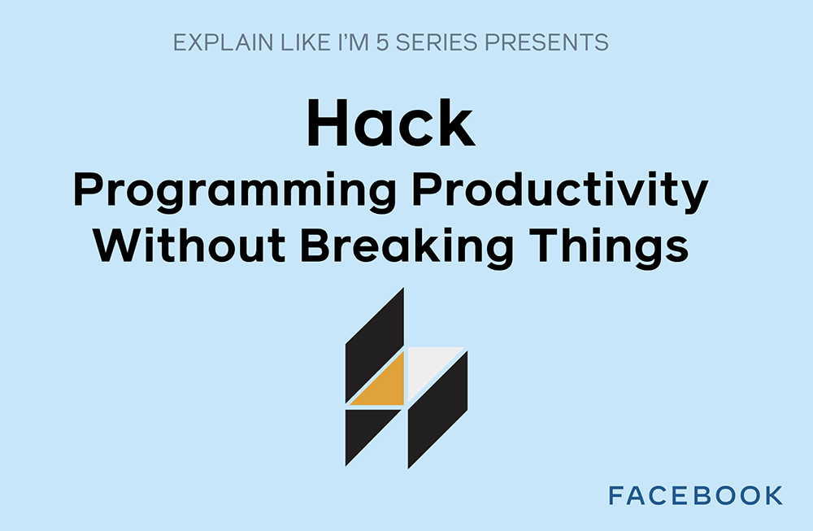

*By Dmitry Vinnik and Joe Previte*

*Originally posted [here](https://developers.facebook.com/blog/post/2021/02/16/eli5-hack-programming-productivity-without-breaking-things/).*

In this post, we explain [Hack](https://l.facebook.com/l.php?u=https%3A%2F%2Fhacklang.org%2F&h=AT1HCzZQX--Ibkm_dJ7aAhRl7w_IqF4IXV0yXVA1oC36oIfNtAQO1XVpt2VzBVYB11Drpjz2Ue4fzs5vi981Vh2DyzH70mQA71bQwFFPONCL5HVm0b0UNEOhaqg0Z9Cv6C34xJQ_kk8ff0NSqo4i_YUR86nQKT0DqT_hmZJIg_o), a programming language focused on productivity and type safety, in a way that is super simple to understand (or, as it's commonly known online, [ELI5](https://l.facebook.com/l.php?u=https%3A%2F%2Fwww.dictionary.com%2Fe%2Fslang%2Feli5%2F&h=AT09NUutfq585iGgdcrGodUuAlPi0hkoQTZbu6jernthzkaMdt2NkChzfKvbQjvimbF587lh5LYLRQYYsEaSuuGVA4pZyo-1thaRVuIbl0cUBeRPTbxFoxSMFSxKWn8ybAT0FsFdRWGtfdrDFu7j_eOyjGTiJZ742cflbp3TKSg)). If you're interested in learning by watching or listening, check out a [video](https://l.facebook.com/l.php?u=https%3A%2F%2Fyoutu.be%2FXlWUUWS2UEE&h=AT0xviusE-wW2s5XAN5ODqHwOYpI5rv1qoRq6xCJKjkniyvYHanQLq4dq9SC_de36uTHz51KB39gV2wl0Qvc_-SU-vJsunhvxrcbslkSz8f7Kg9orAFDhUuqcJaLxwbkYoHPk07oxXh3_hPGb1rFMZGiGOK4w-E3T6mA0is30ps) about this open source project on our [Facebook Open Source Youtube channel](https://l.facebook.com/l.php?u=https%3A%2F%2Fwww.youtube.com%2Fc%2FFacebookOpenSource&h=AT2rKBch-rpC8zwY8CXNnLf_Lepvu6GmPCbRjltB88BZLlxorf9F_-70D4xlq1AQMy68GpaPY2OiNy9jsEkp6MtM8bVfojGtVqFQ6J9xdmr5O6VSG6mzeDWCH1ZX03C2luvdwUoSAMeTLePZFjRffQV9A_X1FJeW_jsk8Jb_Ank).

**Why Hack?**

Developers like to move quickly. We want the fast development cycle of dynamically typed languages. Sometimes, however, that means sacrificing safety features like static typing. What if you could have both? We challenged ourselves to see if we could build a programming language that answered that question.

At Facebook, we have thousands of engineers shipping code multiple times a day. We needed a programming language that could keep up with our fast pace. We built Hack, a programming language focused on increasing developer productivity while preventing them from breaking the codebase.

 
<iframe width="560" height="315" src="https://www.youtube.com/embed/XlWUUWS2UEE" title="YouTube video player" frameborder="0" allow="accelerometer; autoplay; clipboard-write; encrypted-media; gyroscope; picture-in-picture" allowfullscreen></iframe>
 

[Watch the video](https://l.facebook.com/l.php?u=https%3A%2F%2Fyoutu.be%2FXlWUUWS2UEE&h=AT1gm2HbClk5Fl1ZCw2K4bGWYAIHZxTQdgfkWETyQYlMQq4GjSNC8Vyn8-gndiYboY98z0SyVi8S7bav2OAxCImxOtY2gd0OKHvXv_s4UekOrJ-APm2HsrkLOWRTNrPMfYHILnc671gka8hhuCzTqZwRTkxJ5edXaLTySJuJzes)

Hack provides engineers with quick feedback loops to develop faster while keeping safety in mind with static typing. The type checker can stay speedy by incrementally type-checking your files as you edit them. This functionality integrates into your workflow so seamlessly that you hardly notice. We built it specifically for [HHVM](https://l.facebook.com/l.php?u=https%3A%2F%2Fhhvm.com%2F&h=AT2UIMYcPQQjYdLfDPgC0ad8Ke7bTE_f9Vu-oA-oGZGQO_VwN4_U4YKnrLpOppE4ljXir_YW3aOBglrAfuBA4WQdAloNJjp9A7iTPFHIRHEq2BXHk9G4gq9nE9orIDaEY_olGoZPkDrgBCe_UgrygLZGWVvITPsX0MPynpFoXqA), which is a high-performance runtime for your Hack applications. It's also open source and [available on GitHub](https://l.facebook.com/l.php?u=https%3A%2F%2Fgithub.com%2Ffacebook%2Fhhvm&h=AT2lvOiTKw4aY-MitkyPbuv0GD5MDM7necEE5tJt4hhCDO1SL7RkLE_TznYDB1rr3F1Bnsu5Qwq_V5f-6F8OOYISrukg_LtaAPTTmHcIBbTWLe-rpoaGuquCfbFWLHQe7Y1SsrWDN0MJCC_fIF-TbXDa0aVLrWPuCl2D2dzERcM).

**Where is it used?**

Hack was open sourced in [March 2014](https://l.facebook.com/l.php?u=https%3A%2F%2Fengineering.fb.com%2F2014%2F03%2F20%2Fdeveloper-tools%2Fhack-a-new-programming-language-for-hhvm%2F&h=AT3pzDTb1v1u19zcnp6h6ORSZ4DwsvxQWkSzSqJAqMpChAXhSzMLfuGI3JRCuYEu9Pwny714sq0Evi8p-j0JvcH-S4JpxaA_Pcs1_PdRVfL54GOi6yKSa2Xa-Rbr9lgmxM_qjQfpfFTdH5X7js3qMwMxnRq9-vxfnDxxsN8caho). Currently, it is heavily used at Facebook, and companies like Slack and Box also adopted Hack in their stack.

**Where can I learn more?**

To learn more about Hack, visit [the website](http://hacklang.org/). It has excellent documentation for developers who are just starting and developers who want to use more advanced features. If you would like to see Hack in action, you can install it locally by following the [Getting Started guide](https://docs.hhvm.com/hack/getting-started/getting-started). If you have any questions, you can go to [Hack's Facebook group](https://www.facebook.com/groups/hhvm.general/) or [Hack's Twitter](https://l.facebook.com/l.php?u=https%3A%2F%2Ftwitter.com%2Fhacklang%3Flang%3Den&h=AT1LkMU_UhTvWP5aF4O8L4X4in9ceKmwgCqAJKzNH60WTb8Cmf_a46iTNtaoZy6Mt7wlBBP6RfYpuV6qKEvvF2y5CJO5M1aLknQfNfDPL7WngcB7A2KVOKxYQIZOcnedC9jYcLl6zyZQ_YomBfSSgNfoW-oY6EG20VdXPqz9Yqs).

If you have any further questions about [Hack](https://l.facebook.com/l.php?u=https%3A%2F%2Fhacklang.org%2F&h=AT2j42Ry8EVHcZzfv-rU_7oRH-piMRhfF8jF599MalwNHPG5BmlzS-3_0XP1DxBWpNJPJXzYWaFGiZTuFUM9Yx8p8F4K5np5qKVoNeS4V0ykHMqaL_--Qq7FKvJODytzPp9leNdVlAUZoXFoVJvfnrRJCe9GTracIpQc5gf57Bk), let us know on our [YouTube channel](https://l.facebook.com/l.php?u=https%3A%2F%2Fwww.youtube.com%2Fc%2FFacebookOpenSource&h=AT1xJMYTdFLAkL9DtaLhR_0HS04u3e7ioyQhziJkNvXjQR9Ec0Sp2ijVZ3yGkU9zkt2ZbPNcBQjbxzJqUY-U97D3cDd8xL-e4o00yXtyU7_D7glnpGrGg0kUX_o8_PbXBwq7bKx2-kC-tGkcY0yjnQCJqSYrDF9FvmMNnmqMc3E) or [tweet at us](https://twitter.com/fbOpenSource).

**About the ELI5 series**

In a series of short videos (~1 min in length), one of our Developer Advocates on the Facebook Open Source team explains a Facebook open source project in a way that is easy to understand and use.

We will write an accompanying blog post (like the one you're reading right now) for each of these videos, which you can find on our [YouTube channel](https://l.facebook.com/l.php?u=https%3A%2F%2Fwww.youtube.com%2Fchannel%2FUCCQY962PmHabTjaHv2wJzfQ&h=AT2rIJeqsmn7HuTyZF7rplND0oxF8KTUxATDC_7p0fufNonbniFyTax4b8JoLt9laIR1iLSywENnSERNNsLgTz87vInPbc2dtHoBAd_wkODPY8t1MvsxrefYMH1BfRFz3HNomDVQt85Hw94iwh11K8HnycsZzP0urgV4tm2nymM).

To learn more about Facebook Open Source, visit our [open source site](https://opensource.facebook.com/), subscribe to our [YouTube channel](https://l.facebook.com/l.php?u=https%3A%2F%2Fwww.youtube.com%2Fchannel%2FUCCQY962PmHabTjaHv2wJzfQ&h=AT0cRKxaqbPQv0s36Zj_ePcrqODZBxcXPQq0QdLxbAUgcJngGP5CrB2JgBoZDZ24mp_BF579e9Mv0GIoosU5EzFb9-TvkTh3GTLdASnuD8MwpNNLgp7-qbXdFJdfTxYIB2eYyf4eWqlECgnxKUlyolxINmRbKq00S2tVJQlUzN8), or follow us on [Twitter](https://l.facebook.com/l.php?u=https%3A%2F%2Ftwitter.com%2FfbOpenSource&h=AT24F0BCCGY_556rFsbhT3N1CYqIG6hGosubu52uS2Bn31kTKTiSQYNbn92D9zOA7E667kEzS-iu2BSyYoDuKFbV26prnbXDC8Dicp9ZxAoEbLEZdcnNPD2P2lK4C7EFkpUfIgVYQeiGU2ZNKCchW3JWtY9E5sW7PbRx6ud_UcCLY5B8IqdUTCFr) and [Facebook](https://www.facebook.com/fbOpenSource/?ref=aymt_homepage_panel&eid=ARDXvVAPwnpPxsaQUtdpdrWV6jhb5mz67ET63dJme3yZIeS0ACffMtUeMkdUFwe3UjT61YNDIy_rXwdD).

Interested in working with open source at Facebook? Check out our open source-related job postings on our career page by [taking this quick survey](https://l.facebook.com/l.php?u=https%3A%2F%2Fwww.surveymonkey.com%2Fr%2FV76PRN3&h=AT0hFwpTtaRgbaQjNcCGM5OCF5EmffinI2YHBYrmGx-l2sJINlnYdgSKWp2UzKd4n2M7PkgqxxYsPe9eHJo6tuMyv7to-Imj9qT-qPPXKopWsyzNQC0IHNbBgGbdFa4dqMC649-di1nInPSwL9eys-dzhpY0e2S9lgYP5My__Js).