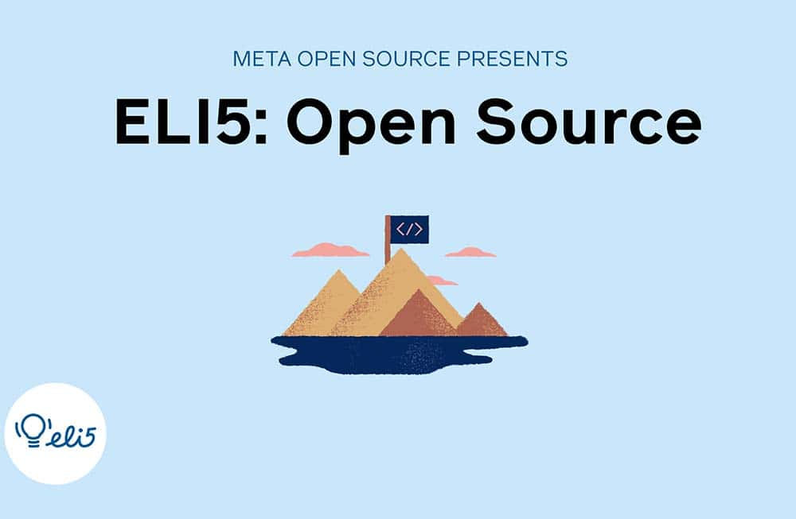

*By Dmitry Vinnik*

*Originally posted [here](https://developers.facebook.com/blog/post/2021/11/15/eli5-open-source/).*

In this blog post, we give a brief overview of what open source is, why companies engage in it, and how you can become a part of this amazing community. We cover this massive topic using the [ELI5](https://l.facebook.com/l.php?u=https%3A%2F%2Fwww.dictionary.com%2Fe%2Fslang%2Feli5%2F&h=AT24lMzIG45iR6emSl-03oC4Etn68cuMtIgnGQisScBWGb-5XaVQUZNGZBrDeJRUAHLyIdnl-YERFthm3qVCSOaM4s1SXgKDgXWOYOLydF5GlK2hsxDe07D6zf7gSVgtJESc3eFN7v1jOBEPzZry03j8UI2JTIob2TqNfoaoEuI) style of explaining things in simple terms in the shortest amount of time.

If you prefer to learn by watching, we also have an accompanying [video about Open Source](https://l.facebook.com/l.php?u=https%3A%2F%2Fyoutu.be%2FOxtpvy7TwIw&h=AT2k_slWbTqkdWyDW3eCKxuq7ByulHybyiSD17cOcwgrCqYcHw95z0HITbXrE6EkOve-xDUDfM7MPbBlwPHPh3ZvTcu1ugxNK8twhlfToADKtNAO9qR_pi_7qh-GkeE_Isjn_DqCYoL_etylYiYNj8GwdGmMMh5I3rAIjy0jK4s) on our [Meta Open Source YouTube channel](https://www.youtube.com/c/FacebookOpenSource).

**What is Open Source?**

[Watch the video](https://l.facebook.com/l.php?u=https%3A%2F%2Fyoutu.be%2FOxtpvy7TwIw&h=AT3dOBi8v6J6Ilm62_SdMcHPrmiaDQ06Ugnnp2ZwErAu-oSX9u_uaWbSBQROd4b2vTKCzD38CwOE0JD4GtVd0EqxSNNu_jHMkJWflOxCzk2N8Ju0vRc2f3UFOtPVTnIxWPoT1sRweCa0u5KPCgqQ5HL0BmV0Zzpj5V5ciDS5O80)

Open source is an enormous topic that has become an integral part of the entire technology industry. More broadly, open source refers to the process of making technology available for others to use and improve. But at its core, it's about the community where all the open source contributions are equally important, whether they are source code, documentation, translations, or tests.

**Why Engage in Open Source?**

Nowadays, nearly all large companies use open source software, either directly or indirectly. As more organizations become involved with open source, they realize the importance of giving back to the community. When it comes to explaining why companies contribute to open source projects, there are generally three main reasons: Leadership, Community, and Productivity.

In terms of leadership, open source brings together developers of varying expertise to give back to a project and each other. Their unique perspectives help to evolve open source and to make it better. By being a part of this effort, companies can be leaders in setting up a direction for the technology, including establishing standards, providing support, and driving further collaboration.

When it comes to community, people are the very foundation of open source. Developers, writers, translators, testers - all their work is what makes open source complete. These people bring their diverse backgrounds, insights and perspectives to a project, making it unique and exciting. This culture of openness and passion for contributing is what defines open source.

Lastly, open source leads to increased productivity as collaborations happen in public at a much faster pace. This shortened [feedback loop](https://l.facebook.com/l.php?u=https%3A%2F%2Fen.wikipedia.org%2Fwiki%2FFeedback&h=AT1XVpmnhEQT2zbZ6QUnyk_Z6YHH0wpYWxForH7NcOiYdzTlaQwKh3XvR5X1vBfwkz-toyETVVlGSxc_J0rDQzzyIXc3Af868LDvJWPWiKHGzFUuKs7gj4tcYyETrO2WGbDaTHoiw-Jrdj-7WPgM4jY_J0fSdQ_jARZEXIXB7-0) helps teams iterate more quickly, making their project better and more responsive to changes.

Here at Meta, we believe in empowering diverse communities through open source technology. Striving for a welcoming and safe space is our goal in open source.

**How to Get Started in Open Source?**

After learning about open source, it might seem overwhelming at first. Where do you start, how can you contribute, and is it even possible to become a part of the open source community? The main thing to remember is that your perspective and expertise matter. Whether it's a code change or a documentation update, the community wouldn't be here without all this work.

To learn more about starting to contribute to open source, watch another video on this channel by Cami Williams on "[Contributing to Open Source for the first time](https://l.facebook.com/l.php?u=https%3A%2F%2Fyoutu.be%2Fc6b6B9oN4Vg&h=AT2P-jT6COqRma8zFDrTDkrgW_5ZYe1zCAUzxfCDYFNHPKeE3P_w9RJlwfA7O1sJObC5byBaCuVx0n_Lg1N0T3AfbJEBwr6E7kT2KKDRQqVDQOF_hY_vlvENEkzppPx-5zwx0mtRSLe7c7XgqX_DYGiYxM-rkS_kmXFIuvLzVJM)."

**Where can I learn more?**

If you want to learn more about open source, visit the [Meta Open Source website](https://l.facebook.com/l.php?u=https%3A%2F%2Fopensource.fb.com%2F&h=AT3fEktCVLPS-DwsTQg3c9UHTQzPusrOI1Rh2lw3oa0Rf0dHDGrSAZrlrZMIEKMyISQhpbHRMVLl7JKxjO9X01y4qfdQlh_qr8K6Gq5Nj64AWEviwlq4uPWTBRT2kRhP7pd-6d91H9aEwQ2slaW9zHayzx-bCT4qyCyo1f94owE). Our site has links to videos and blog posts about our amazing community and the OSS work that our contributors do. You can also subscribe to our [YouTube channel](https://l.facebook.com/l.php?u=https%3A%2F%2Fwww.youtube.com%2Fchannel%2FUCCQY962PmHabTjaHv2wJzfQ&h=AT0ZTXshFVKPwduwMA1FU0heGzSP4BC2N0NvcZ_2K2H70wyWV9RmbIrhxtqBMnEO1El8gssw3O8rk06dUjSjcTBgiSivs6yTGnM2YxvQZsuNBfP85nZyRUTmEbBsDlr3C8Dppj5cIn_7KCrgqeiuenXA0ynADIfu3SuKFQJ3Dnk), or follow us on [Twitter](https://l.facebook.com/l.php?u=https%3A%2F%2Ftwitter.com%2FmetaOpenSource&h=AT2CSOjw4NLyP9ChFii7j9jThvPCZIvSoWS5weQop1x0sIqTa-VAEb-UGJnTMuziNSnFoHjftAUW3PpVJoFO6uo88F99AgMQoKPVltVa6_jjSNyDxVpLNURwJxWG7LsAImFApLoAHT4kQ9vBHvRwsiaJ8Gjt6bk4erfxFY5aieM) and [Facebook](https://www.facebook.com/fbOpenSource/?ref=aymt_homepage_panel&eid=ARDXvVAPwnpPxsaQUtdpdrWV6jhb5mz67ET63dJme3yZIeS0ACffMtUeMkdUFwe3UjT61YNDIy_rXwdD) to get the latest news in Meta Open Source.

**About the ELI5 series**

In a series of short videos (~1 min in length), one of our Developer Advocates on the Meta Open Source team explains a Meta open source project in a way that is easy to understand and use.

We will write an accompanying blog post (like the one you're reading right now) for each of these videos, which you can find on our [YouTube channel](https://l.facebook.com/l.php?u=https%3A%2F%2Fwww.youtube.com%2Fchannel%2FUCCQY962PmHabTjaHv2wJzfQ&h=AT3dcXmbuZqMVa4t6ek9Zb7PDHCE6pt9_kPwPxuHh7SdbwCOIoJ1wiyQhzEKKnmuZMUiof-6hExIiotoltc0-jPW-ud8Bzet9IYVR-ToSy1iWC6vGrtFs2vZw0VKOKTttAylI-XaFDssMEzz4JogeWRVYwODzN_BkEaN0jtsHdk).

Interested in working with open source at Meta? Check out our open source-related job postings on our career page by [taking this quick survey](https://l.facebook.com/l.php?u=https%3A%2F%2Fwww.surveymonkey.com%2Fr%2FV76PRN3&h=AT2sWOasJSCjCA_UUuuRAPQQdE3gW64htaVJBM_4KdKPu6HqAyJM79gnhpm5OOzbb3gX-VKT5CjHoRAILdHBNsFf8CL-GF3Gk4KVCzoSBceb8RrFg5FsyhsK9FBO6nI-lqFz3EJuhMln5lIZUJK7FbIt1N2P96qsALaULEJHzWs).