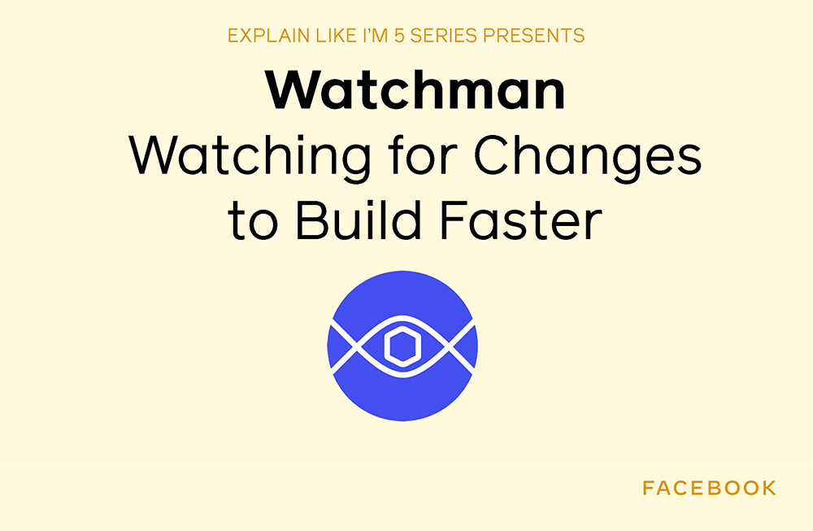

*By Dmitry Vinnik*

*Originally posted [here](https://developers.facebook.com/blog/post/2021/03/15/eli5-watchman-watching-changes-build-faster/).*

In this post, we talk about a project called [Watchman](https://l.facebook.com/l.php?u=https%3A%2F%2Ffacebook.github.io%2Fwatchman%2F&h=AT3kVd0rlBRkIx5WxlYXxd1EI56k2DFpxDof77U55W0MHWDJoYfZ4xkWNAZNK5WLR0pkF-MOUH2_FVTOwqZaBBytAHMHk1qpgI8QHf4NVqd-GbAk3nZO5EcxjXw_CCU3mQ2vlboFWWKAOEKw7nM_yUVavng08TOH9kD92lva7Kc), a file watching service. If you would like to watch a [video](https://l.facebook.com/l.php?u=https%3A%2F%2Fyoutu.be%2FgEsTMR2erAM&h=AT1GeyloOwLDBSBxUqj5518sg5PZZbMFgGH_B3EddbdYmSNXSmROAbRWqP_wF3VwBYzhrXb3UmA3X1tPK6ERdbs-QsMZPIC9v659jfkbRmboDpmE1Rgbt-bejIb0Q2agS9RndZvITjo1skUX7m4eWTFk4qLLVkak80Esvkv8FgQ) about Watchman, go to the [Facebook Open Source YouTube channel](https://www.youtube.com/channel/UCCQY962PmHabTjaHv2wJzfQ).

**Why Watchman?**

Web development has changed dramatically in the past decade. Let's consider what goes into developing and deploying a web app today. After deploying your changes, your web app needs to rebuild itself. The build process usually involves mapping routes and file paths, traversing JavaScript and CSS sources, and handling hundreds, even sometimes thousands, of node packages. It would take a very long time for a large web app like Facebook to rebuild its site from scratch, especially over and over again. And besides, why would you want to rebuild the entire site if you only made changes to a handful of files? Watchman allows developers to focus on managing the files they worked on in the web app development process. This approach is also known as an [incremental build](https://l.facebook.com/l.php?u=https%3A%2F%2Fen.wikipedia.org%2Fwiki%2FIncremental_build_model&h=AT0npPZndWpwN26PfNWfUOaJfZNeRmH2l7Kq1uxiKCAfL-0T3vz_gY5QQ1F80_DtAud8gf_9XPF_18v6k9qGNYGFTvb1dSF0LKMSz1hD31YKzfyFcKQZR0dnk61a5jLTezD1TeVwxUHFKARnryabOU1rcau-NUi5KC3Nddz2vQY).

[Watch the video](https://l.facebook.com/l.php?u=https%3A%2F%2Fyoutu.be%2FgEsTMR2erAM&h=AT2Or5_MjwNL44sV3tgoZ6MRLrOMJ15M8SHv118woWiiadcm6pOIdWb0z5tDNRJBDfmr64viHnsb9pTw69ZSuqr833XugcZntXMgS_QpcNBP0tTXhgWT3WzXzLmd8t0mn1BsQhVM7lUFs176GaClKpwtKe3KM_yvi9egsBW44DU)

Watchman is a file watching service, with clients for a command line, NodeJS and [more](https://l.facebook.com/l.php?u=https%3A%2F%2Ffacebook.github.io%2Fwatchman%2Fdocs%2Fcli-options.html&h=AT3MS5EnP-GGsQdEgNQg36PIG1a23yQdSEnlM2vCI829h7qqUPaY_knVCER8JxZkjWANMW-Xi2x0wC_z7uOpuMKD3Tt5mKygtuebpQxMZT3Dgmmnjik8TIkFGoBAoD8cb61Nv5Tarz0y0z0XbIfRzcBXwnH8lu-0PoiDaXYB5bc). It records any changes and triggers assigned actions. In the example with the Facebook app, Watchman would have made sure that only files that are changed or affected by our developers get updated. We [previously shared](https://www.facebook.com/notes/facebook-engineering/watchman-faster-builds-with-large-source-trees/10151457195103920/) how this service reduced build time by 60% in some cases!

Beyond the build system, Watchman has been updated to support other use cases. It can log changes, trigger test suites, transform files and more. Watchman was also updated to support a wide range of operating systems, including Windows.

**Where is it used?**

Watchman was first open sourced by Facebook in [2013](https://www.facebook.com/notes/facebook-engineering/watchman-faster-builds-with-large-source-trees/10151457195103920). Ever since then, Watchman has been used daily by our developers at Facebook. It was also integrated with many other open source projects like [React Native](https://l.facebook.com/l.php?u=https%3A%2F%2Freactnative.dev%2F&h=AT0QeU_AXVah9NTHnkyVp9Cp3WGg5c5qd6v3uGJ6ceCToLdTXjh6PLYT33Q4DCH7GN0Xb0gYnOP2u9Ija0N49wkzv6bwTB3Tfb2yl1IdQgOaDfx58KIxq7ts7pbqUAevkLLyDjnGbEkj7fOItSziQEwSj2QC4ioYRzVS6Zbc9NE) and [Buck](https://l.facebook.com/l.php?u=https%3A%2F%2Fbuck.build%2F&h=AT0V7H48HlqjzhXNG19qyTMvbjW7J6ohsuqAM7wagdk7FIyyzxtB19elw-X2sPHBbLohTNR6HjawPhqO-N2CmByFZSCvk30fWK4i-92Yrv_IvTUetR_iPJrBV0QXzrkmIM2YaQGmE8LvpQG_TwAG791M2lIdItUWqsiEy8PCdyc).

**Where can I learn more?**

To learn more about Watchman, visit [their website](https://l.facebook.com/l.php?u=https%3A%2F%2Ffacebook.github.io%2Fwatchman%2F&h=AT2REINtESRWN4e9AQK99cRiGuhS2GtUfEYuCKU4UcAo45dP-_oUUSIXjDGYurgvbaG7zZkeougAjQDwbgkrJZbo0R7H5dgI7fy-cAMVZo9fAMP8Ghdjsy5CU3Jyd8f4iwSOp_oj3ew-FaV4_3QjlvdB7mFc38C2WGilU4HNiVk). The project has an excellent [starter](https://l.facebook.com/l.php?u=https%3A%2F%2Ffacebook.github.io%2Fwatchman%2Fdocs%2Finstall.html&h=AT2856hRkGYXxuZpcriUgXgpWk3u5uDlC84C6HFVunBOrLrjM3LR7zfExnnuiJ4sDMJrinDEAsxzD9mC7lbt4w4CI8sF9Lk312IiVJYMWIb2_N1rlNsrJUcinwimRVIiQ3yjRC_a0jnJ-g5SlRu61h42u_sICmpnDh5swpGklas) and [advanced](https://l.facebook.com/l.php?u=https%3A%2F%2Ffacebook.github.io%2Fwatchman%2Fdocs%2Fcli-options.html&h=AT2E_H4jfuFNP-URZsbTaptre8k8fxpAx-3u3WOu7CmOpiF0jHrqazBayjijwmqJ_R1dRKFPsxNyaKVoXeeAT6t3QZph9-SE1CxwKn6kNQeSSklexIyvkO-o2r6mqLdrdDodM-JHKq3HprnYdHTa6yr3dDeLzf1UBEs9PvHGr0w) documentation. The project has an active community chat on the [Freenode](https://l.facebook.com/l.php?u=https%3A%2F%2Ffacebook.github.io%2Fwatchman%2Fsupport.html&h=AT25IQISN0gw7iQODKxPkw9C8wfkwz_atPYbBzTfS_2xWv_jC23NaU8Vb-B1r8y3rMtPoQYS6oG2zooWFSqreXYZ3VUwUoS_kYQ2mcSCevF2nnH1pge_hbFYamGNhzIDQerdnval_hIsmPADrd9j3d9DUmZQ1HH8gk54wG6yzJc) and [StackOverflow](https://l.facebook.com/l.php?u=https%3A%2F%2Fstackoverflow.com%2Fquestions%2Ftagged%2Fwatchman%3Fsort%3Dnewest&h=AT0Zl0ftgySIH7ydnZYodhkquIZqDQAQnAcTytrXM1-RwnJN-HiKCQ-uPmzIrLWCBTLEauV9YjqYgWOfSd3ttDAZPaYNKR41BMYWg_RRW0bL4TBmpma_DUqj-eKSFCraFvy5QqwzHJlywTsv5mXse1XvSFqehLeLE3NPrOd0yyw). If you were to encounter an issue, there is also a [troubleshooting page](https://l.facebook.com/l.php?u=https%3A%2F%2Ffacebook.github.io%2Fwatchman%2Fdocs%2Ftroubleshooting.html&h=AT2CUbCQvXstxOlRmezfEhwTSGt6QJTHXbD74uEsH0lxk4LH3lCFMX2nnSlWHhHgCyx5JTuYG8Qu6c7RxQogdVIy5DbyMlS36wZr-gEYmZFNQbshJwrFI6hVxTMyj3d-rf5bMX7dny7c7L3RlLh2Uf31F9dpRSZ7qm8xVEXJU6g) available on the project's site.

If you have any thoughts or questions about [Watchman](https://l.facebook.com/l.php?u=https%3A%2F%2Ffacebook.github.io%2Fwatchman&h=AT0Zs3q_6wbP2IHUrgTUAPS8OWv3zfDYN_S7BTXXPAv5-_K9sgTwrcbTVxgK56Bafl2JweXnqUcsyTG6sn7nnxv208H6ulYfu1TNNwT1dMhqWeYEzq45drfjAVOh3FPYfnZlW_8ZudSDDDgxtINP4EVFU5NGuHdLkmKl62TgXB4), let us know on our [YouTube channel](https://l.facebook.com/l.php?u=https%3A%2F%2Fwww.youtube.com%2Fchannel%2FUCCQY962PmHabTjaHv2wJzfQ&h=AT01q401D3Hr3R29ojqaNP78ogmColSggL8WZFZizEDjW6zi8n7c1Nd-t0NF5-ky-D5-rY-G3EPkEcDgh8bKGjBkRyzICQ1qKAHYsEYagDeA9CATg5rRuQJMRAGTq1e0Q94mN16ZXBg7RMPrfCaCIYWf4533lNLjml36I7YpTSo), or [tweet at us](https://l.facebook.com/l.php?u=https%3A%2F%2Ftwitter.com%2FfbOpenSource&h=AT378BtlY7I3dXx-M86WEB37ySPCQROzFNi2ldsk3S3zrVphuja8ZAmu0WkajGQVgaz2pHbaGNd0UMBmp98TVfaJH2vFMvJFR56-srcFge3wVAjF-ej7Rctl0u-EITGI2tEhlka0r6jg4TwBaCRnqbZmjcLtNTj-PxMjF1rmsO8).

**About the ELI5 series**

In a series of short videos (~1 min in length), one of our Developer Advocates on the Facebook Open Source team explains a Facebook open source project in a way that is easy to understand and use.

We will write an accompanying blog post (like the one you're reading right now) for each of these videos, which you can find on our [YouTube channel](https://l.facebook.com/l.php?u=https%3A%2F%2Fwww.youtube.com%2Fchannel%2FUCCQY962PmHabTjaHv2wJzfQ&h=AT3hP7pi_nfKbD2R-_MtWdKyRutpigYF_b1H-H5qHou38B0-o1QDkUMkD1wSGGg-4eq76P2qamzfLzIQtp8T6SvUyoZou_3VRNoOTzzgJLELegO_23Q7fm-KcFdaOPlwOCB9jQxAbJQRqNHR62kjwkPORe9nx0KT-Ywm6fohzV8).

To learn more about Facebook Open Source, visit our [open source site](https://opensource.facebook.com/), subscribe to our [YouTube channel](https://l.facebook.com/l.php?u=https%3A%2F%2Fwww.youtube.com%2Fchannel%2FUCCQY962PmHabTjaHv2wJzfQ&h=AT3GWQReAW1X5CRNRHqCnsxOkWfVKt_9TWtpGPFr5ObzpRV2eCIXA-YQgLlnI-eLDxgocHdWdWEBWEjOllMaSvgDbNcYEYfG6anOaB83uK_rFfWSx2pjjHB-fWCu9EN-tmelPleTASo8lzs3QAZ3snjL1imud8S7QJcKixFEQQg), or follow us on [Twitter](https://l.facebook.com/l.php?u=https%3A%2F%2Ftwitter.com%2FfbOpenSource&h=AT2e3KN7DqJBXXSsAJxdXTdazWyZOIEcsmJM6aIhEqKAYVZUxZCAoMl9Dy3ale3q1kjUKEAxvg8S9hlEcmbY8cHNqj4tnP5ef4wFzlYj_0cH451S2HT1X2YNrNy4V1WdSpV-6ebibfKYy05v-kp8IIpIC-guoQOcFSMkkbXMPqc) and [Facebook](https://www.facebook.com/fbOpenSource/?ref=aymt_homepage_panel&eid=ARDXvVAPwnpPxsaQUtdpdrWV6jhb5mz67ET63dJme3yZIeS0ACffMtUeMkdUFwe3UjT61YNDIy_rXwdD).
