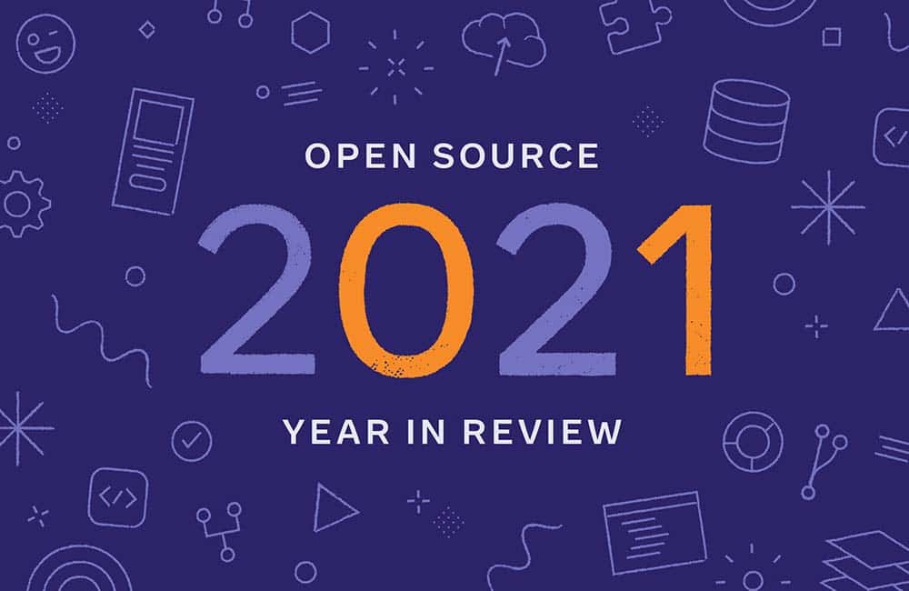

*By Navyata Bawa and Dmitry Vinnik*

*Originally posted [here](https://developers.facebook.com/blog/post/2022/01/24/open-source-2021-year-in-review/).*

*This article was written in collaboration with Dmitry Vinnik, an Open Source Developer Advocate at Meta.*

This past year has been full of challenges and opportunities. We pursued our mission of empowering diverse communities through open source technology with conviction. We launched many exciting projects and received contributions from developers worldwide, growing the open source ecosystem. In this post, we would like to appreciate and highlight some of the achievements and contributions from 2021 that could not have been possible without the support of the open source community.

We will summarize key metrics and detail our foundations and partnerships' focus over the last year. We will review our community engagement through the Meta Open Source social media channels like [Twitter](https://l.facebook.com/l.php?u=https%3A%2F%2Ftwitter.com%2FMetaOpenSource&h=AT3ebHJSx7w5L9D-I_ztpwp1Ggmtg6T5jICrg6nU--5PfIR1JjefStxtLu5mvtRb3kVa55ONCU1Wy6DsFAMGQWJIwBwRQ8hZZpNjepp0gRp3-G1OzlxNPF0422eppWu3i-6NuSHII38ZoI1Kn4Z3oFakXvHteF36jTS9MUz_5uU),[ YouTube](https://l.facebook.com/l.php?u=https%3A%2F%2Fwww.youtube.com%2Fc%2FFacebookOpenSource&h=AT3NVQ3Ai0iJTYGqpH_JcPH0z6Zb-R1drMgcxVjcegzNuVacKSIX23HtontOLnB3ybo6gOCr2B11ZNmbFy55fgrfOb2ldCcGuNQ3Cp_yWMvdph-ndsvP-o3PT5lJAV5te1W5eRfUAn8EpBOqmiA5yRwjlOFpTQRNSdYAN7_K3Zs), [the Diff podcast](https://l.facebook.com/l.php?u=https%3A%2F%2Fthediffpodcast.com%2F&h=AT0T4W7R0PNS0pxtAHCCc-6QrRXf4G3WcKgdb9BAWisGS94iXFH067zYVzgnGw2J1Vfp-QHa5iTCH070BTwMDXITDEcQkVGsqVWecDapaJfI5LdX9HGcvjqNJZmhc6js-vCxQnWBS7r2NymuJRCSLfvqpRbMjU1oR3NKRwdd3lg) and [our blog](https://developers.facebook.com/blog/open_source/). And lastly, we will categorize our open source portfolio by technology domain such as Developer Tools and Programming Languages, Data and Infrastructure, Mobile, Web and AI/ML so that we can share a snapshot view of how our portfolio is evolving.

**Meta Open Source by the Numbers**

At the end of 2021, we had 837 active public projects. After discounting inactive projects that were archived, or projects that were gifted to foundations, that represents 231 new projects launched this year.

Over the past year, we also saw 165,163 commits to our public projects. This number is nearly 20% larger than in 2020. Of those commits, 23,938 were made by community members not employed at Meta. Meta employees made the remaining 141,225.

Our projects on GitHub accumulated an additional 133,854 stars, bringing the total to a staggering over 1.4 million. The community shows accelerating interest and excitement for Meta Open Source projects.

Meta Open Source projects are made possible because of contributions by developers like you. Pull requests, conference talks, feedback on documentation, Facebook posts and anything and everything in between---make our projects better and strengthen the connection in our communities. Thank you for making 2021 another stellar year for open source.

**Foundations and Partnerships**

We believe that open source allows developers to work together uniquely and ambitiously, allowing us to achieve common goals. Our mission is to empower diverse communities through open source technology, and we always look for opportunities to be involved in the appropriate foundations and partnerships that advance this mission.

In early 2021, we announced [our support of the Rust Foundation](https://developers.facebook.com/blog/post/2021/04/29/facebook-joins-rust-foundation/), at its highest member tier, to sustain and grow the Rust open source ecosystem and community. As a part of the foundation, we've worked with the other members to [announce cloud compute resources](https://l.facebook.com/l.php?u=https%3A%2F%2Ffoundation.rust-lang.org%2Fnews%2F2021-11-16-news-announcing-cloud-compute-initiative%2F&h=AT2qY8GWK31ub-lT1avj_uanH4_hbo8KNl4UQuRvdGX8fkm-PKpktWA11IIdVfz0ImfADsc5bu6Cx5OEZU0b_om7LftkhQW0XCKS99G-noDLT-IXdqtsTcDOj4Sz6V1DApIQUzW4DDmN1MbFz8nOT79QqFB3YSNzJb3EfnglRTU) for Rust language development. Our support allows the project to evolve while reducing the time spent building and testing language changes and updates.

We also lead funded [Open Web Docs](https://l.facebook.com/l.php?u=https%3A%2F%2Fopencollective.com%2Fopen-web-docs&h=AT3jZcTFVGlIsUAJ9jqktbaV9EWwrOPrNcTelTLW89DTUjl7MrJJZvyOn8dg9t4mw-6k1t3rwFCzj3DGV8m6nb6P3lwYjMJQYKzJCf2H_9N-dHqs-FlOZO1sogt2ZrIQtzdeOfe7XS6CNa9lpbh-I9O0_oN5PshuzJWbd2IVFEk). We joined their [Governing and Steering Committees](https://l.facebook.com/l.php?u=https%3A%2F%2Fgithub.com%2Fopenwebdocs%2Fproject%23governance&h=AT2qDZB7uypzrSTFhpFZ94sGuDTXoF7ryTrCSl9crwY2mZnqiM4Y2Yb-MZHW1myw9ksDxMEVRMon2wuopD4oAiQwwd_LPnnVGuNKpGkxSdaEj_Vls9tMyZB2J1BzGdScUtKoIgT7yYbKnY8o0Ey24i5wc0aw-vcwm7r7xS2kdRs) to shape the project and deliver social and economic benefits through well-maintained web documentation. Our sponsorship [contributed](https://l.facebook.com/l.php?u=https%3A%2F%2Fgithub.com%2Fopenwebdocs%2Fproject%2Fblob%2Fmain%2FOWD%2520Impact%2520and%2520Transparency%2520Report%25202021%2520-%2520Final%2520Draft.pdf&h=AT0GDazDewkVEACryPtvfLywzS0MhrOwRsELFcdLHxZ6umQqLtduMjq_xB7wUUouvYb77i5SjvfVSV8klMr_-FQ4P3uk5RYHJXs-ZJ9X1C3YnFazQn9krflgUFFq3peZyKs1egglhI6bjqfC8xumRkgUtXNeM_WQNRH-CcQW5yw) to the hiring of full-time Open Web Docs technical writing staff, and to the future of web platform documentation, adding [131 new pages on WebXR](https://l.facebook.com/l.php?u=https%3A%2F%2Fdeveloper.mozilla.org%2Fen-US%2Fdocs%2FWeb%2FAPI%2FWebXR_Device_API%23webxr_reference_docs&h=AT1voiiJuliJ3Rv_eXeHslwnUzdacgmV8F0erVJtJCm_JcOx_E5YIfFcraGBmqzx-8MkUtFvsD_NUJFlgFfqSugL-D6uqxsaHiG5Wnq9WYB7WoUcVsPQIr16bYQAjY1owinRuuzIJJCHc6ExO9YJ6UWvqPCqUSL4oTZPVexHI6I).

In addition to these new partnerships, we continued to collaborate and participate with existing foundations from last year. As a member of the [Presto Foundation](https://l.facebook.com/l.php?u=https%3A%2F%2Fprestodb.io%2F&h=AT216bCil7nIvIw8lYizA-UCiOewNBc3YP6i-YeudH58ZXr2Qc8pgUV9IcEziCzskaIxOaZa0O6WHxrKWymSq-87pcXkS8Qpf-t8vBwdvd_bhWmnI2QQPZgvmxpAopo8dzb0q2YkZ5YwcXX7cPTlLw8y2Eq9xio-KUtiuI2VYLU) - a project we gifted to the Linux Foundation - we helped organize [PrestoCon Day](https://l.facebook.com/l.php?u=https%3A%2F%2Fevents.linuxfoundation.org%2Fprestocon-day%2F&h=AT2DTknncCAD94JOYIlLOjG0zciyWIPqScyu_pSDne2IPizjgNXN-80ou7tIeXGPg1hBKIrg7yIq6HmZzz5KQ3bp5cfDsE9n_MQa5EZpCHDTlPjORUgJrdgHNQYhXmT2ZRAF4jYVnP6qJ9-bhU3UQGvUZnmlHD096ZeSnOeAsBYckTIntmQVSKha), which was a great success in bringing the Presto community together. The foundation shared recordings of the talks on [their YouTube channel](https://l.facebook.com/l.php?u=https%3A%2F%2Fyoutube.com%2Fplaylist%3Flist%3DPLJVeO1NMmyqUDkrabo6CRGQ7zNTOMvu2L&h=AT3TxEjr5E-DbMnscPueafxLt9H0Gh7lfxiTLnqeMKDhnVFCoLjYyrYEiMYyBoTQAxKTriww-Dm4UpZEovMGGuKiqcThLQMbGCIugZjSdR8oyQi8gPWjxEKAd18zWm56GNW_54hfbNl16iiamA9L5yiMCxQ4G88wOeCTzVBlW_A) following the event.

As an active member of the Linux Foundation, our involvement goes well beyond Presto. In 2021, Meta was the largest contributor to the kernel directory, with [17.6% of all changes](https://l.facebook.com/l.php?u=https%3A%2F%2Flwn.net%2FArticles%2F845831%2F&h=AT2rlXmzvhhoHhkSZ9nPzuCIEnHYf7ISY-AvaTLqcnRP2llu8jWYn6tZmdpjC0K7Lb2lEjyjsmhqhOxSoRpUJLus1eJXNWBV0CIan0f_emYGeXlTFdOg9jKAXfY3WovMUG9F9plrwFHR7Tg2zmFyEleMUmMeR7fnLFjmYeMIPBk) by developers at Meta. We also moved one of our open source projects called [Ent](https://l.facebook.com/l.php?u=https%3A%2F%2Fgithub.com%2Fent%2Fent&h=AT0Kq3vG2_xgnUhlvExU-GOZzDhooEKkyQw0aGK3PuURXK2mMV04-NaoHFTWhkYRoP_WgeISu6DymwFPFlw2lwL5ha2kwVcYiZmXeOdGfRFZ4zriuDOMtrso8M0ybDzBzVlykcMlEJRGYU1B4ZL_7bef_e6ls5cgr5nO1Xis7pU), an entity framework for Go, [under the Linux Foundation](https://l.facebook.com/l.php?u=https%3A%2F%2Fwww.linuxfoundation.org%2Fblog%2Fent-joins-the-linux-foundation%2F&h=AT20oKjbyvh_49gMdgFKKzI3xn6BiK28gItTfEr7iaHkY_WHCZA3vpdHgGbRnsXwncXaZX11hEe1kqrWBcfS30AU1WXyYsQhCeFlZSh-SDv1G6BQFRsf_pv9uZg5rL1i67ZipA1JT3PVV3N3Bm42XnprBgF6DOGw8wCMO9Y17HA) to aid in its development and foster the community of developers and companies using it.

In early 2021, we also worked with the Linux Foundation to establish an industry collaboration for Magma, a platform for building scalable carrier-grade networks, to help accelerate the deployment of wireless networks and deliver innovative, next-generation services and launched [Magma Core Foundation](https://l.facebook.com/l.php?u=https%3A%2F%2Fwww.prnewswire.com%2Fnews-releases%2Fmagma-project-accelerates-with-establishment-of-magma-core-foundation-and-new-members-under-open-governance-301274040.html%3F__cf_chl_managed_tk__%3DXQaRpvDS1gUXHEaDMcuyxBWxJ.XGTN0khdBMkb1jXAM-1641798871-0-gaNycGzNCz0&h=AT100JBzk7C0xajWmz0COca1I-ImW83NXUzG9yrdwplP7tFQfXynyVUJOxa7fOHUfvCNCvCsWg-Qtdvf01qqhznsvAuJ5hflBOKW8UPEe3Ve8NWdTKCtmITR31QRzmMJ11wAyrcrAHeDJ6P3wpktD14OPp9QydABd10Np8KZRE4) with over 20+ members. Later in the year, we partnered with several companies to launch the [eBPF Foundation](https://l.facebook.com/l.php?u=https%3A%2F%2Fwww.linuxfoundation.org%2Fpress-release%2Ffacebook-google-isovalent-microsoft-and-netflix-launch-ebpf-foundation-as-part-of-the-linux-foundation%2F&h=AT1HRhg040UTIb0ALp1BDF_ka4Ych6aWATJ5AVnRXWGitNTxLxiDSniAU8bVV0S1O6dh9nch9lV98-sN94eWRlbVZRAhxWKk3wbUYOta2pJs-rpfm8MG0wyP6koVE2Az2rQs6JObpXX6OSqJx29z4qzvS_nWt9zs1IGR7cSw12Y) to help to redefine networking, security, tracing and observability.

**Community**

Community is what defines open source. We want each of our projects to grow their communities while making it a welcoming space for everyone. We shared our developer programs in more ways than ever before.

In 2021, we continued our partnership with Major League Hacking on the [MLH Fellowship program](https://l.facebook.com/l.php?u=https%3A%2F%2Ffellowship.mlh.io%2F&h=AT1P2MVPVpubaKogAvIlnE9vOvY-t0KQpipKT46doKoiFTZnypFpDHmk6jBjfmcxPnPs_xE3oL6Z43YjXrdvinZ0Oopy2h_jhFBt09HorC6bYyS4wmZQqVqOHPyvxxjSVXOHHda3M8-_ie5PQc1XxC6j7cLRivg92x-RrwjkLqw), designed to host, mentor and support developers hacking on open source projects. We believe that investing in open source is a way to empower developers and make the community more diverse. To spotlight and share the success stories of the MLH fellows, we published a [Contributor Story blog series](https://developers.facebook.com/blog/?q=A+Contributor%27s+Story). We will continue sharing other posts with similar content on our [open source blog](https://developers.facebook.com/blog/open_source/), and we hope this will encourage people to contribute to open source and become a part of our growing community.

Although most conferences and events in 2021 took place virtually, we didn't want to miss the opportunity to build a dialog with our community. We delivered several talks that encouraged everyone to use and contribute to open source and work together to make it easier to build great products for everyone. We presented sessions like [The Tale of Five Projects: A Reflection on the Motivations Behind Open Source at Facebook](https://l.facebook.com/l.php?u=https%3A%2F%2Fyoutu.be%2FCWVQUgCis6o&h=AT1wrKqMR1gW00_YstaJHT256RWBA9vIntDTEgmtp3up2bav5PKo3eOO1heLJ-BcdFjjY1aJBIn1EZRIUWG8QJXLRmhYqHOi_tgn7WypIgerQD2I4uqvGlHa6p9_7qnY5ynKTIYfmF6ZNzPvJ-9xKHMfiaDfS_wlzKLmccV0Weo), [Hands-on React Native: From Zero to Hero](https://l.facebook.com/l.php?u=https%3A%2F%2Fyoutu.be%2F9tXktXR9iJk&h=AT1-XVOUCMabGYuCXomNbWuUQy5SNuZVhzVVlNsi-D_8bYMwF-uh9-40AYLttxoL94oFI-Dr4Gn2n0GS5cVnU6iMfdIsLlSiANk4OgHL5ZGYZdJ1r32RlTRNJNltK8r7aBLPEYqARE5Y3I5KSMkUSB2GMnZzYevPhpN_OwDg41Y) and many more.

As we wrapped up the year, we re-launched our podcast, [the Diff](https://l.facebook.com/l.php?u=https%3A%2F%2Fthediffpodcast.com%2F&h=AT1Rg3INuiJwwhUc6bwpVqvZtjWjzNGfoAQ6YsevyiYssgZvYapqAEwlmhKP-Nsj_av9_PhFgIsnljjtMT7JHZWX_7GA5q2SbEwyEuu9zAOBf-pHqbS03eLjRc2acQAv9LZEXAsnT_e4iP26UOR6RWtosYp-n0JCp921YsHeCdM), adding a video component to reach an even larger audience. In [the latest episode](https://l.facebook.com/l.php?u=https%3A%2F%2Fwww.youtube.com%2Fwatch%3Fv%3DQR84BJt4fw0&h=AT2FbT39vqrDjax40bzRnh3kJlpirRlt2UxXkvu7tTPcJSEJsnuHd-1S50TNAf2tOF7U-0ki06XkeYAlMXN9s2AiBo5D6UZCB2AP_NadZkA75xBSjqj4KPoeDfYLZDjL6iPDSR8Uazp0lam-L0lj9kzXbqDTYl-IBrGGt4Gh2Lg), we interviewed Paul O'Shannessy, Meta Open Source Program Engineering Manager and talked about starting and managing open source projects at scale.

We also participated in Q&A sessions with the [Major League Hacking (MLH) fellows](https://l.facebook.com/l.php?u=https%3A%2F%2Fwww.youtube.com%2Fwatch%3Fv%3Dd1XwRIKz15Q&h=AT2eCWK2GFN6ru2m78jDzmDVd3ssyBGoKRxI-nlQB4QWtkxYqBNSNVZHxoOsNh3cbGLCq19WInVt12OX7_z0dtsfIY0Tcko9oFmh4SK6es1sNv_zGvnKISumjdK3MJxFnQn9U86djLJ1j5wqH00e9B1FcOOhCH144D-C_V-Dj6o) and the [F8 Refresh Hackathon](https://l.facebook.com/l.php?u=https%3A%2F%2Fwww.youtube.com%2Fwatch%3Fv%3DIrQLig3knWU&h=AT06Wx_vtR8VTCd0qaGCucMvdYBV2wW9QpC7s7bcm_iCZsvFIJaZXFuMbPAeGlJMIePVjsoxDQLQrtv7rV6UD0Gulp_g9uhQ46QizI4x5g0CBij6eliRBzgSFlpNlfd9shPPQmYe_t8h3xhXvEI74dcIuuPZJSkXwOmvelGcSxtKx5HHfsuEW5up). We shared best practices and discussed other nuances specific to getting started with open source. We also continued our [ELI5 (Explain Like I'm 5) series](https://l.facebook.com/l.php?u=https%3A%2F%2Fyoutube.com%2Fplaylist%3Flist%3DPLzIwronG0sE49zLk608yB5GKKT8WbEhnZ&h=AT0eQ_eAzhMEk4E6S5j3CbeXCQCLuRk7HV1o40GEUvROo0SLZwk1ju-34IiY0IaXUWPy7aqCbkNKtscce065c0gVU4NPS-VEH1i7D8ejQR7aRzD4VW6E7FSAlRUF469sXSreLm0O9-UVGNex1twbBqrMGsAa-WySDMPmBrVf6IA) to give the community access to a comprehensive range of topics in a way that is easy to understand and use.

To ensure that we continue modernizing how we inform and share projects with our community, we launched a [new website](https://l.facebook.com/l.php?u=https%3A%2F%2Fopensource.fb.com%2F&h=AT1l5NoZnmhTaDK2jkDIJtQiQZerOHkQZ7SItBcEhahlNxJeVktZ76DgPXdHVlCGh7UlJhGXBl-q2G9tLzbGe6KlR-DeK1QrgqrfIO5o4LKgpBtCv7Qo5LdlEPWhjxgoDXLzf83kkG80Zle3qqNneXTDVQW2ZgwHmeeuIegko6z-AeXW7xOUDDB4) built with Meta Open Source projects like [Docusaurus](https://l.facebook.com/l.php?u=https%3A%2F%2Fdocusaurus.io%2F&h=AT0PGDHfvbgEhmO8P1rBXDOn8GT9uGqK35pdHIK2puhU6Twf0Y7w_jamgr4ybY8vH-YpDTVQGn7Y-oY4xYP-4DiIdKbxPZjisSZnqr6k2gVAAS5nhFYjW7f61aj3PYCLRVnkMB_nfdfBmpbrDgdDdj8EFKnszc_pRVIwelkIJ7Q), [React](https://l.facebook.com/l.php?u=https%3A%2F%2Freactjs.org%2F&h=AT0LnAu_2pYmRHpXZ-a1CXGfS2dTNhwkHTr5oOkC7k7JtlZAHnkBSvrBAd9CIWOI-FkYdABE7KzX5v3Tq3yfaMvHoX1vGLFKshggkNO5fMcK-BcmfMdwKJ7J3BjBP6bUfMq584uYfS9049naBIVa8lEh-2rpQ6Alw_rsAB8DKrU) and [Jest](https://l.facebook.com/l.php?u=https%3A%2F%2Fjestjs.io%2F&h=AT3Ec0OteBkpYgaW3KfYjwppwXOxILmqofEIkqh6hWaMzoxVm52YVGixH77uumB88xUq8JV-foy2dzWkcZ5HG15alF97W2Mg1gfHydiGWNmYVXbsH-DlsOLF7jvQAWpv43fROE31tfkKpuuZ0ezl8CM6O5L6C-TY6fP9E3iY204) in June 2021.

We hope this will guide current and future community members on their exciting journey.

**Meta Open Source Portfolio at a Glance**

After covering some metrics around Meta Open Source, our external collaborations and community engagement, we want to highlight the components of our open source portfolio. This section will look at our open source contributions in different areas like Developer Tools, Programming Languages, Data/Infrastructure, AR/VR, Mobile/Web and AI/ML.

**Developer Tools**

Here at Meta, we want to empower engineers to be more efficient and productive. One way to do that is through developer productivity tools, which we are happy to share with developers publicly.

Recently, we described the [future](https://developers.facebook.com/blog/post/2021/07/01/future-of-buck/) of our flagship build product, Buck, an open source system used to build in 15+ languages targeting different platforms ranging from mobile devices to web services to VR headsets. The next version of Buck is being re-architected from the ground up, using Rust throughout its technology stack to deliver very high performance and embrace extensibility. Various components of the next version of Buck have been open-sourced, including [Rust-Starlark](https://developers.facebook.com/blog/post/2021/04/08/rust-starlark-library/) and [Gazebo](https://l.facebook.com/l.php?u=https%3A%2F%2Fgithub.com%2Ffacebookincubator%2Fgazebo&h=AT3TqcjxBDRTVhFS7eNoeNOQF2MM5NgIbhlyMKJ-MF-6qSJpMx1PX8OnKAfnBYgb3pE665DmTAfdMOvfMwMBfJ5WLA43t9iUsLFliRAMYmit0IxzgPKTdKFLr9zi1jNVfUSh1ko-pD_FrWV9mAxdhVtJ2AMjUUo3_bIE8twA2cI), and we expect more to be open-sourced in 2022.

We released the next version of the open source documentation infrastructure tool, [Docusaurus 2](https://l.facebook.com/l.php?u=https%3A%2F%2Fdocusaurus.io%2F&h=AT2DuFJ81IekUYSjDSzAYHzmGTA0ec2KqTwFXdgtcth8V3ihtKOvJa5h5bOE6DQguyQibCj1Nf4G76mNKT4VE_V8QOYY_nKNPXf7aOAG5eMUIX9ODLGwDo_mV8bKcxPvPZQYtb9SYFrdGT-7Bk2xVxYl4SJCJB2BMlqllSxVouk), which went into [official beta](https://l.facebook.com/l.php?u=https%3A%2F%2Fdocusaurus.io%2Fblog%2F2021%2F05%2F12%2Fannouncing-docusaurus-two-beta&h=AT0V_xwgqd7Vus08cy7DltUSt_Q-nILtxEyixDUgAATLQJ7cQ5c5N-Bg8rwVpG1e7-9mOSVjDAYejc5AGyw5A-x46EA8tOo_Wu3Qou5h1KPeUzVm8bKMbRgklITOz1-WxERPs61xdhGWXxDWifix6nZEKcIyxiIkKrOleBqHvto) in 2021 and is nearing full release.

The developer tools space is broad and far-reaching. In 2021, we released a project, [Winterfell](https://l.facebook.com/l.php?u=https%3A%2F%2Fengineering.fb.com%2F2021%2F08%2F04%2Fopen-source%2Fwinterfell%2F&h=AT1CH1H_D1q0_RxG4r5PK8q5DZ-KwDS5i41Gx2ZR0gmH4CfvVxmWwlhl4cRLcyjcsel76DaK--W3DOlxeFiboGjz_v3PfWiXx3L_l-pQUiKyJfEJVXWLJoTU0OvdogDOSC2RFfjgE6rIGQRDp-Bema9kd_fwVE3wztrymtWvOXI), which delivers to all developers proofs of cryptographic computational correctness that would otherwise require specialized knowledge and skill to produce. Soon after that, we open-sourced a tool called [Below](https://developers.facebook.com/blog/post/2021/09/21/below-time-travelling-resource-monitoring-tool/) that "travels" through time, helping teams to view and record historical Linux system data.

We believe that the best way to battle test an open source project is to use it in production. This reason is why our static analysis tool, [Infer](https://developers.facebook.com/blog/post/2021/10/22/finding-modifications-to-immutable-data-structures-via-infer/), was used to help with rearchitecting Facebook Lite by catching race conditions and other performance glitches at compile time.

**Programming Languages**

There is no one default programming language at Meta. From third-party languages such as [Swift](https://l.facebook.com/l.php?u=https%3A%2F%2Fdeveloper.apple.com%2Fswift%2F&h=AT1NFTbxIyqJyHHPooQdc-RKNvuarT6vBCY7kWqm1KveZ8LOGHeCdoWfUu5_eeK9zVlduyV2cwRqMMOS45bseoAXVbbrhfUPBnbtBuTXJ8iuZ6hFRtrdklhsVd2ojCn3CN_hIhQyhIa6f44hxpEkLq6zllkCIe3G8IX_OV_IoIQ) and [Java](https://l.facebook.com/l.php?u=https%3A%2F%2Fdev.java%2F&h=AT3IXyB5B8LA5WboSxDfsATzveqiEqHuKyOS4Xano9nd42wpCrlxXbeqZ-UmJxbK0yeAohciwBdKKe_zKjVhVOn4FDnwn8p69FbNS6-0hAZH-GxS8Fbs0yOoQNUHuSGFa29dITQC4uxg7RXr_MXGkvC02wZBG8GzIsOxTcQqJgI), to homegrown developed languages [Hack](https://l.facebook.com/l.php?u=https%3A%2F%2Fhacklang.org%2F&h=AT0Sy0N54HFej2yZK3ghVifpUlG-J43WI__C_0d4db9PjSwg26403_8BofeR1Av8pZckPVQJWokk3MwLgvcRQBBHXkGIQQWGvOf2pUk9WSPpVedIKfQeGEkWOxSr7ZljNw4uS-BzvA-L0Wv4zMR7C58QXGO6WNAEruWd3BaObpE) and [Flow](https://l.facebook.com/l.php?u=https%3A%2F%2Fflow.org%2F&h=AT1DOCXuCjmbUJ6kb-dX_KM6FPTLBluRR-hJtm41DJ3fgDbZ3gP24LIg8n8qSO9APEDyG3ZELGwCyAaz3o3f6tPiMhbIb1u7s_L6_9WGcj0FUE_vtcdSlbJ6pNdtzg5FaoURXbFPHN5NTx-pyXb7gvE0G1lOm4ZKRUXHApbIG-Q), our engineers use the best language for the job. For example, we published [Hsthrift](https://l.facebook.com/l.php?u=https%3A%2F%2Fengineering.fb.com%2F2021%2F02%2F05%2Fopen-source%2Fhsthrift%2F&h=AT1BJc4ROeYNGf_CRlml5HBZZ6CAzcytGd9kX74tHP5TmmsgINg8mGyughCQ0Mzvt8CL-qIixwOUrYZE6BK7LNv1WvqfpSkSqXyPvBeOo-PWtpH-FE4OVQL4cxTCxCBTJLb8xu1WAxoonkQGbbKB9tTPVfumyJFKPHEIURLC644), bringing the benefits of Thrift's simple, language-agnostic protocol for communicating with structured data, to [Haskell](https://l.facebook.com/l.php?u=https%3A%2F%2Fwww.haskell.org%2F&h=AT1X6EWw7lcmAVsoNE2nMJyc1jN8_H7xxjCeUHKro62x3YTB822YXC-z7Rch_XODCEsDb1HtA7IcKA6yAcIT1tIhfdM3A6dRAXXDtheiDbtJfusXY8d_WHEn7BGAz_uZ0becX1Zq6I2hXpTRvYByAnWlvKWDB9g_aPzYoqyjJr8). We also published an [entire series](https://developers.facebook.com/blog/post/2021/09/16/async-stack-traces-folly-Introduction/) on async stack traces in the C++ developed library [Folly](https://l.facebook.com/l.php?u=https%3A%2F%2Fgithub.com%2Ffacebook%2Ffolly&h=AT1xNhRTViwyB8h_JKUhqwGpLul-fTzePVJwKQIjSokyTq1L8l51G7VHqPqLB11zoLr4toTEJmEVtLnhCrKYXvo4_FyZ4q9eRBuWVXP4nHC8DDkTuH8DnD5cc0r6dyuZRqrAlwXupVaaJpFxC7CMjZ8xqzoj6yRlLQ-GnZy6KKg), and helped to make [Python](https://l.facebook.com/l.php?u=https%3A%2F%2Fpython.org%2F&h=AT0fWZS-DMMcRXfe-M1DdmvUGhwZWBoRePqzOsF7wS-rzJMJpwq3Zadgav9KOautV8kPsDdcRUkTRptv9WbVwZBt-5trrfDcsFWIxHKQPjKWIBY4W9wSh1Z4hk8EZKGQE9NuQwj4S-glVK-Upeja_qJOI4pHsk6uYFwLSAmhC3E) a more efficient and high-performance language with [Cinder](https://l.facebook.com/l.php?u=https%3A%2F%2Fgithub.com%2Ffacebookincubator%2Fcinder&h=AT1ethyCNXqiUdtqArtGaPjYTj8b_n4xLMDn3sy1dO8gJXFMs9VUJhV-3FFH8_1d_0z97W2XFIz0_XVYy8d--mBlQ1ET-0n3agfLW99pEj_czlkwsdPF7hY5VsGDA_WtdJrkWIzumT3aSSv5Pma0y1Rle90a2oDwOHfboVJE-2c), Instagram's internal performance-oriented production version of CPython 3.8.

In 2021, the Open Source team focused much of their efforts on one particular language: [Rust](https://l.facebook.com/l.php?u=https%3A%2F%2Frust-lang.org%2F&h=AT1kSqNMaDhWgmaIQlk8XpQXVuQynP98bKB6fnAB8zE1DwT9erZtdTS6PV34pOVMjvXG09qLob-rISzstY3kpirp4v1OMxFavBuXlqYsFsK5O7VHKsWBpKstoVkFGHLMlnsJAKoa5J3rh_qhbgGpUXZACBiTrbmLcw13lueF0nE). Rust is fast becoming a [favorite at Meta](https://l.facebook.com/l.php?u=https%3A%2F%2Fengineering.fb.com%2F2021%2F04%2F29%2Fdeveloper-tools%2Frust%2F&h=AT3twZvFqoPVNFjULqvMJ0gpis9k2qg9hjggr0n28AXNnx1zNH90IL5q8z2_mc6hX8aPM2d8HRYN31uyeRJiwMzrK_nULwSATG9OSE9Vf1d3-zJh0RNxnsP92gcOIdDyG3wVUsjULkxeJz9CHQW3OkkQZV3kngwPs1WJMFrIboE) and in the [developer community](https://l.facebook.com/l.php?u=https%3A%2F%2Fwww.zdnet.com%2Farticle%2Ftop-programming-languages-most-popular-and-fastest-growing-choices-for-developers%2F&h=AT05nr0hDit8NdnW8v-9aBVJw-17k0DjVC4bW4nA3ikhr8KvCao_Bn4QS2OEceRnkMGMoAnR7_GVDrsP_o727uZJiufv2Ycc3y-kH14-rAfPIcm5o4QX02UsQjUIBHpetDgdNvKnWxMZzh1NeSIe7IA1suMJWZFC-Ubr1i_k2bk) at large. We even formed a dedicated Rust team to grow Rust development inside Meta, encourage open source contributions to Rust and Rust-based projects, and improve engagement with the Rust community. We launched two series showcasing the use of Rust within Meta: [Meet the Rustaceans](https://developers.facebook.com/blog/?q=Meet+the+Rustaceans) shares stories about our developers who use Rust in their day-to-day work, and [Rust Nibbles](https://developers.facebook.com/blog/?q=Rust+Nibbles), which dives into a specific topic or project in "bite" size pieces. An [exploration of Gazebo](https://developers.facebook.com/blog/post/2021/08/10/rust-nibbles-gazebo-rest-of-tent/) was the first in the Rust Nibbles series.

**Data and Infrastructure**

With such a breadth of services and a massive user base, scale is one of the biggest challenges we address. And true to our mission, we love to share our innovations in data processing and infrastructure with the open source community.

In early September 2021, we open-sourced a caching engine for web-scale services called [CacheLib](https://l.facebook.com/l.php?u=https%3A%2F%2Fengineering.fb.com%2F2021%2F09%2F02%2Fopen-source%2Fcachelib%2F&h=AT3tYn0roafBWuJSjFo8ATiuuvGG5MvJdsHToTV81R2q_WubRCNvQKA-oU6lUc32diCSETDqfhqA1_eRW4DaIxP4uVJXgyKw0ifj5tfXi5H3HskVNLd1i9kgPP427KDyM3TgRSfWyKguUuxi0ZGenFm5A6iafi-0rju0aZjTr8U). This project that we created in close collaboration with partners like Twitter, Carnegie Mellon University, Intel and many others, aims to help engineering teams build and scale high-performance services across numerous use cases. We also published a new benchmark called [CacheBench](https://l.facebook.com/l.php?u=https%3A%2F%2Fcachelib.org%2Fdocs%2FCache_Library_User_Guides%2FCachebench_Overview%2F&h=AT1-Z-ACt8Po4wVhY0JET0PVgUXMycszNJagfI2kPgoj4r658fEVYbUJZEadS9BfTGrIBzcqz3RFkkPi4ZKO_9t5ZczOpVLuXKE3bJ0pHBlRRNdDkG4le9o4vaGbwSHh7qS7SAv5ml7y1BTY7Owjw6pHhVfGJnDFfyMcKYi65NQ) to let teams objectively evaluate caching performance on diverse production workloads.

At Meta, we are trying to solve some of the same problems that many other contemporary organizations are working on, including those related to time and data. We built and made public an [Open Compute Time Appliance](https://l.facebook.com/l.php?u=https%3A%2F%2Fengineering.fb.com%2F2021%2F08%2F11%2Fopen-source%2Ftime-appliance%2F&h=AT0MvfPKoazVjJf0mwHtaUnD9DhHKEvNiaoBPnmTf8sZ7hNsJxWOCt1nvNPcjMG4RUHvbGbhnohuWrpZfI_HscNs_5mCYdqlw3GZq9_5N-DEjwywLYLAdaotQE2BmPBPl0IVL07C1rqoDnDRyhtZNpVA_dZ_5VYVdiUHtLIQVv8) that plays a significant role in modern timing infrastructure, making it more secure and affordable. In addition to this hardware project, we open-sourced a new library called [Kats](https://l.facebook.com/l.php?u=https%3A%2F%2Fengineering.fb.com%2F2021%2F06%2F21%2Fopen-source%2Fkats%2F&h=AT06WFczfrfxYCW3wYGWNaof2lM_s7uZ5W-S9FQCj-VXu8OlNg42eafw3Q8SyJSHGrv4vi_TTs02zruGxhxkHbUH1T_IBRSCOm6farWGj_cprFRclT_KsygfNt0SpmN9hwaQ1yv2aYcZheZ_B1y5ZrwxFFbwJ3Ne30VtOOfMncg) for analyzing time-series data. This project is a first-of-its-kind, comprehensive Python library that lets its users explore time series with both classical and advanced techniques. This type of data is vital in anomaly detection, feature extraction and analysis, which are fundamental parts of many industries like e-commerce, medicine and supply chain management.

**AR/VR**

We expanded our community presence regarding AR/VR efforts at Meta. As a part of this initiative, we recently launched [Shared Spaces](https://l.facebook.com/l.php?u=https%3A%2F%2Fgithub.com%2Foculus-samples&h=AT2D8bbIpNJV0BM6jz3Bivg5XoXZPW2zUiq1or3M1arp3J22j0gCvV-7w6K2ulj9LiS1TZVjoA91fVN-B0e_4QJM70wf9wMcwwQHhPOpWLu4P7p6yCk0FURF_l4dl5yi-Fp3INKSEgeJwjutv8Nfh5_nCTk39fm2lKevIiXVyLY), the Oculus multiplayer showcase samples, demonstrating basic multiplayer functionality in Unreal and Unity. These include Oculus Social APIs, Oculus Platform authentication, Photon Realtime, Photon Voice with Oculus Spatializer and much more. [This Connect session](https://www.facebook.com/watch/?v=422431035983250&ref=sharing) from 2021 explains how to use these samples to build and grow multiplayer apps for Quest.

At the [GlobalXR Conference 2021](https://l.facebook.com/l.php?u=https%3A%2F%2Fglobalxrconference.com%2F&h=AT2UR5FYTrM-dwppXUsyBXQAOSZtHs5VWINNHtsNpBCJHf_WHRNpGu2ScxMjP_oZNpSoM24lAOuSeRidjo4UVVecBsRYgTB9mFWwyly8TQqeYutnvc_4s6WygP1lA7IlukMJMUyLCDLGJM66Y-9IDbiBw-KWMmFI-mdyjrOAxF0), Developer Advocate [Navyata Bawa](https://l.facebook.com/l.php?u=https%3A%2F%2Ftwitter.com%2FNavyataBawa&h=AT27HR0hzY7BTAiTXtaWQxDI-lwN6gvkdglpBprZh_N_O45ZvstIgYOZc2yUByWp9GHjbmmkSCX4iUh99t5V1GSm8Px0aS11vinpA-CGF9sUwJEaCoZsAgPld46JekgdaNO5b8tduqOVsQrO5NfABx-FWcoMAOY56ly-22ag9_g) spoke on behalf of Meta on ["Fostering Inclusivity in VR"](https://l.facebook.com/l.php?u=https%3A%2F%2Fwww.youtube.com%2Fwatch%3Fv%3Dk_OK4P2cUHU&h=AT3dIJO3EY9bJo8slvk27bxt6frIvd6YNbWZ-xd9oouUl3S1NTRmxxCV0liTUvlHz5cf5TY3gSBTCS7p8gHTae594KNHStn_Rgrp2I9KM2JXSBSu71aIkTDHY-Kz-u-NG2-GwfgXpJV5dIgowBX4Nv8gbt7L6XIztvUQzFbCc-M) for the event's closing keynote, covering various topics, including developing open and inclusive communities, Universal Design, Oculus Virtual Reality Checks and more.

**Mobile and Web**

Our family of apps like Instagram, Facebook App, Oculus and more, have led to advances in front-end technologies that we are excited to share with the open source community.

We open-sourced [Mariana Trench](https://l.facebook.com/l.php?u=https%3A%2F%2Fengineering.fb.com%2F2021%2F09%2F29%2Fsecurity%2Fmariana-trench%2F&h=AT2wabbf0hVq5SZ2qAXL_ZZWiB2C_rWCBFC5Rx0LLwAWyy1Ro3G07D1XM6l7sF9rFsR0hq0BK1RL-Zkg2iYRlCRCyCxciihF6wnbob5l4dZFV0efGENzO3YFG2kN4aQ5P608AGsQfT_RrztJOmaHLLFaLpeRULCa6Kb21aD5Lz8), a tool that lets users analyze Android and Java app security in depth. Considering the millions of lines of code that our developers at Meta are working on, we need to take considerable advantage of automation to scale our security testing. We build sophisticated systems that allow our security engineers to automatically review code and detect potential issues, shifting away from purely manual code reviews. We are excited to see that the open source community found Mariana Trench valuable, which helped some of our engineers win the [2021 IEEE Computer Society Cybersecurity Award](https://l.facebook.com/l.php?u=https%3A%2F%2Fengineering.fb.com%2F2021%2F10%2F20%2Fsecurity%2Fstatic-analysis-award%2F&h=AT3reCAK7MI1fs-FOqKsQndlKJwNAcSz6Y68E8Yc8iN3HYCEGFP7w4k9w7j9J3_yXufl7Oj_UJ9n9H3xxbInzrdDO02ZzxqV9SJ-4KarcRkRcVi_bITJ_wfADhzQSv-aiRySLFnvHD-oOvqe_zkwRq884I1WTCiNStwUc_ISWKU).

React Native has continued raising the bar for mobile development, both at Meta and elsewhere in the industry. In late August, we published [React Native's Many Platform Vision](https://l.facebook.com/l.php?u=https%3A%2F%2Freactnative.dev%2Fblog%2F2021%2F08%2F26%2Fmany-platform-vision&h=AT0aqPtk7MUpF_afLBZuxi1FKUCIGgqe4wqagU4JgRSJs5CHnDKhG91BpaJ3XPfXrrYlRutLI39tIoVZT08UZfRg30JyiT_9SWpRTTLBseN83KGY0wnJXV4U0NKk3hHNzoQXndlUhiuXpth6v8thY4BiEIPzsRP_domnecqFVRM) to bring the framework to desktop and virtual reality platforms. The team shared its plans to expand to new platforms with apps like Messenger for Desktop, now available on Windows and macOS. React Native also announced a closer partnership with Reality Labs, to help bring the framework over to VR.

Continuing to share our updates in the React ecosystem, the community has been vital in developing and adopting a new version of React. Earlier in 2021, we created a [public workgroup](https://l.facebook.com/l.php?u=https%3A%2F%2Fgithub.com%2Freactwg%2Freact-18%2Fdiscussions%2F4&h=AT2k4ucMJot9TPHsJ5FTxeLs_STV9reTJPRKdh5lxgiPizBTmDDKPgcMYkK_rjqOdFkXhtvFntsVTYj9zRgeWhICjSJVpUm2VDhlauaYWkBwNGbESG4939d_i1BSbRCUcJMZpToouplnqM_XSvB3oCwKcoYgW1iUB8nRhlwYg3U) to help develop React 18 with features like Concurrency support, automatic batching for fewer renders, Server-Side Rendering for Suspense and many more. We also engaged with the community further and had a blast sharing some of the fantastic work that the community has done at [ReactConf 2021](https://l.facebook.com/l.php?u=https%3A%2F%2Fconf.reactjs.org%2F&h=AT28ketFNjs9Ax425iYAf0DuTpjXaizh8thBG8ae-S9ltvX9BOsY_vsagv_jTmQ9y3kPfOSzCtCHc7lYvTc40IRj9aqfm-gtF5ZVjbXqAkV3LQfEA1w8xswkOrKHyulRpEJt1msd_G0LSuRFf3Tl8eHSb_w89I9Sbo2TizXy1gE). We launched a new [React Docs website](https://l.facebook.com/l.php?u=https%3A%2F%2Fbeta.reactjs.org%2F&h=AT2MZqcrLSpVgNmbHCV7NdHXLfrdz2hvTaqRP-dDvlA-pKOgBAcDXED_cnDRSEpcRPAgAwcg9_hqmEwm-SxHZTlxGpV9ujr8ykIvQzvboRuEHsrFkqyc0InTDRdWi26iwl69YLCKqrIh4_FyiwcCTN63qieGsZhjlQO2r1_Ku6c), designed around the learning experience, to help folks learn React more efficiently.

We also launched a new [React Labs video series](https://l.facebook.com/l.php?u=https%3A%2F%2Fwww.youtube.com%2Fwatch%3Fv%3DrVpMhn5CafM&h=AT3oapHWA302mB9fM8ex1n-UFMlUnAAHjHrgZKCRXaUX_NQHlVqH1NkgHt84QJ8GxYEXGtPIdeiSavqBALLAcavf9vdTVGQs8uvacO_ddYQbiqLVfaMM2YI0RHFleUuHTQ889aK_j8hRkXjXoyh9uRzPYdieAUqqWgD7E4mlCQc) to share ongoing research and development done by the React team. As part of this series, we did several Q/A sessions about the [React Server Components](https://l.facebook.com/l.php?u=https%3A%2F%2Fyoutu.be%2FjK0Vg8XbIXk&h=AT2uR3CSLhf1Q9DO_xGBjEnepUQMEoUi7ke_IgTVUjghebJv6AdaWOMvNr7kldE2bkLL1L6cGvvpocfrvGzvEz0B1mVlKOVBN1T8mFMl8u6jlytn_GfMF1_fovUaAmXXvMn0vUb27NBdIgVY4Dr07FGlDCRjNjRxbfI17OnhTu0) and [updates for React 18](https://l.facebook.com/l.php?u=https%3A%2F%2Fyoutu.be%2FF4YjkMqTgao&h=AT39lZygzSIliylfbAodgRr9hJxDnsxV8g74bTryHZoWm-12Tvb9uFLu3k-l7Xk92Qgoco4IYuvlwJG2G1tyZkcF72QXuLOcwrpxHJTyL5kOPCXM6tfefnUAv5zGoC3Sq0SlIxSxawf5BSMjCmuCF1lmUK1zV9mKwoTPidEPam8).

To further evolve the web tooling space, we made significant improvements to Relay, a JavaScript framework for fetching and managing GraphQL data in React applications. In March 2021, we [introduced Relay Hooks](https://developers.facebook.com/blog/post/2021/03/09/introducing-relay-hooks-improved-react-apis-relay/), a new, more developer-friendly Relay API built using [React Hooks](https://l.facebook.com/l.php?u=https%3A%2F%2Freactjs.org%2Fdocs%2Fhooks-intro.html&h=AT1xr6772J78WXVoHvVF1GjpK9uDIcNrDyoGz4vfyd_t47qK3rc1fPN0E6GD0mB8CvojJ15HkxVZH1XmsUqYOdY9g3he4HQTaKfhXsquQ1cRrhMzyKv0F5QCkOQfF86uNls4sudZzrc3FXwk1ymoUPp8du_4gmjC1yjALhzJDfC4YLCQxLKezffR). This latest iteration of Relay aims to improve developer experience significantly, have better type-safety with greater coverage and avoid error-prone tasks like re-fetch queries.

**AI/ML**

Open datasets and benchmarks have been key drivers of recent advances across AI. To promote open and collaborative research for more languages worldwide, Meta AI released datasets for [multilingual speech research](https://ai.facebook.com/blog/a-new-open-data-set-for-multilingual-speech-research/), two datasets for semantic parsing in [conversational AI](https://ai.facebook.com/blog/democratizing-conversational-ai-systems-through-new-data-sets-and-research/) and the most extensive [multilingual speech corpus](https://ai.facebook.com/blog/voxpopuli-the-largest-open-multilingual-speech-corpus-for-ai-translation-and-more/) for AI translation.

Last year, Meta AI researchers went beyond text by training [NLP models directly on raw](https://ai.facebook.com/blog/textless-nlp-generating-expressive-speech-from-raw-audio/), [unannotated audio signals](https://ai.facebook.com/blog/textless-nlp-generating-expressive-speech-from-raw-audio/), making AI more inclusive and able to model a wider variety of languages. Meta AI also has open-sourced [Blender Bot 2.0](https://ai.facebook.com/blog/blender-bot-2-an-open-source-chatbot-that-builds-long-term-memory-and-searches-the-internet/) that can remember conversations over weeks and months, and generate contextual internet search queries while responding to people's questions and comments.

We also shared new research on how we teach AI to perceive the [world through our eyes](https://ai.facebook.com/blog/teaching-ai-to-perceive-the-world-through-your-eyes/) (and perspectives) instead of from the sidelines, to help [robots understand touch](https://ai.facebook.com/blog/teaching-robots-to-perceive-understand-and-interact-through-touch/), and a simulator to train [home assistant robots](https://ai.facebook.com/blog/habitat-20-training-home-assistant-robots-with-faster-simulation-and-new-benchmarks/).

It's truly exciting that all of this cutting-edge research is powered by PyTorch, a popular open source machine learning library. As the biggest contributor to PyTorch, Meta continues to evolve the project with almost 400 contributors who pushed out two new PyTorch releases ([1.8](https://l.facebook.com/l.php?u=https%3A%2F%2Fpytorch.org%2Fblog%2Fpytorch-1.8-released%2F&h=AT3LHzlsdYWAxubVG8mOlMfV25bo02DcUOY6_uv0hB-D1MYecP1xcmAbDECB0urLInQTqtwcHr1RqYKTHUismhQ-IMdusJ54mRyVb4e7PV8pykkH35hdxqxxOWEzDdMIJwnkGOlvFSdMjbzu0p30bVKeI8PEiNVmO90F-gw19-c), [1.9](https://l.facebook.com/l.php?u=https%3A%2F%2Fpytorch.org%2Fblog%2Fpytorch-1.9-released%2F&h=AT3zkOhvlg4pClbCk7RvtCkv3rxK2pj8xm1r7_rbYT_6era0iSvYS_DwU6CwBFZMioixKADF7SLWtCQfJcUvfVMoSuPt3nqb8Su0h6vy2t8vA1U64jK5zEQKJt1cFGAMMfUYzYE9yJ7JrLcQ6XFBUg6uSFdyI400fgpELyw6fAA-OFpEhtXlN_EL) and [1.10](https://l.facebook.com/l.php?u=https%3A%2F%2Fpytorch.org%2Fblog%2Fpytorch-1.10-released%2F&h=AT1DOLyNBtWmqKDimG1UKNaWcOGoT2xcVCvJBS9q7Aju1U-SoLgo6Jyr_BysCIy9la9QpjAGvdygt-ToCUluOWQqJjOt-Dlc6iLtxWPdcA0wpVN6BSdIVEf3pFhVavZ5YGVi_HZ6WIeUl_o273LD0HtssKuDXte88y_bSrqHQHo)) last year, improving support for distributed training, scientific computing, edge computing and inference performance. To engage with the open source audience, the PyTorch team hosted [Ecosystem Day](https://l.facebook.com/l.php?u=https%3A%2F%2Fpytorch.org%2Fblog%2Fecosystem-day-2021-recap%2F&h=AT3p_LGUYjRNIw7ALaKsHauC0hw6lWwBYDFaOsvrRw6R0KeWzvNUIqsXzYtfu1viUHfhdTZRoVywP_UlDucwgPp3f3I0LM4yIIMgMk9hkFVc8z4JzWakcg3DodkCYghPwOgQhL5flYlTicjfnY3tXFRZuDbmtoU5xbNjyQwpOLc) and [Developer Day](https://l.facebook.com/l.php?u=https%3A%2F%2Fwww.youtube.com%2Fwatch%3Fv%3DvXbbaEZbrOI&h=AT0S5k3rxTuZBajUi1iuF4p436urJg9JtthuAQih_6MJD5Uok_w5UrAa6dt-5tWyYfQ-Dy1gqdr_F_ieVNjOsdHAX38Wb3W6Bc3q7YSlphUuu5P3ZqLVwvd_DogIdD5nxr1dM2d1cJHggs4ygm3KcQLTnfELUk5djnTp8QPQgFg), where community members met online, engaging in technical talks at the cutting edge of Machine Learning, deep dives into ML projects and discussing the latest and greatest of PyTorch. The PyTorch Developer Advocate team led by Suraj Subramanian also launched [PyTorch Community Voices](https://l.facebook.com/l.php?u=https%3A%2F%2Fwww.youtube.com%2Fplaylist%3Flist%3DPL_lsbAsL_o2D9gCMeAK89MD02E6sBeHMi&h=AT0xpezjIth4gl4r1B-cmsVRPZjzCNtex1V436X-e5dYP0Cb6tTLgvEmyVYGi8OrgZdj0wnerIl6vTb1TXmpNoCa48A5D3jLhrK1iHIrx7NVljT3aetksM01sYrgQXiOpwTVMCUouiu3uQnsTGeBkhgzFJre9qVwukZKLmVovZg), a weekly live chat show on YouTube. This new series highlighted external contributors who presented their PyTorch-based projects and shared their use of AI to tackle diverse problems ranging from healthcare imaging, deep learning for time series and libraries that improve developer productivity.

 

* * * * *

 

We at Meta Open Source believe that open source accelerates the pace of innovation in the world. By sharing our research, code and designs with others, we're moving the industry forward while helping other companies and individuals scale more quickly and build great products.

We are very thankful to our worldwide community, who came together to contribute their efforts and time creating and growing open source technologies that anyone can freely use and contribute to. We look forward to working with everyone in the years to come.

To learn more about Meta Open Source, visit our [website](https://opensource.facebook.com/), subscribe to our [YouTube channel](https://l.facebook.com/l.php?u=https%3A%2F%2Fwww.youtube.com%2Fc%2FFacebookOpenSource&h=AT2nJHnDVVR-_G8-5erwNOi2kBWPWNZGdRk-nXwjOB-Y04T3oz7KiMm9zKAbBzNZdZCeNCOZejRQ1QSQK6cgOuZj3_kBj-koZohWKOeM-wtQKvr4oeibKmN3acfVc_rU5f0yV0Fz6frtfkNOqefSDOkQjw_dRB67hEaGTy4Z3I4), or follow us on [Twitter](https://l.facebook.com/l.php?u=https%3A%2F%2Ftwitter.com%2FmetaOpenSource&h=AT0eRHPSUK_ml-jnZWA0pNUO5iTjgWSbSPlTlJhJUn2RkoDYhCrPZuHmZWYvikuFnkaJGRzz3Dig0M-JqB2dKCn403koKYZy8LWnWBRErVz_iTR6Hox0ZstNWiZQ5bjW7_6e0oIvdLCGKp6Tb_shc6AOit1fRtse-9SjJvY2A7c) and [Facebook](https://www.facebook.com/MetaOpenSource).