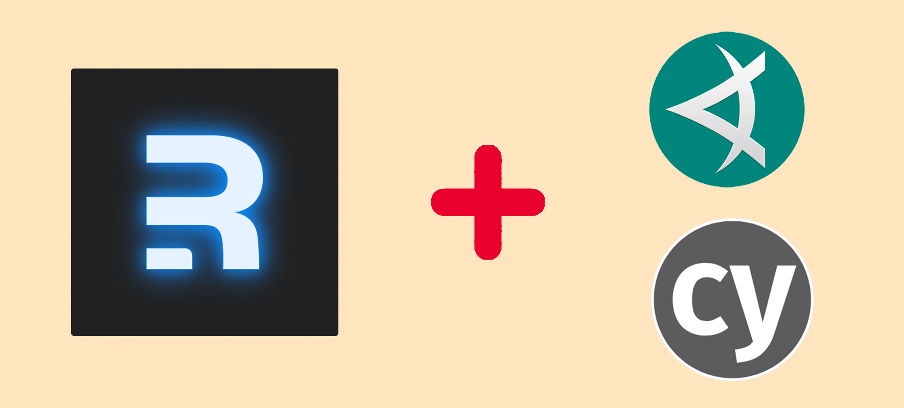

*By Dmitry Vinnik*

*Originally posted [here](https://applitools.com/blog/how-to-visually-test-remix-app-applitools-cypress/).*

In this blog post, we answer a single question: how to best visually test a [Remix](https://remix.run/)-based app? 

We walk through Remix and build a demo app to best showcase the framework. Then, we take a deep dive into visual testing with [Applitools](https://applitools.com/) and [Cypress](https://www.cypress.io/). We close on scaling our test coverage with the [Ultrafast Test Cloud](https://applitools.com/product-ultrafast-test-cloud/) to perform cross-browser validation of the app.

So let our exciting journey begin in pursuit of learning how to visually test the Remix-based app.

**What is Remix?**


*Remix Logo*

Web development is an ever-growing space with almost as many ways to build web apps as there are stars in the sky. And it ultimately translates into just how many different User Interface (UI) frameworks and libraries there are. One such library is [React](https://reactjs.org/), which most people in the web app space have heard about, or even used to build a website or two. 

For those unfamiliar with React, it's a declarative, component-based library that developers can use to build web apps across different platforms. While React is a great way to develop robust and responsive UIs, many moving pieces still happen behind the scenes. Things like data loading, routing, and more complex work like [Server-Side Rendering](https://en.wikipedia.org/wiki/Server-side_scripting#Server-side_rendering) are what a new framework called [Remix](https://remix.run/) can handle for React apps.

Remix is a full-stack web framework that optimizes data loading and routing, making pages load faster and improving overall User Experience (UX). The days are long past when our customers would wait minutes while a website reloads, while moving from one page to another, or expecting an update on their feed. Features like Server-Side Rendering, effective routing, and data loading have become the must for getting our users the experience they want and *need*. The Remix framework is an excellent open-source solution for delivering these features to our audience and improving their UX.

**What Does Remix Mean For UI Testing?**


*Testing Remix with Cypress and Applitools*

Our end-users shouldn't care what framework we used to build a website. What matters to our users is that the app works and lets them achieve their goals as fast as possible. In the same way, the testing principles always remain the same, so UI testing shouldn't be impacted by the frameworks used to create an app. The basics of how we test stay the same although some testing aspects could change. For example, in the case of an [Angular app](https://angular.io/), we might need to adjust how we wait for the site to fully load by using a specialized test framework like [Protractor](https://www.protractortest.org/#/).

Most tests follow a straightforward pattern of [Arrange, Act, and Assert](https://testautomationu.applitools.com/capybara-ruby/chapter2.1.html). Whether you are writing a [unit test](https://en.wikipedia.org/wiki/Unit_testing), an [integration test](https://en.wikipedia.org/wiki/Integration_testing), or an [end-to-end test](https://applitools.com/blog/simplify-end-to-etest-maintenance/), everything follows this cycle of setting up the data, running through a set of actions and validating the end state.

When writing these end-to-end tests, we need to put ourselves in the shoes of our users. What matters most in this type of testing is replicating a set of core use-cases that our end-users go through. It could be logging into an app, writing a new post, or navigating to a new page. That's why UI test automation frameworks like [Applitools](https://applitools.com/) and [Cypress](https://www.cypress.io/) are fantastic for testing -- they are largely agnostic of the platform they are testing. With these tools in hand, we can quickly check Remix-based apps the same way we would test any other web application.

**What about Remix and Visual Testing?**

The main goal of testing is to confirm the app's behavior that our users see and go through. This reason is why simply loading UI elements and validating inner text or styling is not enough. Our customers are not interested in HTML or CSS. What they care about is what they can see and interact with on our site, not the code behind it. It's not enough for a robust coverage of the complex UI that modern web apps have. We can close this gap with visual testing. 


*Functional vs Visual Testing Perspective*

[Visual testing](https://applitools.com/blog/visual-testing/) allows us to see our app from our customers' point of view. And that's where the [Applitools Eyes SDK](https://applitools.com/products-eyes/) comes in! This visual testing tool can enhance the existing end-to-end test coverage to ensure our app is pixel-perfect.

To simplify, what Applitools does for us is that it allows developers to effectively compare visual elements across various screens to find visible defects. Applitools can record our UI elements in their platform and then monitor any visual regressions that our customers might encounter. More specifically, this testing framework exposes the visible differences between [baseline snapshots](https://help.applitools.com/hc/en-us/articles/360007188691-What-is-a-baseline-and-how-is-a-baseline-created-) and future snapshots.

Applitools has integrations with numerous testing platforms like [Cypress](https://www.cypress.io/), [WebdriverIO](https://webdriver.io/), [Selenium](https://www.selenium.dev/), and many others. For this article, we will showcase Applitools with Cypress to add visual test coverage to our Remix app.

**Introducing Remix Demo App**

We can't talk about a framework like Remix without seeing it in practice. That's why we put together a demo app to best showcase Remix and later test it with Applitools and Cypress.


*Remix Demo App*

We based this app on the [Remix Developer Blog app](https://remix.run/docs/en/v1/tutorials/blog) that highlights the core functionalities of Remix: data loading, actions, redirects, and more. We shared this demo app and all the tests we cover in this article in [this repository](https://github.com/dmitryvinn/remix-demo-app-applitools) so that our readers can follow along.

**Running Demo App**

Before diving into writing tests, we must ensure that our Remix demo application is running.

To start, we need to clone a project from [this repository](https://github.com/dmitryvinn/remix-demo-app-applitools):

`git clone https://github.com/dmitryvinn/remix-demo-app-applitools`

Then, we navigate into the project's root directory and install all [dependencies](https://nodejs.dev/learn/npm-dependencies-and-devdependencies):

`cd remix-demo-app-applitools`
`npm install`

After we install the necessary dependencies, our app is ready to start:

`npm run dev`

After we launch the app, it should be available at `http://localhost:3000/`, unless the port is already taken. With our Remix demo app fully functional, we can transition into testing Remix with Applitools and Cypress.

**Visual Testing of Remix App with Applitools and Cypress**

There is this great quote from a famous American economist, [Richard Thaler](https://en.wikipedia.org/wiki/Richard_Thaler): "If you want people to do something, make it easy." That's what Applitools and Cypress did by making testing easy for developers, so people don't see it as a chore anymore.

To run our visual test automation using Applitools, we first need to set up Cypress, which will play the role of test runner. We can think about Cypress as a car's body, whereas Applitools is an engine that powers the vehicle and ultimately gets us to our destination: a well-tested Remix web app.

**Setting up Cypress**

Cypress is an open-source JavaScript end-to-end testing framework developers can use to write fast, reliable, and maintainable tests. But rather than reinventing the wheel and talking about the basics of Cypress, we invite our readers to learn more about using this automation framework on the [official site](https://docs.cypress.io/guides/overview/why-cypress), or from [this course](https://testautomationu.applitools.com/cypress-tutorial/) at [Test Automation University](https://testautomationu.applitools.com/).

To install Cypress, we only need to run a single command:

`npm install cypress`

Then, we need to initialize the `cypress` folder to write our tests. The easiest way to do it is by running the following:

`npx cypress open`

This command will open Cypress Studio, which we will cover later in the article, but for now we can safely close it. We also recommend deleting sample test suites that Cypress created for us under `cypress/integration`.

Note: If `npx` is missing on the local machine, follow [these steps](https://nodejs.dev/learn/the-npx-nodejs-package-runner) on how to update the Node package manager, or run `./node_modules/.bin/cypress open` instead.

**Setting up Applitools**

Installing the [Applitools Eyes SDK](https://www.npmjs.com/package/@applitools/eyes-cypress) with Cypress is a very smooth process. In our case, because we already had Cypress installed, we only need to run the following:

`npm install @applitools/eyes-cypress --save-dev`

To run Applitools tests, we need to get the Applitools API key, so our test automation can use the Eyes platform, including recording the UI elements, validating any changes on the screen, and more. [This page](https://applitools.com/docs/topics/overview/obtain-api-key.html) outlines how to get this `APPLITOOLS_API_KEY` from the platform.

After getting the API key, we have [two options](https://applitools.com/tutorials/cypress.html#running-tests-with-applitools) on how to add the key to our tests suite: using a CLI or an Applitools configuration file. Later in this post, we explore how to scale Applitools tests, and the configuration file will play a significant role in that effort. Hence, we continue by creating `applitools.config.js` in our root directory.

Our configuration file will begin with the most basic setup of running a single test thread (`testConcurrency`) for one browser (`browser` field). We also need to add our `APPLITOOLS_API_KEY` under the `apiKey' field that will look something like this:

</br>

```
    module.exports = {
        testConcurrency: 1,
        apiKey: "DONT_SHARE_OUR_APPLITOOLS_API_KEY",
        browser: [
            // Add browsers with different viewports
            { width: 800, height: 600, name: "chrome" },
        ],
        // set batch name to the configuration
        batchName: "Remix Demo App",
    };
```
</br>


Now, we are ready to move onto the next stage of writing our visual tests with Applitools and Cypress.

**Writing Tests with Applitools and Cypress**

One of the best things about Applitools is that it nicely integrates with our existing tests with straightforward API.

For this example, we visually test a simple form on the Actions page of our Remix app.


*Action Form in Remix App*

To begin writing our tests, we need to create a new file named `actions-page.spec.js` in the `cypress/integration` folder:


Basic Applitools Test File

Since we rely on Cypress as our test runner, we will continue using its API for writing the tests. For the basic Actions page tests where we validate that the page renders visually correctly, we start with this code snippet:

</br>

```
    describe("Actions page form", () => {
        it("Visually confirms action form renders", () => {
            // Arrange
            // ...

            // Act
            // ..

            // Assert
            // ..

            // Cleanup
            // ..
        });
    });

```

</br>

We continue following the same pattern of Arrange-Act-Assert, but now we also want to ensure that we close all the resources we used while performing the visual testing. To begin our test case, we need to visit the Action page:

</br>

```
    describe("Actions page form", () => {
        it("Visually confirms action form renders", () => {
            // Arrange
            cy.visit("http://localhost:3000/demos/actions");

            // Act
            // ..

            // Assert
            // ..

            // Cleanup
            // ..
        });
});

```

</br>


Now, we can begin the visual validation by using the [Applitools Eyes framework](https://applitools.com/products-eyes/). We need to "open our eyes," so-to-speak by calling `cy.eyesOpen()`. It initializes our test runner for Applitools to capture critical visual elements just like we would with our own eyes:

</br>

```
    describe("Actions page form", () => {
        it("Visually confirms action form renders", () => {
            // Arrange
            cy.visit("http://localhost:3000/demos/actions");

            // Act
            cy.eyesOpen({
            appName: "Remix Demo App",
            testName: "Validate Action Form",
            });

            // Assert
            // ..

            // Cleanup
            // ..
        });
    });

```

</br>

Note: Technically speaking, `cy.eyesOpen()` should be a part of the Arrange step of writing the test, but for educational purposes, we are moving it under the Act portion of the test case.

Now, to move to the validation phase, we need Applitools to take a screenshot and match it against the existing version of the same UI elements. These screenshots are saved on our Applitools account, and unless we are running the test case for the first time, the Applitools framework will match these UI elements against the version that we previously saved:

</br>

```
    describe("Actions page form", () => {
        it("Visually confirms action form renders", () => {
            // Arrange
            cy.visit("http://localhost:3000/demos/actions");

            // Act
            cy.eyesOpen({
            appName: "Remi Demo App",
            testName: "Validate Action Form",
            });

            // Assert
            cy.eyesCheckWindow("Action Page");

            // Cleanup
            // ..
        });
    });

```

</br>

Lastly, we need to close our test runner for Applitools by calling `cy.closeEyes()`. With this step, we now have a complete Applitools test case for our Actions page:

</br>

```
    describe("Actions page form", () => {
        it("Visually confirms action form renders", () => {
            // Arrange
            cy.visit("http://localhost:3000/demos/actions");

            // Act
            cy.eyesOpen({
            appName: "Remi Demo App",
            testName: "Validate Action Form",
            });

            // Assert
            cy.eyesCheckWindow("Action Page");

            // Cleanup
            cy.eyesClose();
        });
    });

```

</br>

Note: Although we added a cleanup-stage with `cy.eyesClose()` in the test case itself, we highly recommend moving this method outside of the `it()` function into the `afterEach()` that will run for every test, avoiding code duplication.

**Running Applitools Tests**

After the hard work of planning and then writing our test suite, we can finally start running our tests. And it couldn't be easier than with Applitools and Cypress! 

We have two options of either executing our tests by using [Cypress CLI](https://docs.cypress.io/guides/guides/command-line) or [Cypress Studio](https://applitools.com/blog/getting-started-cypress-studio/).

Cypress Studio is a great option when we first write our tests because we can walk through every case, stop the process at any point, or replay any failures. These reasons are why we should use Cypress Studio to demonstrate best how these tests function.

We begin running our cases by invoking the following from the project's root directory:

`npm run cypress-open`

This operation opens Cypress Studio, where we can select what test suite to run:


*Actions Tests in Cypress Studio*

To validate the result, we need to visit our [Applitools dashboard](https://eyes.applitools.com/app/test-results/):


*Basic Visual Test in the Applitools Dashboard*

To make it interesting, we can cause this test to fail by changing the text on the Actions page. We could change the heading to say "Failed Actions!" instead of the original "Actions!" and re-run our test. 

This change will cause our original test case to fail because it will catch a difference in the UI (in our case, it's because of the intentional renaming of the heading). This error message is what we will see in the Cypress Studio:


*Failed Visual Test in Cypress Studio*

To further deal with this failure, we need to visit the Applitools dashboard:


*Failed Visual Test in Applitools Dashboard*

As we can see, the latest test run is shown as *Unresolved*, and we might need to resolve the failure. To see what the difference in the newest test run is, we only need to click on the image in question:


*Closer Look at the Failed Test in Applitools Dashboard*

A great thing about Applitools is that their visual AI algorithm is so advanced that it can test our application on different levels to detect content changes as well as layout or color updates. What's especially important is that Applitools' algorithm prevents false positives with built-in functionalities like ignoring content changes for apps with dynamic content. 

In our case, the test correctly shows that the heading changed, and it's now up to us to either accept the new UI or reject it and call this failure a legitimate bug. Applitools makes it easy to choose the correct course of action as we only need to press thumbs up to accept the test result or thumbs down to decline it.


*Accepting or Rejecting Test Run in Applitools Dashboard*

In our case, the test case failed due to a visual bug that we introduced by "unintentionally" updating the heading. 

After finishing our work in the Applitools Dashboard, we can bring the test results back to the developers and file a bug on whoever made the UI change.

But are we done? What about testing our web app on different browsers and devices? Fortunately, Applitools has a solution to quickly scale the tests automation and add cross-browser coverage.

**Scaling Visual Tests Across Browsers**

Testing an application against one browser is great, but what about all others? We have checked our Remix app on Chrome, but we didn't see how the app performs on Firefox, Microsoft Edge, and so on. We haven't even started looking into mobile platforms and our web app on Android or iOS. Introducing this additional test coverage can get out of hand quickly, but not with Applitools and their [Ultrafast Test Cloud](https://applitools.com/product-ultrafast-test-cloud/). It's just one configuration change away!

With [this cloud solution](https://applitools.com/blog/cross-browser-tests-cypress-all-browsers/) from Applitools, we can test our app across different browsers without any additional code. We only have to update our Applitools configuration file, `applitools.config.js`.

Below is an example of how to add coverage for desktop browsers like Chrome, Firefox, Safari and E11, plus two extra test cases for different models of mobile phones:

</br>

```
    module.exports = {
        testConcurrency: 1,
        apiKey: "DONT_SHARE_YOUR_APPLITOOLS_API_KEY",
        browser: [
            // Add browsers with different viewports
            { width: 800, height: 600, name: "chrome" },
            { width: 700, height: 500, name: "firefox" },
            { width: 1600, height: 1200, name: "ie11" },
            { width: 800, height: 600, name: "safari" },
            // Add mobile emulation devices in Portrait or Landscape mode
            { deviceName: "iPhone X", screenOrientation: "landscape" },
            { deviceName: "Pixel 2", screenOrientation: "portrait" },
        ],
        // set batch name to the configuration
        batchName: "Remix Demo App",
    };

```

</br>


It's important to note that when specifying the configuration for different browsers, we need to define their `width` and `height`, with an additional property for `screenOrientation` to cover non-desktop devices. These settings are critical for testing [responsive apps](https://applitools.com/blog/webinar-recording-advanced-techniques-for/) because many modern websites visually differ depending on the devices our customers use.

After updating the configuration file, we need to re-run our test suite with `npm test`. Fortunately, with the Applitools Ultrafast Test Cloud, it only takes a few seconds to finish running our tests on all browsers, so we can visit our Applitools Dashboard to view the results right away:


*Cross-browser Coverage with Applitools*


*Mobile Coverage with Applitools*

As we can see, with only a few lines in the configuration file, we scaled our visual tests across multiple devices and browsers. We save ourselves time and money whenever we can get extra test coverage without explicitly writing new cases. Maintaining test automation that we write is one of the most resource-consuming steps of the [Software Development Life Cycle](https://en.wikipedia.org/wiki/Systems_development_life_cycle). With solutions like Applitools Ultrafast Test Cloud, we can write fewer tests while increasing our test coverage for the entire app.

**Verdict: Can Remix Apps be Visually Tested with Applitools and Cypress?**

Hopefully, this article showed that the answer is yes; we can successfully visually test Remix-based apps with Applitools and Cypress! 

Remix is a fantastic framework to take User Experience to the next level, and we invite you to learn more about it during the webinar by [Kent C. Dodds "Building Excellent User Experiences with Remix"](https://applitools.com/excellent-ux-with-remix-webinar/).

For more information about Applitools, visit [their website](https://applitools.com/), [blog](https://applitools.com/blog/) and [YouTube channel](https://www.youtube.com/c/Applitools). They also provide free courses through [Test Automation University](https://testautomationu.applitools.com/) that can help take anyone's testing skills to the next level.