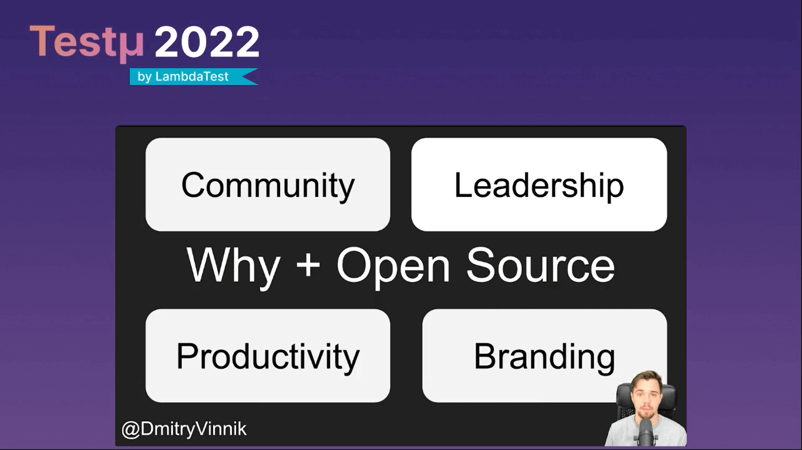

*Originally posted [here](https://www.lambdatest.com/blog/steps-of-open-source-project-health/).*

Welcome to another intriguing session of the Testμ conference!

Dmitry Vinnik is a lead open-source developer advocate at Meta, focusing on business messaging and open-source projects. He aims to increase developer productivity and empower diverse communities with open-source knowledge. Being a developer-first, Dmitry likes to explore open-source projects, create new educational content and deliver various talks with the same enthusiasm.

We thank Dmitry for enlightening us at this conference and talking about measuring open-source project health and how to improve it.

 

<iframe width="560" height="315" src="https://www.youtube.com/embed/-vXXQgAJnOk" title="YouTube video player" frameborder="0" allow="accelerometer; autoplay; clipboard-write; encrypted-media; gyroscope; picture-in-picture" allowfullscreen></iframe>

Before exploring further, let’s look at the key takeaways of this session.

* Learn how Meta‘s open-source team measures the current state of Meta’s open-source projects.
* How to use these metrics to prioritize and direct our efforts.
* Based on the information about your open-source communities, how to focus on the quality of the projects rather than the quantity of public repositories.
* Let’s begin with the major highlights of the talk!

**What is Open-source?**

The session starts with Dmitry explaining what open-source is. It is a process of making technology available for other folks to use and improve. The last two words – “use” and “improve,” are the most important ones. It means we are looking for the two primary personas at least – open-source users and contributors who help us improve the project and contribute back to it.

But why do people and organizations contribute to open-source projects?

First, it’s the community behind the project. Next is leadership, so if you are creating an open-source project and leading it or participating as the core contributor, you have an essential role in that industry, whether it’s AI or mobile web, and that’s why again, corporations often contribute to open source.

Then comes productivity; you have people from different backgrounds and highly diverse communities, in some cases, that help improve your project. You might not think about some accessibility issues, for instance, because your team hasn’t had experience with that, and people in open source will do it for you. It’s just an example of how productive you can get with open source.

Also, one of the crucial things to keep in mind is branding. Some enterprises and organizations entirely built an open source, and that’s where branding comes into play. It can help you with recruitment and elevate your brand.

**What are we trying to achieve?**

Dmitry then deep dives into what we are trying to achieve or what our goal is.

He listed some of the following objectives.

* Define gaps in open-source project health.
* Provide guidelines for open-source project health.
* Show communication as a priority.
* Are there any metrics that can define open-source project health? – he added.

The short answer is NO!

However, the long answer is – it depends. There are some metrics that you can use. For example, potential health metrics like repo numbers, whether it’s watchers, stars, or forks on the GitHub or GitLab repository. Forums like Reddit, Stack Overflow, or other Q/A chats. Twitter and YouTube are other areas where people can interact with each other.

There is also an Orbit model that helps people find metrics and grow their communities.

But instead of looking at numbers and particular metrics, we need to look for a more conceptual approach.

Dmitry lists down four types of open-source work you can think of. They are as follows.

**Types of Open-source work**

1. Planning: Why do we want to open-source a project in the first place? Open-sourcing projects for the sake of open sourcing is not reasoning. You must know exactly why you’re open-sourcing something and how you will wind it down eventually. Will you have world domination, or will you sunset or archive it down the line? Think of that; maybe you’re going to move it to a foundation or do something with it. In the first stage of open sourcing, you must keep that in mind.

At the launch, you need to have a plan behind your actions. The achievable goal that one can have is recruiting. Try to recruit people to your organization or your project through that open-source work you’re sharing. You can also look for people to contribute and improve the project that you will use internally or as an enterprise supporter of the project.

Branding is crucial to positioning yourself as an open-source organization. And adoption, you try to dominate the market or maybe become a significant player in the market, and that’s where you know another UI framework might come into play, and it would be a good example. Always think for the long term, but the important thing is that you need to have your team’s commitment. Whoever is behind the project, you need to know that they are doing it with their passion and dedication.

2. Branding: When it comes to branding, it’s not just about marketing; instead, it’s about showing commitment to your project. When you think about branding a bit more, you can think of it as a name. For example, when you try to google Pandora, you see it’s a jewelry store or a familiar brand that people have. Search engine optimization will downgrade your project way down the line, so you have to think about the proper name.

Even if you are not trying to pay some expensive designer to create a logo for you, something that you or your team can quickly draw, you can get the community involved and throw a logo for your project.

You need a narrative about how you will position your project, what it is for, and what problem it’s solving. Having documented this in the ReadMe shows your commitment. With social media, your project is shared with the community where your community resides.

3. Documentation: It is one of the cornerstones of open source projects. If you look at the top projects. They have great documentation. People spend hours, days, months, and years ensuring it’s as good as possible. Documentation is excellent for contributions, especially for first-time contributions. It makes it searchable. People can find it on Google or elsewhere.

Creating the website helps people to find you and your project. Some quick guidance and frequently asked questions set the project apart from many others. Consider using alex.js to find non-welcome words that you might be using in your documentation.

4. Codebase: You want to make sure that your community has a code of conduct established like kind of guides, how the community behaves, how you deal with bad actors, how you navigate some conflicts, and what you establish as the environment in your project and there are lots of great examples of where to grab the code of conduct from.

ReadMe is what people first see on GitHub or GitLab, so make sure that one is well defined, like what you’re looking for and why it’s there. If you are looking for contributions, you should have a contributors guide so they know how to get started, build your project on their local machine, have it in development mode, and make the pull requests.

With GitHub, you have a great way to establish what you’re looking for. When someone files pull requests or an issue, you don’t want to have a back and forth with whoever filed one of these items. If there is a test failure, then make sure to define the reproduction steps, what did you expect to happen, and what happened.

**Last but not least – Community work**

Dmitry then mentions the role of community.

Community work is vital on every level of open-source work, and it’s team driven. Often it’s focused on contact, so make sure that your community knows and your team knows where they contribute, how to contribute, and learn projects things like tutorials, videos, and podcasts.

Again the content driven by the community is always the best. You can have a community space for people to connect and ask questions by creating a Slack or Discord channel.

Communication is the key. If you don’t tell your project contributors to users what to expect, they might abandon the project, and this lack of communication usually leads to disaster.

**Q&A session!**

*What are some of the open-source projects that Meta has as of now?*

Dmitry: We have over 700 projects. You can Google Meta year in review, blog posts, Meta open source year in review blog posts that we’ve been publishing for quite some time, and so those posts we usually start with excellent infographics outlining quantity or the brief metrics on how many people contribute, how many projects there are, how many commits we’ve seen from the external and internal contributors.

*In my opinion, in future, most of the current commercial products too will enter into open source. What’s your thought on this?*

Dmitry: I don’t know whether more companies will be open-sourcing their stuff because not all organizations would want that. If the company is trying to establish itself as one of the big players in the space, working toward a leadership and credibility position, then the open source would make sense. Still, they might not be looking for contributions as much. If these three main points: community productivity and leadership, aligns with the company’s goal, they will open source a lot more.

*Can there be a commercial version of open-source software?*

Dmitry: Of course! If you look at projects with operating systems like Linux and Unix, they make it open-source and free to use. Still, they will provide consulting services for installation, maintenance support, and many similar projects. There are quite a few examples, like YouTube.

*How to contribute open-source as a tester?*

Dmitry: As a tester, you can contribute to test coverage – that’s one way. You would have been surprised how essential open-source software is for the entire world and how few tests it might have. You can find many pretty popular projects with very little test coverage. Therefore, your expertise as a full-on tester would be greatly appreciated there as you don’t need to sell tests anymore; people understand the value of it. They just don’t know how to write them.

*Which are the underrated open-source projects cooking up nowadays, in your opinion?*

Dmitry: One of the great projects I’ve seen is Alex.js. It’s a linter and easy to use that you can run on your docs. It will help you identify biased language that you might have overlooked.