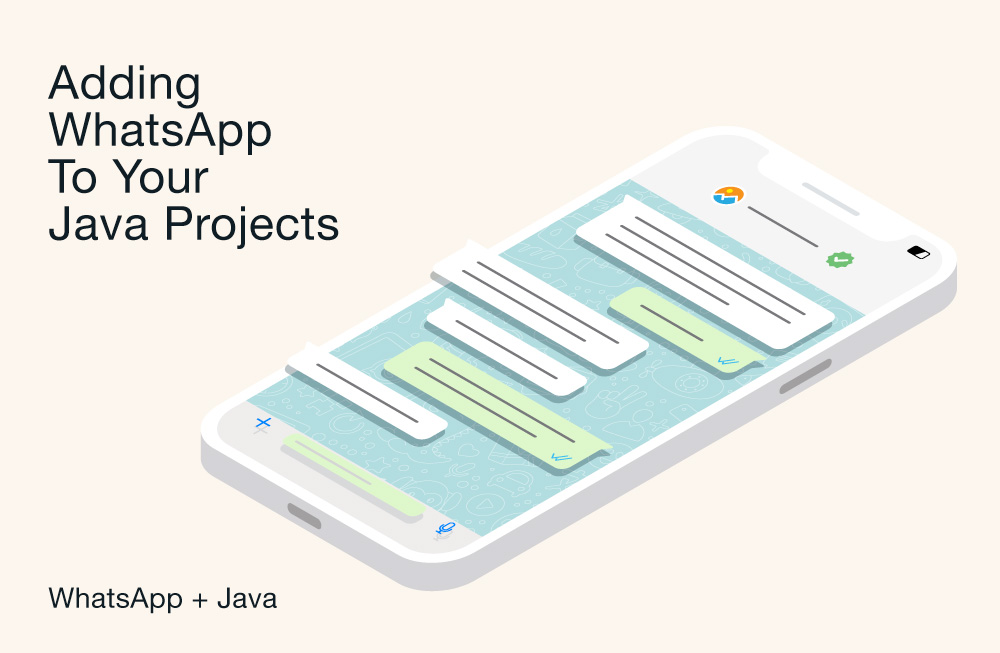

*By Dmitry Vinnik*

*Originally posted [here](https://developers.facebook.com/blog/post/2022/11/07/adding-whatsapp-to-your-java-projects/).*

WhatsApp Business Platform is a messaging solution that supports businesses at scale. It provides you with tools to help automate responses to customer messages or showcase a catalog of available products.

With the [Cloud API](https://developers.facebook.com/docs/whatsapp/cloud-api/), hosted by Meta, Meta's integration of the WhatsApp Business Platform, your apps can use WhatsApp to send and receive messages to create an engaging experience for your customers. The Cloud API also scales easily to meet temporary demand spikes as business volume expands.

This article demonstrates how to build a Java app to send a simple text-based message and then dives into using message templates for more detailed messages. The full project code is available on [GitHub](https://l.facebook.com/l.php?u=https%3A%2F%2Fgithub.com%2Ffbsamples%2Fwhatsapp-api-examples%2Ftree%2Fmain%2Fsend-messages-ecommerce-app-java&h=AT2ZmvH94606BQyU9HwnFONESRvVf6mcvHUZ_zYmGq_-yMRsGijws4fMzkbUykVCJsZ7PRFXzgMvNgnOgzPAfsssFhQf3CaLyS5dussZsVgCTqRPDRJgDn0b0odvxE-4WiDspQpLBniV1S3N2W4MEwoEiRoAeKfUWge7ytY68bk).

**Getting Started**

The first step in this tutorial is to create a brand-new Java project in Visual Studio Code (VS Code) and add functionality to send messages via the API.

Make sure you do the following before you get started:

-   [Install VS Code](https://l.facebook.com/l.php?u=https%3A%2F%2Fcode.visualstudio.com%2F&h=AT1UgoudUX58eWdyqnPvG2aAxSFS-brGjNJrInARFCHOes7Kt1kfcEjO4-wIxQO6OsqLx_g2yIwjPO9nX8chw0KL1BDClgOyAp85ugDHjGahGj4qwiFLGTQclY15P18vHTrQWmsEMSF2THhzD8GxKCLFUDha2cL-ZM6JPbcNBGEAV9klRC5TPtIZ).

-   Install the [Java Coding Pack](https://l.facebook.com/l.php?u=https%3A%2F%2Fcode.visualstudio.com%2Fdocs%2Fjava%2Fjava-tutorial&h=AT34kl5_YLIOe2kFwlyEGvdWktwC4rUjrK7wHHsMpLTHC-IrMYw2EBt8KciEaBni4v6e13yIUwRVhR2wtrrPypKp34oUxFyUGzl5sw8lYB03lKoEfq-LT5eXm2V8a1Mc0Y3dfQ7b7x5lNClADq5K_k-JvXmMkh1jD6EwmxVKces) for VS Code.

-   Ensure you have [Java version 11](https://l.facebook.com/l.php?u=https%3A%2F%2Fwww.oracle.com%2Fjava%2Ftechnologies%2Fdownloads&h=AT0HwWiKagbkU6C32zkASHn36KvfkR1JK4OFQIU-KM7XEYA9MhlFMN78pViwSubumxD6UB7uCY7cA--Z60sbIbeuXbddKD1RcIMQQ0TaPwcliQCt_pnrL7Sml5Flbj1XvmBAZZws_hKrojjalnape1iunyPZTPchKK4NIzmUq4w) or greater installed.

-   Register as a developer at [Meta for Developers](https://developers.facebook.com/).

-   [Enable two-factor authentication](https://www.facebook.com/business/help/280940009201586) on your account.

-   Ensure your Meta account is linked to a [Meta Business account](https://www.facebook.com/business/learn/how-business-manager-works/guide).

Once complete, create an app on Meta for Developers. Start by visiting [Meta for Developers](https://developers.facebook.com/) and clicking My Apps. Then, click Create App and select Business as the app type.

Provide the requested details, including the app name and contact email address, and select your business account from the dropdown. Once the app is created, scroll down and click Set up from the WhatsApp card, as shown below:

This will take you to the Getting started page, which contains all of the information you need for your Java app to start sending WhatsApp messages. Additionally --- and most importantly --- this page provides a temporary access token and the pre-populated cURL command that's necessary for sending your first test message.

Now that your app is created in the Meta for Developers console, open VS Code and create your new Java application.

In VSCode, create a new Java project by opening the command palette (Cmd+P/Ctrl+Shift+P) and typing "Create Java Project."

You have the option to choose your favorite build tools or select none. You won't need any for this tutorial, so you don't need to select any tools.

Then, follow the instructions to choose a location for the project and provide it with a name. This generates some boilerplate Java code with a main function that prints "Hello World!"

Now that you're set up and have all the necessary information, you're ready to modify the boilerplate Java code and send your first message.

**Sending an Example Message**

On the Getting started page in the Meta for Developers console, there's an example cURL request that provides details about which URL you need to call, the headers you should provide, and an example payload to include as the body.

You can translate this to Java code by using the built-in java.net packages that provide the functionality to create an HTTP client.

Next, build and send a request, then you can parse the response.

Let's break this down. Note that some parts of this code need to be replaced with your own details. These are marked with chevrons, like <YOUR PHONE NUMBER ID>. Make sure the number you're sending a message to [includes the country code and is formatted correctly](https://developers.facebook.com/docs/whatsapp/cloud-api/reference/phone-numbers#formatting).

First, you're creating an HTTP request using a builder. You're supplying the builder with the URI and the two header properties.

Then, you're using the POST function, so the builder knows it's a POST request. This is also where you set the payload body. Here, you can copy and paste the body provided on the Getting started page --- just remember to escape the double quotation marks.

Next, you're creating a new HTTP client to send your request. The `HttpResponse<String>` object captures the response and provides functions to access things like the response status code and body.

You can run the Java app by right-clicking on the project in VS Code under the JAVA PROJECTS heading and clicking Run.

If everything is configured correctly, a WhatsApp message similar to the one below should have been sent to the target phone number. Note that Meta's provided example template sets the message's content.

Now that your example message works, you can send a simple text message without using a message template.

For this to work, you need to reply to the initial message that was sent using this template. The contents of the reply don't matter. Once that's finished, you can modify your POST request to provide a simple text message payload.

As you can see, the type property has now been changed to text. You also replace the template object with a text object specifying the desired message.

Now, rerun the application. You'll see a second WhatsApp text message arrive:

You can now successfully send a simple text message using the API!

**Creating Your Own Message Template and Sending a Message**

Next, you'll create your own message template for sending more rich and personalized messages, containing an image and a call to action.

From the Getting started page in the Meta for Developers console, step two features a link to create your own message template. Click this and then click Create Message Template. First, select Transactional as the message category, and then provide a name and a language.

Start building the template by choosing an Image as the Header, filling in the Body, and [dynamically using parameters](https://developers.facebook.com/docs/whatsapp/cloud-api/reference/messages) to change the message's content.

Finally, add a Footer and a Call To Action. For this tutorial, use the Visit Website call to action, which allows you to provide a URL. This adds the call to action to the bottom of the message, as shown in the preview in the image above.

To ensure your template is accepted, make sure it follows the [proposed guidelines](https://developers.facebook.com/docs/whatsapp/message-templates/guidelines/) and that you've provided sample data. You can provide data using the Add Sample button at the top of the page.

The approval process can take a bit of time, so while you're waiting, modify the code in preparation to use this new template.

Again, you only need to make changes to the POST section of your HTTP request builder and modify the request body to use the new template --- similar to the very first example. The difference with your new template is that it uses two components: a header and a body.

Within the components array, start by specifying your header component and declaring your image parameters. This enables you to provide an image URL for each message, which is useful if you have different images for different user segments.

The body component contains the text that should replace the parameter placeholder ({{1}}) you added while building the template. Now that it's set up, check that the message template has been approved in the console. If so, run the code again. You'll see a new message should match the template, similar to what's shown below:

**Best Practices**

This post took you through the basics of getting started with the Cloud API to send simple text and template-based messages. When adding this to a production application, there are some best practices to follow.

First, message templates must be used to start business-initiated conversations. You saw this when sending a simple text message, as before it could work, you had to send the example message template and respond to it. Then, this opened the conversation to further messages.

Second, as your app will be calling an external service, it's important to make use of the asynchronous calls the HTTP client provides. Using` client.sendAsync` will prevent the main thread from being blocked, so the application can continue doing other things while waiting for the message to be sent.

You should also consider how you're going to authenticate with the API. You can create a permanent access token or [request an access token](https://developers.facebook.com/docs/whatsapp/on-premises/reference/users/login) from the API. In either scenario, you should ensure that you [secure sensitive details](https://developers.facebook.com/docs/facebook-login/access-tokens/security) and refrain from hardcoding them in your application.

Finally, it's important to add error handling to your application. Several factors could prevent a message from being sent, and your application should know how to deal with them. Meta provides a list of [error codes](https://developers.facebook.com/docs/whatsapp/cloud-api/support/error-codes) and their meanings so you can gracefully handle errors. You may want to code specifically for some common or predictable errors and provide default functionality for dealing with any others that occur. It's recommended to log these errors for later analysis.

**Next Steps**

This tutorial demonstrated how to build a Java application that can send messages via the Cloud API. You've sent simple text-based messages and more complex messages containing images and call-to-actions using bespoke message templates.

The API is a simple-to-use REST API, making it effortless to integrate into a Java application utilizing Java 11's built-in HTTP libraries to build and send HTTP requests. With the addition of [webhooks](https://developers.facebook.com/docs/whatsapp/cloud-api/guides/set-up-webhooks), you have the ability to build an application that can send automated messages in near real time, creating even more ways to interact with your users.