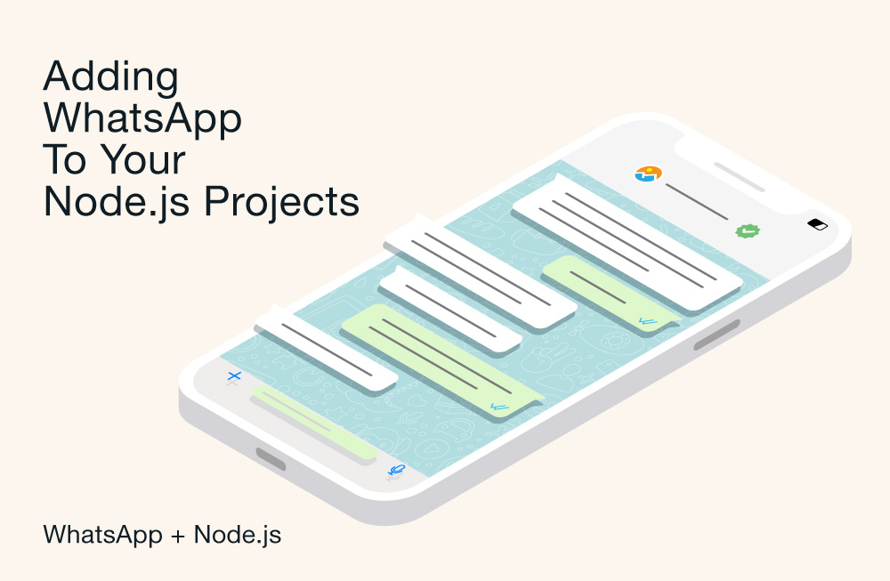

*By Dmitry Vinnik*

*Originally posted [here](https://developers.facebook.com/blog/post/2022/10/31/sending-messages-with-whatsapp-in-your-nodejs-application/).*

WhatsApp is one of the world's most popular mobile messenger apps, with nearly [two billion monthly active users](https://blog.whatsapp.com/two-billion-users-connecting-the-world-privately). Businesses can leverage the WhatsApp Business Platform to communicate closely with their audiences, help boost sales, and transform the customer experience.

This article describes how the Cloud API, hosted by Meta, Meta's integration of the WhatsApp Business Platform, can be used in a Node.js application to provide the capability to send and manage WhatsApp messages sent and received via the Cloud API.

Let's dive in and explore how to create a Node.js web app powered with WhatsApp messaging from scratch to send a simple text-based message and then using message templates for more detailed messages. If you'd like a preview of where you'll end up, you can [download the complete application code](https://l.facebook.com/l.php?u=https%3A%2F%2Fgithub.com%2Ffbsamples%2Fwhatsapp-api-examples%2Ftree%2Fmain%2Fsend-messages-movie-ticket-app-js&h=AT181v5Ex6Pb7URXyBi8HD8owSANgJCy0xysktsDkDkR3UXo6tOSkq90O-AEx2Sv_iLiDSRK92i98nkGLYhayrY_d1xpeUuHTxfoS6gBOugXH_EPQpa8dZwYXp9KAmU1a9MK28Ns9EcqMVb1Z8arhqsgKXE).

**Prerequisites**

To send and receive messages using a test phone number, follow the [Set up Developer Assets and Platform Access](https://developers.facebook.com/docs/whatsapp/cloud-api/get-started#set-up-developer-assets) tutorial, making sure you complete the steps below.

First, you'll need to [download and install Node.js and npm](https://l.facebook.com/l.php?u=https%3A%2F%2Fdocs.npmjs.com%2Fdownloading-and-installing-node-js-and-npm&h=AT38TwG1fm6BXvQKGBj078Nj3CWjiBH1w6cfO1yC78cDcmhAhg8kWY9X6V1vA_mLIbezb72LBOLLSGwMpx_-gVgiYE7qDyG8SePSNGZ_rRfXA_gkvJoxbR_XVEdG2c0S1Eoch-5FS6gkDnmioEWM571wBHo) on your machine, if you don't have it installed already.

Next, Register for a free account as a [developer with Meta for Developers](https://developers.facebook.com/docs/development/register/).

Enable two-factor authentication for your account.

[Create a Meta App](https://developers.facebook.com/apps/). The App ID and the App Secret will be used later in this tutorial.

Connect your Meta App with the WhatsApp product.

Then, associate your app with a [Business Manager](https://developers.facebook.com/docs/instant-articles/guides/businessmanagersetup) account.

On the App Dashboard, open the WhatsApp > Get Started menu and configure a recipient phone number. Your app will need it as a recipient for the WhatsApp messages. This number will be used later on.

Create a [system user](https://business.facebook.com/settings/system-users/) for your Business Account. For a more detailed walkthrough, see our [Business Manager documentation](https://developers.facebook.com/docs/instant-articles/guides/businessmanagersetup#biz-mgr).

On the System Users page, generate a new token for your new system user. Assign your app all the available permissions. This token will be used later in this article.

On the System Users page, configure the assets to your System User, assigning your app with full control. Don't forget to click the Save Changes button.

**The App We're Building**

This small sample application will work as an online movie ticket purchase and booking service. The application will use the API to provide the user with an engaging and more personalized experience than email communication. When the users log in, they're greeted by a WhatsApp message. Then, when they buy a movie ticket, they receive a message confirming the purchase.

**Creating a Minimal App with Node.js and Express**

To get started, you need to get a new Node.js project up and running. We'll use [EJS](https://l.facebook.com/l.php?u=https%3A%2F%2Fejs.co%2F&h=AT30eVZ3US4Ka0H0a0--ohff7SJ2zZqExoLQFHDCKWLM7Hr6Mq3Pqf5zbeiaiYNjBf6fnIp52ntiabch16p1ovoU0BuXopUUjJaYfUmsCYY4Vaa1UknEfpVYNqqFqRkUh6wu1uBqo9BkihZusCGAKSdRpbQ) as a lightweight JavaScript templating engine and [Express](https://l.facebook.com/l.php?u=https%3A%2F%2Fwww.npmjs.com%2Fpackage%2Fexpress&h=AT0tj6PjkqE3fmyhLZfkvASR_3QVpfmxOi8-5xLETrm3XEoj9OE44b10-Z2EUaM2OKGdJEUV3x831qw9S61eAJycW2sAqFW9u93nl6ZzmBH3Q1uHvOB-CEVTRRubJgmZ-mSJvB-ZxY6rxgE9g-GvxX86-og), the minimalist web framework for Node.js.

Open terminal/command prompt and create a folder for your project to live in. Then execute the npm init command from the root of your project folder to initialize your project to use npm packages:

`npm init`

Create a starter application using express-generator:

`npx express-generator -v ejs`

Next, run the following command to install the packages and resolve their dependencies:

`npm install`

Finally, execute the following command to start the server and host your app locally:

`npm start`

Now visit [http://localhost:3000](https://l.facebook.com/l.php?u=http%3A%2F%2Flocalhost%3A3000%2F&h=AT3heRvqI1QtG6RikS-TBHYyWnRF9LbpkRtuoRH_On8lJRwOhms5xnT8fAyZ9fQ0NxQEkxRcabFVmLLvYR_XXcvLJssrvUS3a-Kq-Ywgz0BJPSexBZ0SRzv-sn6Zr2Lznl1yGcLSDAS4qttwQWPTjfblzFc), and you'll see the homepage of your Node + Express starter application:

**Creating the Sample Login Page**

To start your movie ticket application, you'll create a sample login form that will work as your homepage. You'll need to call the render function of the [Response object](https://l.facebook.com/l.php?u=https%3A%2F%2Fexpressjs.com%2Fen%2Fapi.html%23res.render&h=AT1CXloIirAsoxJgO94LIqccrrneAid2WRZLgN9-rZTe1SfvKo_Yw2mGOjugcqIWswaXhoycrTr5Ox9Dl7UCRPaaSMiqfRRSBqVOP1XL8GDCyPIstAG3tFecXkIj1W-MvSYp9nIBIqruJ1-RiKyA4uXoMt0) to render a view from a separate HTML file.

Open the [routes\index.js](https://l.facebook.com/l.php?u=https%3A%2F%2Fgithub.com%2Ffbsamples%2Fwhatsapp-api-examples%2Ftree%2Fmain%2Fsend-messages-movie-ticket-app-js%2Froutes%2Findex.js&h=AT1P1I7r8GbSQKBmbOyoVBIPihdLGKF3SxhMQoxva8yu6fcfIjS-mdDvoN6LyA8Dt2EZFtR1PhKJiohsi6r6tUU48LbwTfDhFQbezSrbDbMbh4RYVPHK5kBMuKA0jn95ZW1jSXd9po1N4bt3ZCulODU0oag) file and replace its code with the following contents:

var express = require('express');  var router = express.Router();  /* GET home page. */ router.get('/',  function(req, res, next)  { res.render('index',  { title:  'Login'  });  }); module.exports = router;

Next, open the [views\index.ejs](https://l.facebook.com/l.php?u=https%3A%2F%2Fgithub.com%2Ffbsamples%2Fwhatsapp-api-examples%2Ftree%2Fmain%2Fsend-messages-movie-ticket-app-js%2Fviews%2Findex.ejs&h=AT0Dcd4kspDVMfLbXholy2XSE2gp1xYvhwROvCrmVrKRbbHd-3oCtLszNaJbM84k6KPGA-sROKaCnhlPqh_Pgb8ooV6w16Dp1FmWFpcRwIDpehKmPgKBUvCwEBlOhYBg0zMz4pU3YITyOCYX8aZdZWw6gLI) file and add the HTML content below. Here, you're creating a sample form login that comes with a stand-in login and password, so that you don't need to provide those to use the application.

For your web app front end, use [Bootstrap](https://l.facebook.com/l.php?u=https%3A%2F%2Fgetbootstrap.com%2F&h=AT36qOkF3yMaEkeXo3b3oDm8WHr8lhzKdHhJmqFHZju-lPNaNvI0ypCmY-m6F8vpq8SSkcjFacefFP5mPxnDzq7r1DzIs9CMNZVJJt31EI54RI0390qA6Q3iTzTQbZxnj-IXKMfm-fEg1gB5lINJxOqif7o). This popular library will help you build a consistent, lightweight UI that comes with responsive styling, allowing you to easily run your app across devices with simplified CSS rules.

Then, restart the app again to see the new login page, by using CTRL+C and the command:

`npm start`

**Sending Text Messages with Node.js and WhatsApp Business**

Your Node.js application will need to use specific data from your Meta developer account created in the beginning of this article. For the convenience of having all of your configuration in one place, and not scattered throughout code during development, place it in a file.

Create a .env file at the project root with the following configurations:

APP_ID=<<YOUR-WHATSAPP-BUSINESS-APP_ID>>
APP_SECRET=<<YOUR-WHATSAPP-BUSINESS-APP_SECRET>>
RECIPIENT_WAID=<<YOUR-RECIPIENT-TEST-PHONE-NUMBER>>
VERSION=v13.0
PHONE_NUMBER_ID=<<YOUR-WHATSAPP-BUSINESS-PHONE-NUMBER-ID>>
ACCESS_TOKEN=<<YOUR-SYSTEM-USER-ACCESS-TOKEN>>

Note: Replace each of the above settings with data from your WhatsApp Business account Dashboard.

Your login form action tells the app to POST to the /welcome route. So, you'll need a new router to:

-   Handle the "welcome" HTTP POST request.
-   Obtain the configuration needed for the welcome message.
-   Send a welcome message via the API.
-   Redirect the app to the homepage once the message is sent

Next, create a new [routes\welcome.js](https://l.facebook.com/l.php?u=https%3A%2F%2Fgithub.com%2Ffbsamples%2Fwhatsapp-api-examples%2Ftree%2Fmain%2Fsend-messages-movie-ticket-app-js%2Froutes%2Fwelcome.js&h=AT0K2dMkGuWUFuLSSzZ6NHirSGjCbmAG6MSr0MmMY1-2v5tfs4HMz7bKn81UG-VAR49PBtznjPikyO8x-XUO6QS6lrG2U4Q1PZrvw6fmVnU_77hbSW6DoilKiJSlkOtFTPRqDKG1D3i2VV0YGhMKr8EgmwY) file with the following code:

var express = require('express');  var router = express.Router();  var bodyParser = require('body-parser'); require('dotenv').config()  const  { sendMessage, getTextMessageInput }  = require("../messageHelper"); router.use(bodyParser.json()); router.post('/',  function(req, res, next)  {  var data = getTextMessageInput(process.env.RECIPIENT_WAID,  'Welcome to the Movie Ticket Demo App for Node.js!'); sendMessage(data)  .then(function  (response)  { res.redirect('/); res.sendStatus(200);  return;  })  .catch(function  (error)  { console.log(error); console.log(error.response.data); res.sendStatus(500);  return;  });  }); module.exports = router;

Next, you'll need the function to encapsulate the code that sends basic text messages via the API. Create a new [messageHelper.js](https://l.facebook.com/l.php?u=https%3A%2F%2Fgithub.com%2Ffbsamples%2Fwhatsapp-api-examples%2Fblob%2Fmain%2Fsend-messages-movie-ticket-app-js%2FmessageHelper.js&h=AT3mZiIizdJCxJagF6bv1GIyjfIdEBWwnwGy1owOatp8GaucLA4ssfB8M96Ubr8sPvzaqviWqGJ7Ji-SrPouOvnxJvKXZ-8NSmM_yttL2hkToZT-fpgDfQOMU-Yj2HG7khl2pNu2dpYRnZ4oNHupzc-SAhY) file at the project root with the following code:

var axios = require('axios');  function sendMessage(data)  {  var config =  { method:  'post', url:  `https://graph.facebook.com/${process.env.VERSION}/${process.env.PHONE_NUMBER_ID}/messages`, headers:  {  'Authorization':  `Bearer ${process.env.ACCESS_TOKEN}`,  'Content-Type':  'application/json'  }, data: data };  return axios(config)  }  function getTextMessageInput(recipient, text)  {  return JSON.stringify({  "messaging_product":  "whatsapp",  "preview_url":  false,  "recipient_type":  "individual",  "to": recipient,  "type":  "text",  "text":  {  "body": text }  });  } module.exports =  { sendMessage: sendMessage, getTextMessageInput: getTextMessageInput };

The code above makes an HTTP POST request to the /messages endpoint on the Meta [Graph API](https://developers.facebook.com/docs/graph-api/) at graph.facebook.com, passing:

-   The Cloud API version you're working with
-   The test phone number that will receive the message (you've already configured that)
-   The access token you generated for your System User

Also, note that the getTextMessageInput function returns a specific data structure required for sending basic text messages.

Moving on, open the app.js file and create a router variable for the /welcome route:

`var welcomeRouter = require('./routes/welcome');`

Then enable the app to use the new welcomeRouter variable:

`app.use('/welcome', welcomeRouter);`

Finally, restart the app again to see the new login page, by using CTRL+C and the command:

`> npm start`

When the login screen loads, click the Login button. You'll see the WhatsApp notification popping up on your screen:

Click the notification that appears to open WhatsApp and view the basic text message sent by the Node.js application:

So far, you've sent simple messages using WhatsApp. Next, you'll send more complex messages using templates.

**Creating the Movie Ticket Catalog Page**

The next step is to create a catalog of available movies and their details so that online customers can buy tickets. This data will be stored in a separate file.

You now need a new route for users to access the movie catalog page.

Create a new file at [\routes\catalog.js](https://l.facebook.com/l.php?u=https%3A%2F%2Fgithub.com%2Ffbsamples%2Fwhatsapp-api-examples%2Ftree%2Fmain%2Fsend-messages-movie-ticket-app-js%2Froutes%2Fcatalog.js&h=AT1F0LveVUh6JVZ-pSUs5hM-mz4CDKJWPRefIKaxOJqqfyWWM2td4YqVWM3NX0jDHK0blhUHc3qgA_kf8to5D1QVMZhWveT1gvA2uOIbTNEiot3ZlRJ7y2uV8a4kD5IFpMJu51rDrF68__t0vPKAk4f2h50) with the following content to render the catalog page with the movies data:

var express = require('express');  const  { movies }  = require("../public/javascripts/movies");  var router = express.Router();  /* GET home page. */ router.post('/',  function(req, res, next)  { res.render('catalog',  { title:  'Movie Ticket Demo for Node.js', movies: movies });  }); router.get('/',  function(req, res, next)  { res.render('catalog',  { title:  'Movie Ticket Demo for Node.js', movies: movies });  }); module.exports = router;

Now create a new file at [\views\catalog.ejs](https://l.facebook.com/l.php?u=https%3A%2F%2Fgithub.com%2Ffbsamples%2Fwhatsapp-api-examples%2Fblob%2Fmain%2Fsend-messages-movie-ticket-app-js%2Fviews%2Fcatalog.ejs&h=AT34Mt5cbut0lXCq4MMEnoXScgtUvQNZzLzPngtRg2vY4ionG9HyYd-fhhWdqL6f10jFZ-lGq8bn52Gv2YjUXDGPB1vmimQI7qBu67Fd4xt0y2keT_Rpdg8LFXywkv1OLC6oeDi8m-owHwIZHXC19Tu7vmQ) with the following content, which renders the movie data using the EJS template syntax.

Now you have to make the welcome endpoint redirect to the catalog page once the welcome message is sent to the user. Open the [routes\welcome.js](https://l.facebook.com/l.php?u=https%3A%2F%2Fgithub.com%2Ffbsamples%2Fwhatsapp-api-examples%2Ftree%2Fmain%2Fsend-messages-movie-ticket-app-js%2Froutes%2Fcatalog.js&h=AT0zPrwScTFOc9IDtFeYtA37WkTBtELFyjzcol6RXaomH-aLTwxZsuE_MCLQLEvU48QfaFKIL9eIl0P1vnkxGySFcVQNuNiddLTYpR700TkjDHL2xzUqYa5MsCpEB9F5bkMIOi_iGQSWmdL5J2cs8PXgsRw) file and modify the redirect to the /catalog route :

   sendMessage(data)
    .then(function (response) {
      res.redirect('/catalog');

Next, open the app.js file and create a router variable for the \catalog route:

`var catalogRouter = require('./routes/catalog');`

Then enable the app to use the new catalogRouter variable:

`app.use('/catalog', catalogRouter);`

Finally, restart the app again to see the new login page, by using CTRL+C and the command:

`> npm start`

Now click the Login button. This will send your WhatsApp number a welcome message and redirect you to the catalog view:

Note that there's a button to buy the ticket for each movie displayed on the screen above. Next, you need to configure the application to process the ticket purchase.

**Sending Templated Messages with Node.js and WhatsApp Business**

A message template is required to start a [business-initiated conversation](https://developers.facebook.com/docs/whatsapp/conversation-types). These conversations can be customer care messages or appointment reminders, payment or shipping updates, alerts, and more.

Create new router code at [routes\buyTicket.js](https://l.facebook.com/l.php?u=https%3A%2F%2Fgithub.com%2Ffbsamples%2Fwhatsapp-api-examples%2Ftree%2Fmain%2Fsend-messages-movie-ticket-app-js%2Froutes%2FbuyTicket.js&h=AT1gHxZ02EjAU8z9b8pok5eVn3uh2-qiH1QkNYxp-sI2h0UEWL3lp-k8GT2dkS_odrdLQnC9AZa91LWVMXOadcL7q2pkQXDNSa0LMU2H30MgWFy3C-rVbqn2MWNGiNsADL6l4Avm-fwi5Xr41kCOB_9GiIM):

var express = require('express');  var router = express.Router();  var bodyParser = require('body-parser'); require('dotenv').config()  var  { movies }  = require('../public/javascripts/movies');  const  { sendMessage, getTemplatedMessageInput }  = require("../messageHelper"); router.use(bodyParser.json()); router.post('/',  function(req, res, next)  {  var movie = movies.filter((v,i)  => v.id == req.body.id)[0];  var data = getTemplatedMessageInput(process.env.RECIPIENT_WAID, movie, req.body.seats); sendMessage(data)  .then(function  (response)  { res.redirect('/catalog'); res.sendStatus(200);  return;  })  .catch(function  (error)  { console.log(error); res.sendStatus(500);  return;  });  }); module.exports = router;

The following code to send the ticket purchase message is similar to what you did for the welcome message. Open the [messageHelper.js](https://l.facebook.com/l.php?u=https%3A%2F%2Fgithub.com%2Ffbsamples%2Fwhatsapp-api-examples%2Ftree%2Fmain%2Fsend-messages-movie-ticket-app-js%2FmessageHelper.js&h=AT2yqJPTXnFNPKvHomOGZ9V1iLV62W7odLuq1W2ureZRT3WgQjtc0k6sQG0k4UUe78nJ-YZ6g9ZVhywF_trWG2uawl47MgID-HkJBM3yjTDK-WTY7E2xPpD18ShTiEuN9tEHQhLiw8XfOU7Oqxm3-NjVKnM) file and add the getTemplatedMessageInput function.

Note that we are using the sample_movie_ticket_confirmation template above, where you provided the movie thumbnail, the movie title, the date/time, the location, and the number of the seats. You can experiment with other available templates or create new ones, by visiting the [Message Templates](https://www.facebook.com/business/help/722393685250070) page.

Now open the [app.js](https://l.facebook.com/l.php?u=https%3A%2F%2Fgithub.com%2Ffbsamples%2Fwhatsapp-api-examples%2Ftree%2Fmain%2Fsend-messages-movie-ticket-app-js%2Fapp.js&h=AT2XAecTts5Np-Kawi-QuDrVGqBOd8HeKSfjIwr0Jlpvgd1v3s6mm8dVdtxT4kqnQWSunIEr0VOmiJWNENUzgek1yKmpfEHTqAHqGsZL4t8R6NZ90ivci5dbrmHsZid2TUhj4fPETos8td8B2X1PNUA6ra0) file and create a router variable for the buyTicket route:

`var buyTicketRouter = require('./routes/buyTicket);`

Then make the app use the new welcomeRouter:

`app.use('/buyTicket', buyTicketRouter');`

Finally, restart the app again to see the new login page, by using CTRL+C and the command:

`> npm start`

From the ticket screen, select three seats under a movie card:

Then click the Buy button. This will cause your app to send a template message to your test phone number via

WhatsApp:

Now, open WhatsApp to see the template message.

That's it!

As you can see, sending messages from Node.js code is straightforward. However, here are some tips and best practices for integrating WhatsApp into applications:

-   Even if you're automating your app messages, make sure that communication with customers doesn't feel robotic. People expect a more personal experience, so try sending personalized messages.
-   Explore a more relaxed and informal tone.
-   Keep your text messages clear and to the point.
-   When using templates, provide rich context information by using links to documents, videos, or images such as those above, where we depicted the movies related to the tickets.

**Conclusion**

This article demonstrated how to add messaging capability to a Node.js app by integrating it with a WhatsApp Business account.

First, you created a simple Node.js application from scratch. Then, you added a sample login page and configured the application to send basic welcome messages to users via the API. Finally, you added a catalog page and configured it to send template messages with movie ticket details to customers.

But this is only the tip of the iceberg. You can explore our [documentation](https://developers.facebook.com/docs/whatsapp/cloud-api) to see how you can get the most out of the Cloud API.