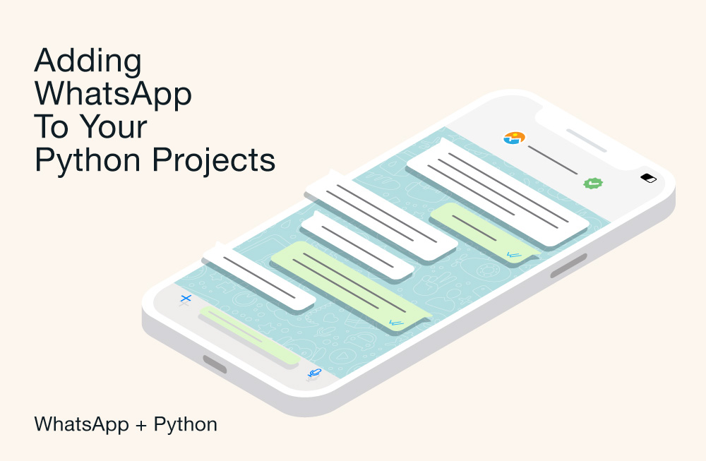

*By Dmitry Vinnik*

*Originally posted [here](https://developers.facebook.com/blog/post/2022/10/24/sending-messages-with-whatsapp-in-your-python-applications/).*

WhatsApp Business Platform enables businesses to communicate more closely with their audiences, offering tools that allow you to automate the sending, receiving, and handling of incoming messages. For example, automated messaging allows you to welcome new customers or notify them when they contact you outside business hours.

This article describes how you can integrate the [Cloud API](https://developers.facebook.com/docs/whatsapp/cloud-api/), hosted by Meta, Meta's integration of the WhatsApp Business Platform, into a Python application to enable sending and managing WhatsApp messages.

Let's dive in and explore how to create a Python web app powered with WhatsApp messaging from scratch. If you'd like a preview of where we'll end up, you can [download the complete application code](https://l.facebook.com/l.php?u=https%3A%2F%2Fgithub.com%2Ffbsamples%2Fwhatsapp-api-examples%2Ftree%2Fmain%2Fsend-messages-flight-app-python&h=AT0wUzEpdb2gTpl-r_hjQ9f_rICHwmoNhiIMTZYTAsEQW_5BSaf3d8VQp7chtXSOmRLGfQvF50Yb3eFYKpOVGhWZ_J54JKcQgB7BLIM6GG56rfdaRMxirOoJvZs5Z0KXEerit-keJqt861rvxgk7hVzD2SKk8Z1utX-yCB55QWI).

**Requirements**

To send and receive messages using a test phone number, follow the [Set up Developer Assets and Platform Access](https://developers.facebook.com/docs/whatsapp/cloud-api/get-started#set-up-developer-assets) tutorial, ensuring that you complete the steps below:

Register for a free developer account at [Meta for Developers](https://developers.facebook.com/docs/development/register/).

Enable two-factor authentication for your account:

[Create a Meta App](https://developers.facebook.com/apps/). The App Id and the App Secret will be used later in this article.

Connect your Meta App with the WhatsApp product.

Associate your app with a Business Manager.

On the App Dashboard, open the WhatsApp > Get Started menu and configure a recipient phone number. Your app will need it as a recipient for the WhatsApp messages. This number will be used later in this article.

Create a [system user](https://business.facebook.com/settings/system-users/) for your Business Account.

On the System Users page, generate a new token for your new system user, assigning your WhatsApp app and all the available permissions. This token will be used later in this article.

On the System Users page, configure the assets to your System User, assigning your WhatsApp app with full control. Don't forget to click the Save Changes button.

Last but not least, [download and install Python](https://l.facebook.com/l.php?u=https%3A%2F%2Fwww.python.org%2Fdownloads%2F&h=AT1b828Wp2Z_pjNy7v_BFDDp47FCXBL5pAql-l2Y90MnBEVwsdzuNY6KGEW2Gj4Vhl8h7h2YUwmwqsC8izkidLCf12KHKKbB-4m4zxXd_fIYf8i0N-FwKxyYZteMzlVPKPjyMUXNX92EOujTyE-I1b-KD5TM_MSF5Adkbd_Dc4g) if you haven't already.

**The App We're Building**

Our small sample application will work as an online flight reservation service. The application will use the API to provide the user with an engaging and more personalized experience than what email communication offers. When the users log in, they're greeted by a WhatsApp message. Then, when they buy a flight ticket, they receive a message confirming the purchase.

**Creating a Minimal App with Python and Flask**

This section will help you get a new Python project up and running. We'll use Jinja, a lightweight template engine, and Flask, a micro web framework.

First, open a terminal and create a folder for your project. Then execute the following command:

`python3 -m venv venv`

This command will create a virtual environment for your Python project.

Then, execute the following:

   $ mkdir myproject 
   $ cd myproject
   $ python3 -m venv venv

Next, activate the virtual environment.

`$ . venv/bin/activate`

Now, install Flask:

`pip install flask[async]`

Create an app.py file at the project root with this content:

    from flask import Flask

    app = Flask(__name__)

    @app.route("/")
    def hello_world():
    return "
Hello, World!
"

Run the app:

`$ flask run`

Then, you'll see the app running locally at port 5000:

     * Serving Flask app 'app.py' (lazy loading)
     * Environment: production
       WARNING: This is a development server. Do not use it in a production deployment.
       Use a production WSGI server instead.
     * Debug mode: off
     * Running on http://127.0.0.1:5000 (Press CTRL+C to quit)

Now, visit [http://127.0.0.1:5000/](https://l.facebook.com/l.php?u=http%3A%2F%2F127.0.0.1%3A5000%2F&h=AT0WDu32MTAjrJA4gdDBTlzeNfBkJYEGin_DtKlp7_pLkTkT-1USWvIvKLzAi8kiuc9alO1sD7_x1TDxnNioYjt5l8illBsuw6wjL4F2pa2CmloaBkdPFlS2xli2OLICG-hIa_6pVslkkYai4tf9OT08WR6hXVsE2I3HSpgiFqE) and you will see the homepage of your Python + Flask starter application:

**Creating the Sample Login Page**

To start your Flight Ticket application, you'll create a sample login form that will work as your homepage. You'll need to call the render_template function to render a view from a separate HTML file. Open the app.py file and modify it to import the render_template function:

`from flask import  Flask, render_template`

Then replace the hello_world with the index function as follows:

    def index():
    return render_template('index.html', name=__name__)

Create a new folder named templates and create a new file named index.html:

    \templates
            |--- index.html

Next, open the index.html file and add the HTML content below. Here, you're creating an example login that comes with a placeholder login and password. This way, you don't need to provide those to use the application.

For our web app front-end, we're using [Bootstrap](https://l.facebook.com/l.php?u=https%3A%2F%2Fgetbootstrap.com%2F&h=AT1z2SUAgey-HLxmcBZC1qXJIfKY1D348r0fayYD409gztr32Zw2GHeqOHD7KNGn9XL413ExVVfeES90Wdo4QM82a5wcBAIRxKK4IB035K-zFQgtxe2YRA4CVqdnPhoTgqQFyrPiVx65Pzi1lUWZ3E-KCwk3BsMJzp8jXPts9-0). This popular library will help build a consistent, lightweight UI that comes with responsive styling, allowing us to easily run our app across devices without worrying about CSS rules.
Then, run the app again to see the new login page:

`> flask run`

**Sending Text Messages with Python and WhatsApp Business**

Your Python application will need to use specific data from your Meta developer account created in the beginning of this article. For the convenience of having all of your configuration in one place, and not scattered throughout code during development, place it in a file.

Create a config.json file at the project root with the following settings, replacing any placeholders with details from your WhatsApp Business account dashboard:

    {
	"APP_ID": "<<YOUR-WHATSAPP-BUSINESS-APP_ID>>",
	"APP_SECRET": "<<YOUR-WHATSAPP-BUSINESS-APP_SECRET>>",
	"RECIPIENT_WAID": "<<YOUR-RECIPIENT-TEST-PHONE-NUMBER>>",
	"VERSION": "v13.0",
	"PHONE_NUMBER_ID": "<<YOUR-WHATSAPP-BUSINESS-PHONE-NUMBER-ID>>",
	"ACCESS_TOKEN": "<<YOUR-SYSTEM-USER-ACCESS-TOKEN>>"
    }

Your login form action tells the app to POST to the /welcome route. So, you'll need a new router to:

* Handle the "welcome" HTTP POST request.
* Obtain the configuration needed for the welcome message.
* Send a welcome message via the API.
* Redirect the app to the homepage once the message is sent. request.

Now, install aiohttp to enable your app to perform asynchronous HTTP requests:

`pip install aiohttp[speedups]`

The above code makes an HTTP POST request to the /messages endpoint on the Meta Graph API at graph.facebook.com, passing:

* The Cloud API version you're working with
* The test phone number that will receive the message (you have already configured this)
* The access token you generated for your System User

Also, note that the get_text_message_input function returns a specific data structure required for sending basic text messages.

Finally, run the app again:

`> flask run`

Then click the Login button. You'll see the WhatsApp notification popping up on your screen:

Click that notification to open the WhatsApp app and see the basic text message sent by your Python application:

So far, you've been able to send simple messages using WhatsApp. Next, you will use templates to send more complex messages.

**Creating the Flight Catalog Page**

First, you'll create a catalog of available flights and their details so that online customers can buy tickets. This data will be stored in a separate file. Create a new \flights.py file.

You now need a new route for users to access the flights catalog page. Open the app.py file and import the get_flight function:

`from flights import get_flights`

Modify the welcome function to redirect to the catalog page instead of the index page:

`return flask.redirect(flask.url_for('catalog'))`

Run the app again and click the Login button. This will send your WhatsApp number a welcome message. Plus, it will redirect you to the /catalog view:

`> flask run`

Note that there is a button to buy the ticket for each flight displayed on the screen above. Next, you will configure the application to process the ticket purchase.

**Sending Templated Messages with Python and WhatsApp Business**

A message template is required to start a [business-initiated conversation](https://developers.facebook.com/docs/whatsapp/conversation-types). These conversations can be customer care messages or appointment reminders, payment or shipping updates, alerts, and more.

Open the app.py file and add an import of the get_templated_message_input and request functions:

    from flask import Flask, render_template, request
    from message_helper import get_templated_message_input, get_text_message_input, send_message

Then, add a new function for the /buy-ticket route with the following contents:

    @app.route("/buy-ticket", methods=['POST'])
    async def buy_ticket():
        flight_id = int(request.form.get("id"))
        flights = get_flights()
        flight = next(filter(lambda f: f['flight_id'] == flight_id, flights), None)
        data = get_templated_message_input(app.config['RECIPIENT_WAID'], flight)
        await send_message(data)
        return flask.redirect(flask.url_for('catalog'))

Next, open the message_helper.py file and include the get_templated_message_input function:

    def get_templated_message_input(recipient, flight):
    return json.dumps({
    "messaging_product": "whatsapp",
    "to": recipient,
    "type": "template",
    "template": {
      "name": "sample_flight_confirmation",
      "language": {
        "code": "en_US"
      },
      "components": [
        {
          "type": "header",
          "parameters": [
            {
              "type": "document",
              "document": {
                "filename": "FlightConfirmation.pdf",
                "link": flight['document']
              }
            }
          ]
        },
        {
          "type": "body",
          "parameters": [
            {
              "type": "text",
              "text": flight['origin']
            },
            {
              "type": "text",
              "text": flight['destination']
            },
            {
              "type": "text",
              "text": flight['time']
            }
          ]
        }
      ]
    }
  })

Note that we are using the `sample_flight_confirmation` template above, where we provided the flight document PDF file, the flight origin, destination, and the date/time. You can experiment with other available templates or create new ones by visiting the [Message Templates](https://www.facebook.com/business/help/722393685250070) page.

Finally, run the app again and click one of the Buy buttons. This will cause your app to send a template message to your test phone number via WhatsApp:

`> flask run`

Now, open your WhatsApp app to see the template message.

That's it!

As you can see, sending messages with Python code can be straightforward. However, note the following tips and best practices for integrating WhatsApp into applications:

* Even if you're automating your app messages, make sure that communication with customers doesn't feel robotic. People expect a more personal experience, so ensure that you're sending more personalized messages.
* Explore a more relaxed and informal tone. However, avoid syntax or grammar mistakes.
*  Keep your text clear and to the point.
*  When using templates, provide rich context information by using links to documents, videos, or images like those used above to depict the flights related to the tickets.

**Conclusion**

In this article, you learned how to add messaging capability to a Python app by integrating it with a WhatsApp Business account.

After creating a simple Python application from scratch, you added a sample login page and configured the application to send basic welcome messages to users via the Cloud API. Finally, you added a catalog page and configured it to send template messages with flight confirmation details.

And this is only the tip of the iceberg. Want to learn how to configure [WebHooks](https://developers.facebook.com/docs/whatsapp/webhooks) in your application and configure notifications about sending and receiving customer messages and business account information? Check out [WhatsApp Business Platform documentation](https://developers.facebook.com/docs/whatsapp/cloud-api) to discover this and much more.
