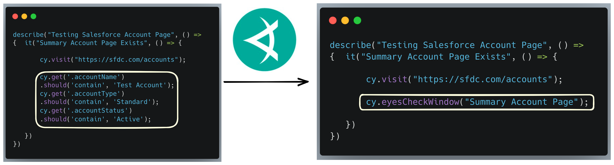

*By Dmitry Vinnik*

*Originally posted [here](https://applitools.com/blog/lightning-fast-testing-for-salesforce-with-applitools-and-testzeus/).*


Salesforce is not just one of the most popular CRM platforms; it’s an ecosystem that combines almost anything that a business needs under one roof. Gone are the days when entrepreneurs were willing to use hundreds of different tools through separate services. Nowadays, companies want everything they need in one product, under one domain – think messenger, documentation, product site, analytics, and more. That’s what Salesforce provides to its customers – a single place where businesses can conduct their work.

Since its founding in 1999, Salesforce has undergone many changes. While it’s natural for a product to evolve to meet its customers’ demands, in 2018, Salesforce introduced its Lightning Platform, which was a complete overhaul of the entire user experience at Salesforce.

With a highly dynamic platform like Salesforce, developers who create apps and integrations on Salesforce need a reliable way to test their applications. Test automation and, more specifically, visual testing ensures a scalable way of validating core functionality that your customers rely on.

**Why Testing Matters**

As with any product, we want to be confident that our application doesn’t break overnight. We need to ensure that the behavior that our customers are used to stays the same unless we intentionally want to introduce a change. This reason is why end-to-end testing is vital since it covers the core user workflows like logging in, creating an account, buying an item, and many other use cases.

While other levels of testing, like unit or integration tests, are fantastic for ensuring a short feedback loop for our developers, end-to-end tests give us the highest level of confidence that the overall product continues to work well for our customers.

Suppose we are working within the Salesforce ecosystem. In that case, we need a reliable way to test our Salesforce product to ensure that our Salesforce integration or a custom app is fully functional. 

This post looks at how TestZeus, a test automation library for Salesforce apps, and Applitools Visual AI can provide us with an optimized, efficient, and deterministic way to automate our customer scenarios by writing less code yet increasing test coverage.

**Introducing TestZeus for More Effective Test Automation for Salesforce**

TestZeus is an open-source UI automation framework that provides an efficient way to find elements on Salesforce apps. It relies on what’s called AutoLocators strategy that uses the Salesforce Developer API to find UI elements on the webpage. 

In order for us to properly demonstrate how TestZeus works, we first need to set up our Salesforce environment.

**Setting up Salesforce Environment**

Salesforce is an entire ecosystem created around its Customer Relationship Management (CRM) system. And as fun as testing in production could be, we should make a development environment with Salesforce.

Luckily, Salesforce has a highly engaging community of developers and many learning resources. One of the community members has covered in great detail how to setup what’s called a Salesforce Developer Edition instance. In this article, we will only focus on the core parts of the process (for more information, you can read the community forum).

After you navigate to the signup page, you will need to fill out some basic information about your account.

Immediately after you sign up, you will receive a confirmation email that will look something like this.

Apart from pressing “Verify Account” button, you will need to make sure to capture your instance’s URL (HOME_URL as we will call it in the test properties) and username (USERNAME in the test properties):

When you first attempt to log into the Salesforce instance, it will prompt you to create a password which we will later use as the PASSWORD property in the tests.

**Using Salesforce Developer API**

TestZeus requires us to use the Salesforce Developers API. For this article, we will need a security token for your account and a consumer key/secret combination.

Without diving into too many details, a security token is another way to authenticate the Salesforce Developer API. At the same time, a consumer key/secret combination lets Salesforce control the scope of your API calls.

**Getting a security token**

The security token is one of the components required for API authentication. To get it for the first time, you need to “Reset Security Token” through the Salesforce UI. This video goes through details on how to do it step-by-step. Ultimately, you will receive an email containing a security token that we will use as SECURITY_TOKEN properties in our tests.

**Acquiring a consumer key/secret combination**

The last piece of information we need to authenticate your tests successfully is what’s called a Consumer Key and Secret. We will need to create a Connected app that will, in turn, provide the authentication details. You can think of this step as a way to control the permission scope of the API usage.
This video walks through the steps to create the Connected app and retrieve its authentication details. In short, we need first need to create a New Connected App.

Then fill in all the required fields, enable OAuth settings and choose the necessary scope (as shown in the video):
Following the app’s creation, you must click “Manage Consumer Details” to retrieve the authentication information:
This new window will show us the exact data we need: a Consumer Key and a Consumer Secret

In our test, we will later use this information as CONSUMER_KEY and CONSUMER_SECRET properties.

**Functional Testing with TestZeus**

Now with all the necessary information and demo environment set up, we can proceed with writing our tests. For this article, we put together a small project that you can see here. We will first walk through this code to show how to use a TestZeus framework for testing a Salesforce application and, later, add a visual testing component using Applitools.

**Preparing Test Scenario**

For our article, we will do a primary case of validating UI for a test account we create beforehand.

In your Salesforce instance, navigate to Accounts and click “New account”.

Then we will create an Account named “Test Account,” and our test scenario is ready to be used.

**Setting Up TestZeus**

First, we need to clone our demo project:

`git clone git@github.com:dmitryvinn/applitools-testzeus-demo.git`

Our demo project uses Java programming language and Maven as its build system. Hence, we encourage you to use an IDE like Intellij IDEA to simplify the development experience.

After you open the project with your IDE of choice, you must use Maven to build the project and download all necessary dependencies. One of the critical dependencies we are relying on for this part of the article is TestZeus dependency:

```
<dependency>
            <groupId>com.testzeus</groupId>
            <artifactId>Test_Zeus</artifactId>
            <version>1.0.2</version>
</dependency>
```
The next step is to fill out all the required properties we will use in our tests in the config.properties file. So far, we have covered all but the APPLITOOL_KEY property, which we will discuss later.

Writing Our First TestZeus Test
In this article, we explore a simple use case of validating an account we created beforehand.

For brevity purposes, we will skip going into the general Selenium Webdriver code and focus only on specific details around TestZeus.

First, we need to authenticate our test, so we can use the Salesforce Developer API to work with data objects, retrieve specific selectors, and more.

In BaseTest.java, we have the following method we invoke in our setup() to handle authentication:

```
private void authenticateUser() {
    HTTPClientWrapper.SFLogin_API(HOME_URL, TOKEN_GRANT_URL, CONSUMER_KEY, CONSUMER_SECRET, USERNAME, PASSWORD + SECURITY_TOKEN);
}
```

Then, we need to create a new test named AccountsTest.java where we will have our #findTestAccount() test case.

We will begin our test scenario by Arranging it, or in other words, by setting up our test case.

We will first initiate an SFPageBase with the current webdriver instance and then navigate to the home URL:

```
final SFPageBase salesforcePage = new SFPageBase(driver);

salesforcePage.openHomepage(HOME_URL);
salesforcePage.maximize();
```

Now, we will proceed to log into our demo environment:

```
driver.findElement(By.id("username")).sendKeys(USERNAME);
driver.findElement(By.id("password")).sendKeys(PASSWORD);

final WebElement loginButton = driver.findElement(By.id("Login"));
salesforcePage.safeClick(loginButton);
```

In the next step, we will transition into the Act portion of the test case, starting with test-specific actions.

We will use TestZeus’ SFBasePage to navigate to the Accounts tab and open our “Test Account”:

```
salesforcePage.appLauncher("Account");

final WebElement testAccountItem = driver.findElement(By.xpath(String.format("//a[@title='%s']", TEST_ACCOUNT_NAME)));
 salesforcePage.safeClick(testAccountItem);
```
Lastly, in the Assert stage of the test case, we will validate one of the fields shown on the UI:

`driver.findElement(By.xpath("//p[text()='Account Owner']"));`

As we can see, TestZeus helps simplify waiting for UI elements, navigation, and working with Salesforce Objects.

Now with this highly efficient way of locating UI elements using TestZeus, we can take our test automation to the next level with Applitools and visual testing.

Taking Next Steps: Functional Testing for Salesforce apps with Applitools and TestZeus
Functional testing is a type of testing that focuses on the core functionalities of an application while following predetermined steps. In other words, it’s a way to evaluate a scenario with two potential outcomes, failure or success, using the same input.

While there are many functional testing levels like unit or integration testing, end-to-end tests give us the highest confidence level in customer use cases. It’s also one of the most expensive types of testing since it takes a lot of effort to write assertions for every single element of the app and then keep maintaining this workflow. But not with Applitools and Visual AI analysis.

With the Visual AI in Applitools Eyes, rather than writing assertions focused on just one object, Applitools lets us capture the entire web page or mobile app screen, then send it to the Applitools Visual AI for analysis.

**Simplifying Functional Testing with Applitools**

This visual testing allows us to see our app from our customers’ points of view. And that’s where the Applitools Visual AI comes in! This AI-based visual testing tool can enhance the existing end-to-end test coverage to ensure our app’s user experience conforms to the expected design.

Using AI algorithms, Applitools allows developers, testers, and product/business teams to effectively compare visual elements, with corresponding baselines, across various screens to find visible defects in your test environments. This way, you can prevent functional and visual defects from escaping to production and affecting your customers negatively.

Applitools has integrations with numerous testing platforms like Cypress, WebdriverIO, Selenium, and many others. This article will showcase Applitools with TestZeus to add visual test coverage to our Salesforce app.

**Setting up Applitools**

Applitools has fantastic documentation on how to get started with the project. For this article, we will first need to register with Applitools and retrieve an APPLITOOLS_API_KEY for our config.properties.

We will also add the following dependency to our Maven build:

```
      <dependency>
            <groupId>com.applitools</groupId>
            <artifactId>eyes-selenium-java5</artifactId>
            <version>5.39.0</version>
        </dependency>
```
Now, we are all set to write our test cases with Applitools.

Visual Testing with Applitools and TestZeus
By using this great starter project, we can quickly enhance our existing test suite with visual test automation using Applitools.

First, we will create a new test class named AccountsApplitoolsTest.java. Then, we will need to add some additional setup code to enable Applitools and its Ultrafast Grid, so we can scale our tests in the future.

```
    @BeforeAll
    public static void setUpConfigAndRunner() {
        runner = new VisualGridRunner(new RunnerOptions().testConcurrency(1));

        config = new Configuration();
        config.setApiKey(APPLITOOLS_API_KEY);

        final BatchInfo batch = new BatchInfo("Salesforce Accounts Page Tests with TestZeus");
        config.setBatch(batch);

        config.addBrowser(1024, 768, BrowserType.CHROME);
    }
```

In the above code snippet, we set our tests to be run one at a time (the limit for free Applitools accounts), specified the Applitools API Key, and chose Chrome as our test browser.

The next step is to “open the eyes” which is an API terminology for starting visual testing for our test suite:

```
    @BeforeEach
    public void openBrowserAndEyes(TestInfo testInfo) {
        eyes = new Eyes(runner);
        eyes.setConfiguration(config);

        eyes.open(
                driver,
                "TestZeus Demo",
                testInfo.getDisplayName());
    }
```

Now, similarly to the previous example with TestZeus, we will have a new test named findTestAccount(). One of the best things about using Applitools is that we don’t have to make any additional changes to our test scenario! So everything from Arrange to Act steps will remain the same:

```
    @Test
    public void findTestAccount() throws Exception {

        // Arrange
        final SFPageBase salesforcePage = new SFPageBase(driver);

        salesforcePage.openHomepage(HOME_URL);
        salesforcePage.maximize();

        driver.findElement(By.id("username")).sendKeys(USERNAME);
        driver.findElement(By.id("password")).sendKeys(PASSWORD);

        final WebElement loginButton = driver.findElement(By.id("Login"));
        salesforcePage.safeClick(loginButton);

        // Act
        salesforcePage.appLauncher("Account");

        final WebElement testAccountItem = driver.findElement(By.xpath(String.format("//a[@title='%s']", TEST_ACCOUNT_NAME)));
        salesforcePage.safeClick(testAccountItem);
```
The only change we will need to make is in the Assert part of the test case. Here, we will have code to validate that the page loaded correctly and that its layout matches between test runs. We could also validate a snapshot of the entire page with Applitools, but Salesforce apps are known to have varying load times. So the layout match level helps to avoid false positives:

`eyes.check(Target.window().fully().withName("Test Account").layout());`

We are almost done! To make sure that our Applitools tests are closed correctly after their run, we will need to add this @AfterEach method:

```
public void cleanUpTest() {
        eyes.closeAsync();
}
```

With this, our first test with Applitools and TestZeus for the Salesforce app is complete. Let’s visit our Applitools Dashboard to review the results:

**Wrapping Up**

Salesforce is an ever changing ecosystem of apps and products under one platform. That’s why tools like TestZeus are beneficial in simplifying both the creation and, more critically, maintenance of our tests.

Combined with testing automation platforms like Applitools, we can take our testing infrastructure to the next level by focusing on scale, cross-platform support, and a short feedback loop.