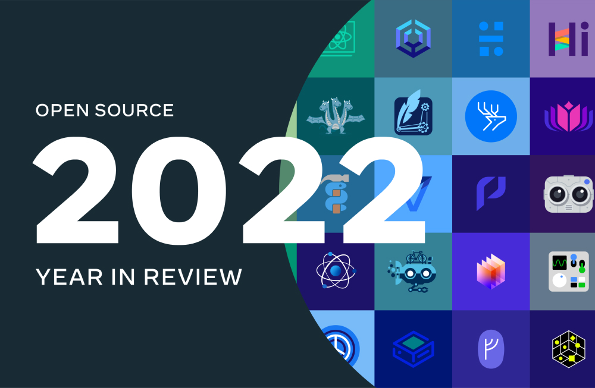

*Originally posted [here](https://developers.facebook.com/blog/post/2023/01/17/open-source-2022-year-in-review/).*

This past year was one of renewed human connection and community for many people around the world. This theme carried over to open source work at Meta, as contributors, users and organizations congregated to further the impact of open source.

Projects made public by Meta address developer needs and challenges—from powering next-generation AI to building innovative, user-friendly web apps and experiences—while the open source community provides a conduit for sharing technologies and building on them collaboratively.

This post explores highlights from Meta Open Source and how Meta helped to build open source community in 2022. It also covers updates on tools and code that Meta and its engineers have shared, including major developments for PyTorch, the release of React 18, the introduction of Sapling’s source control client and more.

**Moving to foundations: Expanding openness, collaboration and reach**

Diverse perspectives and contributions strengthen open source, and Meta actively seeks opportunities where working with existing foundations can achieve shared goals. A number of projects from Meta have moved to a foundation this past year, in order to further democratize the open source resources they offer and expand their governance.

In September, the PyTorch framework for AI joined the Linux Foundation, through the formation of the new PyTorch Foundation. The board, which includes industry leaders, intends to expand over time and will serve as stewards for outreach efforts as well as business and product marketing of the technology.

The graphic shows Meta has 1,034 active non-archived open source projects as of 2022.
Jest began moving to the OpenJS Foundation this past year. The open source project is one of the most widely used JavaScript testing frameworks. Goals for the foundation include making the project more accessible to new users and developing new features.

Meta is committed to further driving innovation in open source projects it donates to foundations. In 2022, Meta deepened its collaboration with the Presto Foundation, upgrading to the foundation’s highest-tier membership level. Meta also sponsored PrestoCon Day and PrestoCon, the foundation’s first in-person conference.

**Driving impact through open source outreach**

Members of the Meta Open Source team gathered at the All Things Open conference for a team photo in October 2022.
Caption: The Meta Developer Advocates and additional members of the Meta Open Source team at All Things Open this past October.

Meta Developer Advocates and Engineers sought out impactful opportunities for outreach throughout the year, and they learned from experts and organizations across the community while sharing knowledge of open source projects launched at Meta.

Developer Advocates and members of the Open Source team at Meta attended the 10th anniversary of All Things Open to represent Meta Open Source. Prior to the event, Engineering Director Killian Murphy shared thoughts on how Meta is working to break down barriers for open source contributors and striving to make open source available to all. Meta is committed to setting a high standard for welcoming all who wish to use and contribute to the technologies it has open-sourced.

The graphic reads "At a time when the open source community is larger than ever, Meta is optimistic about the potential for open source to become more inclusive and, in turn, more empowering." Killian Murphy, Engineering Director
The Meta Open Source team also crewed a booth at All Things Open to broaden awareness of projects from Meta and meet developers who use those technologies across research and industry. Developer Advocates and Engineers also spoke at the event.

Blog posts from the Meta Linux Kernel team highlighted their ongoing research and development. The posts included how to join the Linux community. 11 members of the broader Meta Kernel team presented talks at the 2022 Linux Plumbers Conference. You can find the complete list of talks on the event website. The team also launched a Meet the Developers series featuring several Meta Engineers who presented at the conference, which covered topics such as an overview of the BPF networking hooks and user experience in Meta, kernel live patching at scale and many others.

The graphic shows there were 252 new open source projects and repositories published by Meta in 2022.
The Meta Linux Kernel team supports the kernel's direction in ways that improve its use at Meta and increase the health of the broader community. The team works closely with the upstream Linux kernel community and ensures projects are designed for inclusion upstream and land upstream kernel-first.

On the Meta Open Source blog, the Hasher-Matcher-Actioner Contributor’s Story highlighted the work of MLH Fellowship Recipients Franklin Phan and Samyak Mehta, and Meta continued its support of the fellowship in partnership with GitHub and Major League Hacking.

The Meta Contributor’s Story series shared successes and challenges of contributing to open source along with best practices for getting involved in the community.

**Building momentum in the open source community for VR/AR**

The metaverse aspires to be a place where people can gather and interact with one another in new, innovative ways. To create a metaverse that is successful for all, it needs to be built upon a foundation of strong community while incorporating diverse ideas.

Open source communities, with their inherent “build together” mentality, are a natural starting point to help steer important conversations that will shape the metaverse, and Developer Advocates from Meta shared in the conversation. Navyata Bawa continued the “Fostering Inclusivity in VR” series at the Global Women in Tech Network Conference in June, and she explored how VR applications can be built with accessibility and inclusivity as work in VR/AR continues to grow.

In the Stack Overflow Podcast episode, “Here’s what it’s like to develop VR at Meta,” Developer Advocate Manager Cami Williams shared how Reality Labs can learn from—and build a bridge to—the React community, along with some of the tools and resources to get started developing for VR.

Graphic reads "Build diversity from within. Not just in the users and playtesters, but also among the developers. Only then will we be able to design applications that accurately represent and accommodate for a large audience, by learning from these diverse lived experiences." Navyata Bawa, Developer Advocate, Reality Labs
As part of Meta’s commitment to expand community presence and provide tools for creating within the VR ecosystem, Quest showcase samples were released on GitHub. To help evangelize these tools, Bawa created the “Building Your Multiplayer VR Experience” series for the Oculus Platform SDK and Unity SharedSpaces sample, as well as the tutorial “Building Intuitive Interactions for VR” for the Interaction SDK andFirst Hand samples.

The “Summer of Open Source: Moving Virtual Reality Forward” blog post featured some of the latest innovations in the space from Meta and highlighted an interview with Software Engineer Eric Le Saux on The Diff episode 14. Check out the AR & VR playlist for more recent conversations with Meta developers, tutorials and resources in this space.

**Advances in AI/ML**

2022 was a big year for PyTorch and new models from Meta AI designed to empower everyone from researchers to creators. Here are some of the ways Meta advanced the training, optimization and deploying of AI models.

**PyTorch updates**

After moving to the PyTorch Foundation (under the Linux Foundation), PyTorch 2.0 was introduced at the PyTorch Conference, held in New Orleans in December. Numbers shared at the conference show how much growth PyTorch and its community saw in 2022 : 63 percent of AI research implementations chose to use PyTorch, while according to GitHub data, the number of GitHub repositories using PyTorch increased by 45 percent from the previous year.

PyTorch 2.0 brings years of research together to improve its compiler performance while upholding the PyTorch experience that users already know and love. Updates include one-line speedups with torch.compile, 100 percent backward compatibility, and an all-Python compiler.

**Meta AI models hit new milestones**

Model training and optimization frameworks help create AI models that can take on real-world tasks in complementary ways to people’s skills. This reciprocity is evidenced in language translation, where AI models can learn hundreds of languages, even those spoken by only a few people. In 2022, Meta AI introduced the No Language Left Behind AI model that translates 200 different languages with state-of-the-art results, along with an evaluation dataset and respective open source code. These open source efforts can help improve models to translate critical documents and preserve low-resource languages.

The image shows that there were 186,210 commits made to public Meta repositories in 2022. 159,723 were internal, while 26,487 were external.
Meta open-sourced CICERO, the first AI agent to achieve human-level performance in the complex natural language strategy game Diplomacy.* The integration of a language model with planning and reinforcement learning algorithms gives CICERO the ability to reason and strategize with regard to players’ motivations, then use language to reach agreements to achieve shared objectives, form alliances, and coordinate plans. There were many other moments in AI and open source that are not covered here, and more AI-related stories can be found on the Meta AI Blog.

**React 18 and other updates in web/mobile**

Beyond the news of Jest beginning its move to the OpenJS Foundation, Jest 29 was released in August. The project surpassed 40,000 stars on GitHub in the second half of this year. Another key moment in web and mobile was the launch of React 18, with support from the public React 18 Working Group. This included updates for concurrency rendering, with additional features and supporting APIs. Check out the efforts to update the React Docs Beta alongside the release, including Effects documentation and Quick Start.

In September, Meta’s React Technologies teams joined core contributors and library maintainers for the React Native Core Contributor Summit. Discussions at the summit explored the current and future ecosystems of React Native and Metro, and attendees established active initiatives to improve the React Native ecosystem.

The image shows that there were 7,353 total contributors to Meta open source projects in 2022. There were 3,727 internal and 3,626 external contributors.
Among other projects Meta open-sourced for web and mobile, Js-flipper is an NPM package that exposes a Flipper client to JavaScript apps and allows developers to easily create new Flipper plugins or reuse existing ones. Another project, MemLab, provides JavaScript memory testing that automates memory leak detection.

Finally, Meta developers shared insights into how they build with, and build for, open source web and mobile technologies. One blog post investigated a Hermes bug report—and how the report led the responding team to program an exploit that ran the 1993 version of Doom within Hermes. Another featured a new Chromium-based WebView, which provides a better experience for users of the Facebook in-app browser for Android.

**Developer tools: Source control, documentation tools and other advances**

Developers at Meta use open source tools built at the company to support its infrastructure. These tools are often tested and improved in day-to-day work at Meta, resulting in open source projects that meet unique challenges of scale and speed.

In 2022, the Sapling team introduced a new Git-compatible source control client. With usability and scale in mind, Sapling is a source control system that aims to share what developers at Meta have refined for over ten years, in order to inspire further work in this area and show developers a potential future for source control systems. August brought the release of Docusaurus 2.0, a performant static site generator, extending its use of React and its support of websites beyond documentation.

Graphic reads "In 2022, Meta Open Source gained additional 133,854 stars on GitHub, bringing the total number to 1,563,562 stargazers."
Additional updates to projects included a new deadlock detector for Android, added lazy imports in Cinder and a preview of the next-generation OpenStreetMap editor RapiD 2.0. Another project, Hermit, introduced a practical deterministic operating system that allows developers to solve problems like flaky tests and control for implicit inputs such as thread scheduling, random number generation and more.

One of the broader posts published shared how Meta developer tools work together as part of a developer's workflow, many of which are open source. This included projects like the Buck build system, SuperConsole, EdenFS (a file system closely integrated with Sapling), the Jest testing framework and other tools.

Discover additional articles and releases covering developer tools in 2022.

**Data: Updates on Velox, Presto, and RocksDB**

The open source C++ library, Velox, was announced in August 2022. Velox is an evolution in energy reduction and performance gains for data engines. The library uses native execution and is being integrated with many tools at Meta as a unified execution engine layer.

Velox is designed to greatly reduce code maintenance and has performance increases from 2x to 10x in various use cases. Learn about Velox’s growing community and its innovative refactoring of how big data engines and databases execute data queries in the paper “Velox: Meta’s Unified Execution Engine,” published at VLDB 2022.

In the last year alone, the Presto open source project on GitHub had 21 releases, gained just under 2,000 new stars, had 600 new forks and 152 new contributors. The Presto Foundation hosted its first in-person event, PrestoCon, at the Computer History Museum in Mountain View, CA, where Tim Meehan gave a keynote as the TSC Chair, and Philip Bell announced the direction of Presto for the coming year.

In December, the RocksDB team resumed their annual in-person meetup at Meta’s Headquarters in Menlo Park, bringing together Meta Engineers and external collaborators to discuss use cases, new innovations and aspirations for the project.

**Security and hardware**

Security and hardware play an important role in supporting the work of developers. From debugging tools to networking hardware, open source at Meta can help make sure that systems and code are robust, secure and reliable.

Earlier in the year, a contributor’s story shared work on Pysa, a Python static analysis tool under the Pyre-check project. The story highlighted how building healthy open source communities can directly impact the success of projects like Pysa, in this case resulting in increased security of code.

In hardware, Precision Time Protocol was deployed across Meta’s networks and data centers. The technology provides new levels of accuracy and precision for clock synchronization in distributed systems. In conjunction with the Open Compute Project, both the hardware and software designed to support the protocol were open-sourced to support industry adoption.

In 2022, Meta continued open sourcing work within products like WhatsApp and Messenger. Code Verify, open-sourced in March, is a browser extension that lets developers protect the integrity of code in WhatsApp Web and Messenger by visualizing if the code on a web page may have been tampered with or altered.

**Thank you to the open source community**

This post has covered just a few of over 1,000 Meta open source projects and their updates in 2022. To explore more of these open source projects, visit the Meta Open Source website and follow us on Facebook, Instagram, Twitter and LinkedIn. Special thanks goes out to the community of contributors, users, organizations and partners who collaborate with Meta on open source projects.

At Meta, we believe open source accelerates the pace of innovation in the world. By sharing our code, our stack and even our hardware designs, we're aiming to move the industry forward while giving other companies and individuals a chance to use our solutions to scale more quickly and build great products.

*This post was written in collaboration with Meta Developer Advocates Dmitry Vinnik, Suraj Subramanian and Cami Williams.*