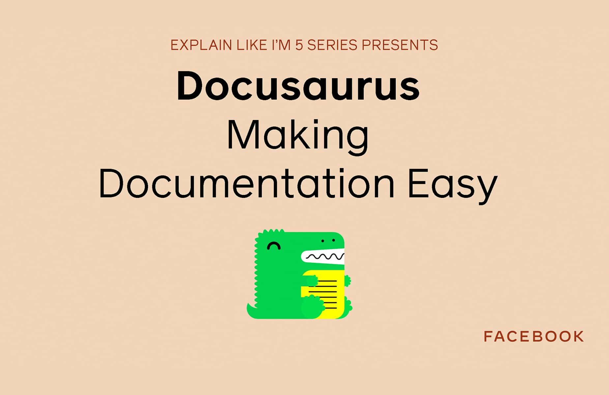

*By Dmitry Vinnik*

*Originally posted [here](https://developers.facebook.com/blog/post/2020/11/30/eli5-docusaurus-making-documentation-easy).*

In this post, we will briefly talk about [Docusaurus](https://l.facebook.com/l.php?u=https%3A%2F%2Fv2.docusaurus.io%2F&h=AT3X6nzDri3X9nvwmLEmCj1SfaNY9QXh-r6s_n04V3g-WTX8uSXR0gJiEfz33gWxnptSPR07rnVr7m5Fh_xprosZBEzYUdXVOfnEQ3Z4pLKbSCxnLrRPA7o_BWGYQP05MVyTKWIHtCJs3BOgypFKaAc2t7okEz_UUasYHawwD_w), a website building tool that makes it easy to develop, maintain and deploy a documentation site. If you prefer to learn about Docusaurus in a [short video](https://l.facebook.com/l.php?u=https%3A%2F%2Fwww.youtube.com%2Fwatch%3Fv%3D_An9EsKPhp0%26feature%3Dyoutu.be&h=AT3T6b0RAVu5PDaRxarX2ZRPoK9KveKX6VfjsR9y71ZPS5Yzq55fMk21Gb3C5nLTKoswhrKqGXzuKaJ43hVwgWUM3_jztATdRm2BonWOOGGyZluzWmQ1H0MNrXcA7fO5DSQtWwtFMNU0Z1JllLUs-MuO1whfXrh38FYS9RywSTM) rather than a blog post, go to the [Facebook Open Source YouTube channel](https://l.facebook.com/l.php?u=https%3A%2F%2Fwww.youtube.com%2Fc%2FFacebookOpenSource&h=AT2tSr1EGZjNft_DI0F3Z03GFhfeOjzuB9Smg3TOY2B_75YbJCEY9-kJwsLpZx8NmPC8BhtmH7GONikNYGPvcRWFNiWyct-W_dDOqPx_9Z6DWKBT_PbeQf_C1_IGfiXJi1AhAWdOLo8h8HfB7J20vc_7NyjTJGWkfU2BMlzdw6M) to watch another episode of [ELI5](https://www.dictionary.com/e/slang/eli5/).

**Why Docusaurus?**

The top open source projects on GitHub have their own documentation sites that contain an overview of the project, short getting started guides, in-depth tutorials and project blogs. These resources are key to the success of any open source project, but building, managing and deploying them can be a lot of work. Unless you're using Docusaurus.

 
<iframe width="560" height="315" src="https://www.youtube.com/embed/_An9EsKPhp0" title="YouTube video player" frameborder="0" allow="accelerometer; autoplay; clipboard-write; encrypted-media; gyroscope; picture-in-picture" allowfullscreen></iframe>
 

[Docusaurus](https://l.facebook.com/l.php?u=https%3A%2F%2Fv2.docusaurus.io%2F&h=AT2fRKmxk9zHJLTZXD4RtLM2p2-KJX9xi1wbJd86UylUCan8WcGajU5JTLY1OaA5iGnnmq4aO_QCL9MDCrtQM1wdi-6BDR4oGf4MfN_v06kgp0fwbgHQ0ACWnEEkDAdWD3tLpQZ-t1WyfK-81RErceSmoKT-xtPyhPb8z7q1YnM) is an open source project for building, deploying and maintaining websites. This project's main goal is to get you started with your website in a matter of seconds. Beyond creating the site, Docusaurus emphasizes speed of both developer and end users by following the [PRPL pattern](https://l.facebook.com/l.php?u=https%3A%2F%2Fweb.dev%2Fapply-instant-loading-with-prpl%2F&h=AT0qNhSIgZrOvnvMZ4FiDAYXXXxQVuO9C8iIWuNWMH6axubCQZQOHnj2KBszZ0gDQY1UDOTx0xHtH0qv_vQlLivu5lTV9Cyt2_bDXb5Kpn51s1F46ri1yWK9vDqyPtu33w2WEuTd61oZH8LoUi5C6t8lchZ1vRYJ0j2k7EDi3Og) and by relying on an incremental build for content changes.

Docusaurus allows developers to use tools they already know like [Markdown](https://l.facebook.com/l.php?u=https%3A%2F%2Fen.wikipedia.org%2Fwiki%2FMarkdown&h=AT1ZdiEQ_2XHzvxVpqKNJJFrIau1ZjaxTiZY7AHsqerYUY6-bwm9v9WvDK4wSt0IEiOTdKa2a9Wo8aWbX1Xw_jI2__9T-QO07FpBGKEDZum2pILOgnyNRlnFvo6g10wyI-J-8RCvlWoIBE00K7qlYwn3GNsTlgD7f0SO4rzty10) or [MDX](https://l.facebook.com/l.php?u=https%3A%2F%2Fmdxjs.com%2F&h=AT1P9ZTLvq3N01sH_g1_ovohlsBP4kCyR9R7aiDWAY_WCO7o2irYjceLeGshE1enT8Lp8lNxHwScGNvmgggTDDg460tG5tf4EykO2rENnOfWWk5t3w1lbHC8RzZUsV442jVdHmfRwaiDYLfvwGFW64cioEEGgD80pwcCLlLQeEk) to write documentation or blogs. With [React](https://l.facebook.com/l.php?u=https%3A%2F%2Freactjs.org%2F&h=AT2fPLScvTnqfSKGZpwpapzWyz-D-A7vgu0dxjsIdrLS1vru4sAXTrOgY8EWlA_cOEtSNqJE18RXgCOEx6CjTGrKfxk7Sgqarn51_jHjp035HgNqU66q-5ZYMH269WvpvmvSdnJLLWyFLhDb4-YMl2v3eQqQPN0OEgUy1-wD0vU) as the backbone of Docusaurus, developers can customize their website to fit their use case.

This website building tool also comes with search and localization features. Projects built with Docusaurus leverage [Algolia](https://l.facebook.com/l.php?u=https%3A%2F%2Fwww.algolia.com%2F&h=AT2DNt9sZl-WEWArpwuh2CmBBAI08ABIFqn4lB9FzODo76YuTrnWeoMfCIjfK_yHZ8qEDYPfFEZtz1btwrSH7H1wn0YxSueq1e0WJF0giCu0bY3y1n-JAehdVRlmZsXVznzrNob724BjLZB7DLywFCM6bnDNLa1k2-5-PT5WTKg) for a built in search engine and [Crowdin](https://l.facebook.com/l.php?u=https%3A%2F%2Fcrowdin.com%2F&h=AT1nScY6Eq-wTfsjFI_U0Dg3N2TKFTIWYEDjnryQxLS6oHCOm9qGP037oA-tGrIHKsd78yD8-FUKOwWnrYSo2o2v5BkjZc3fg3cGnz_PA34tBjPMdMzrSHmdLN9JIHafmK_TsaLanlk-nkAFEBqUaBfjqX-HI541y-NxSqY00xI) for language support.

The cherry on top is that you don't have to manually update your documentation every time you update your code. Docusaurus automatically syncs docs to project releases so that you can spend more of your time working on the things you care about.

**Where is it used?**

Docusaurus was first released to the public by the Facebook Open Source team in [2017](https://docusaurus.io/blog/2017/12/14/introducing-docusaurus). Since then, this project has been used by a large number of the [Facebook open source projects](https://l.facebook.com/l.php?u=https%3A%2F%2Fdocusaurus.io%2Fen%2Fusers&h=AT1QbJFVna9KdhA8U2maFRBaBIOhcpHg4D2PNq_nfArXSoTP1U23nYaoEEJ-B3YwPiT70Ph25o_nsOe0kxHlwlnz9OgtNdPwNV6ZGfrNT3EOEEpyeh7b7rlo7IvQoW0Q91ScMAvNXOhxtjpeDMknA6iec2m-33752Q6dc6bOPWQ) and by over 100 external projects.

**Where can I learn more?**

Want to learn more about Docusaurus? You can find [extensive documentation](https://l.facebook.com/l.php?u=https%3A%2F%2Fv2.docusaurus.io%2Fdocs%2F&h=AT1nb0ifeUyxcDuUcB26XvJAo7s0--rbcZJQzdRDURj-kItOjL7-5GTlZA3X4corqOoRGb_meMxf1-yaNz-SjoSaXdCFnDgzR8lfyq1ohaVfczXd4ZySlEYCU-VGg280cCIL-GT7WVFPJYZgS4OvvoZEcv9kS7Tnp3ZO6X60rg4) and [tutorials](https://l.facebook.com/l.php?u=https%3A%2F%2Fv2.docusaurus.io%2Fdocs%2Fcreating-pages%2F&h=AT2ssB55wVwaDX0ckCvjr5jiCemoN-nAeNwyAPeop2rkK5VT_SLqCcviHpEdCtaNmqfVHtr9t-7D_XhvR5esTXCvKmtg7XUcBWfy7tVAAHEDKMzALc_khRO4gMuFxEaRUMCGufn95zzhmSNen7qohT9UT8EBvpwD0GZ5mflaAmk) covering a wide range of topics on building and customizing your site. If you want to engage with the community, feel free to join the [Discord channel](https://l.facebook.com/l.php?u=https%3A%2F%2Fdiscord.com%2Finvite%2Fdocusaurus&h=AT1OZtWs2K7im24VWIpu8twcJl6BmdTJnUbjvUMhWuERJ3lUBG5fJfJuddJHqdcf4jOIIkVYMyEnGY548gbG2oYSad8U-W_AN5fwNrKdhn1CXSqC737i5ipuInr_L7eWDC1EzWZ5iqhYn6jLeR-va6b7TIpyXcDu7aDO6LuEss8) or talk to the team on [Twitter](https://l.facebook.com/l.php?u=https%3A%2F%2Ftwitter.com%2Fdocusaurus&h=AT0tW3S6B4-dh6oip2h-EWun9jkFUOuA5jZskZzftyFhytF3u3hT1IGJbfq8EYPdTcVHa2c5MyYMF4I2OhRDN9WxgV3WjHCM0L-QA7BFro49PWfeb3Is7iHn68fNNe4qMXWsKhnqvpln5QTIBFro5mcEy1AT33R8Iz3jzyAyBZM).

If you want to see more content about [Docusaurus](https://l.facebook.com/l.php?u=https%3A%2F%2Fv2.docusaurus.io%2F&h=AT26Z3NuJuF3pop8AdChaxNxOKK1TJoVumahV0gnAQYSgG5Gjg_enWvLyq4h6gcuK256Q_OdFpDN-tL53AEK4dtTUXHESI43IH2ztmLrfu3h7ysBBfQgjYfhBOodyempvK_FKd7UlRvaZraZGYI4vDiMK8LoqpXN2zUvmnZ7hbU), let us know on our [YouTube channel](https://l.facebook.com/l.php?u=https%3A%2F%2Fwww.youtube.com%2Fchannel%2FUCCQY962PmHabTjaHv2wJzfQ&h=AT2s-I0b9k1EjzFCoXAtKZUTQs45LhZZVBQL5UXR-PCM4aL0LUsDoxO63mH9iABUA45tX1X1zujfElSv3a3aWDrIscj1WKVYlzXk3uLLsWB7Trikwr1OPNgVMMmLQNXGr6H7rWUM5psVVJP8yO14ViMkdsFhgdP41L12l8yWcYY), or by [tweeting at us](https://l.facebook.com/l.php?u=https%3A%2F%2Ftwitter.com%2FfbOpenSource&h=AT0ByDHnDtiB713Um6ikFrJ2oBhL2W-R1lLV1q1afNqoFsa87RKT2Rkk8lBd5vVbl3Maiqi-26UZlARmdVTDXViOi32sdsBVL0GvEiaCOw_1aAJP2tKO7KLwYv22-MMAw7K69gqQSxmSDSsoVZ72j05vQtooDcLCdvJJP4eWz68).

**About the ELI5 series**

In a series of short videos (~1 min in length), one of our Developer Advocates on the Facebook Open Source team explains a Facebook open source project in a way that is easy to understand and use.

We will write an accompanying blog post (like the one you're reading right now) for each of these videos, which you can find on our [YouTube channel](https://l.facebook.com/l.php?u=https%3A%2F%2Fwww.youtube.com%2Fchannel%2FUCCQY962PmHabTjaHv2wJzfQ&h=AT02V3b7CMOiX7GnRnKTEKW6WIAspuTqHa1wccMq7xwkmIOplQGRiYYYH7mDrrZiNWgPBk-jd7nhkpAGmfe23NlDJLpxVe_AFxiSWpBTryJlDebk5LRRPTCBP85Rj3e7r3Upq5Yu6GOR3UtigVXHzz0YxLI6LbkTRo5F-wmD-iE).

To learn more about Facebook Open Source, visit our [open source site](https://opensource.facebook.com/), subscribe to our [YouTube channel](https://l.facebook.com/l.php?u=https%3A%2F%2Fwww.youtube.com%2Fchannel%2FUCCQY962PmHabTjaHv2wJzfQ&h=AT1BHdWkyX8mjeI1nqij72ihhusD7dHIxw7EARSgdhI7hLb_gRtByaxFHE8crVUnqwOutGAhozTX3xNQ1MH9A9EdmsIeZCAAu4X3twsH9BKa-9ExDu40RCIeNABZcxP6JfNQ0dYbor_GPV14KhJRRuURh8hIwYNg0tcxika3rG0), or follow us on [Twitter](https://l.facebook.com/l.php?u=https%3A%2F%2Ftwitter.com%2FfbOpenSource&h=AT3DoypdZye7DI3ZBfRlvAHjRxchVDIK9Y4we2URlbKaOC61NEgphitqqjI2l5BC2Slc5h1TlNvNoWQ9ufBLkUQRPf8y_sS6Kxw2PGZ761HFC86cCXRJvGZrbPSCMlojzcfeu2pWfMAE7nNikXzpHY73WKsdzeiGJXSPm4Lwbls) and [Facebook](https://www.facebook.com/fbOpenSource/?ref=aymt_homepage_panel&eid=ARDXvVAPwnpPxsaQUtdpdrWV6jhb5mz67ET63dJme3yZIeS0ACffMtUeMkdUFwe3UjT61YNDIy_rXwdD).

Interested in working with open source at Facebook? Check out our open source-related job postings on our career page by [taking this quick survey](https://l.facebook.com/l.php?u=https%3A%2F%2Fwww.surveymonkey.com%2Fr%2FV76PRN3&h=AT35mi1rO96LV1thARDZxGSSe36xpMc9ZCbt4HuceNmqUSUuGKO6pQAFgcKMMfXR-XWF9k0u-q4ssvdSaTvDzzeR3gByi4Z_qLk95pe2uDmrZQFRqj0yORYfsGcYt2eUq47UlruOlngnXgVvzALLL1ZGa7MGMsE4lwSOo3JJbNE).