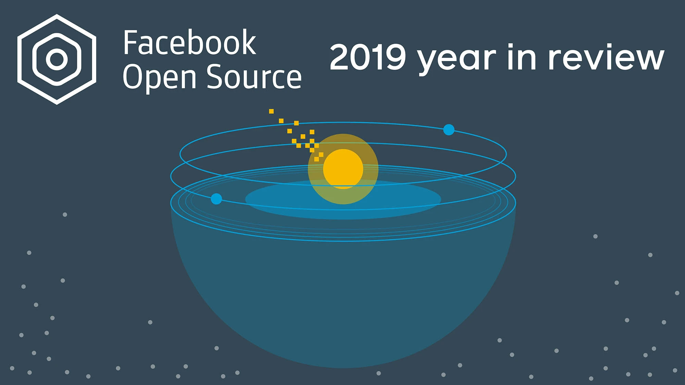

*By [Dmitry Vinnik](https://engineering.fb.com/author/dmitry-vinnik/ "Posts by Dmitry Vinnik")*

*Originally posted [here](https://engineering.fb.com/2020/01/13/open-source/open-source-2019/).*

Last year was a busy one for our [open source](https://opensource.facebook.com/) engineers. In 2019 we released 170 new open source projects, bringing our portfolio to a total of 579 [active repositories](https://opensource.facebook.com/). While it’s important for our internal engineers to contribute to these projects (and they certainly do — with more than 82,000 commits this year), we are also incredibly grateful for the massive support from external contributors. Approximately 2,500 external contributors committed more than 32,000 changes. In addition to these contributions, nearly 93,000 new people starred our projects this year, growing the most important component of any open source project — the community! Facebook Open Source would not be here without your contributions, so we want to thank you for your participation in 2019.  

  

**Foundations and partnerships**

We also continued to work toward our goal of collaboration and support of open source projects. One of the ways we worked to achieve this goal in 2019 was through foundations and partnerships with organizations that are passionate about their respective communities.

In 2018 we collaborated with the [Linux Foundation](https://www.linuxfoundation.org/) to announce our [intent to form a foundation to support GraphQL](https://www.linuxfoundation.org/press-release/2018/11/intent_to_form_graphql/). A year later, the [GraphQL Foundation](https://foundation.graphql.org/) is thriving and the community is expanding with new members. The foundation is holding true to the initial promise of expanding its audience and recently launched a [free course on building web APIs with GraphQL](https://graphql.dev/news/2019/10/31/linux-foundation-training-announces-a-free-online-course-exploring-graphql-a-query-language-for-apis/).

[Presto](https://prestodb.io/), another Facebook open source project, also [became a foundation hosted under the Linux Foundation](https://www.linuxfoundation.org/press-release/2019/09/facebook-uber-twitter-and-alibaba-form-presto-foundation-to-tackle-distributed-data-processing-at-scale/). In the newly established Presto Foundation, the community carries on the task of distributed data processing at scale while keeping a neutral governance model to better enable collaboration and diversity in the community.

**PyTorch**

[PyTorch](https://pytorch.org/), an open source deep learning platform developed at Facebook, experienced [rapid adoption](https://ai.facebook.com/blog/pytorch-adds-new-dev-tools-as-it-hits-production-scale/) and an expansion of its [ecosystem](https://pytorch.org/ecosystem/) in 2019. During our annual [PyTorch Developer Conference](https://developers.facebook.com/videos/2018/pytorch-developer-conference/), we announced major updates to the platform, such as the launch of [PyTorch Mobile](https://pytorch.org/mobile/home/). This new platform allows for an end-to-end workflow for PyTorch models to be deployed on mobile devices while keeping performance and optimization concerns in mind.

In addition to the platform itself the PyTorch ecosystem has gotten many new projects under its belt this year. The main idea behind these additions to the PyTorch toolkit is to allow users to focus on the task at hand while abstracting complex operations like handling security or privacy. One such project is [CrypTen](https://ai.facebook.com/blog/crypten-a-new-research-tool-for-secure-machine-learning-with-pytorch/), a framework for privacy-preserving ML. While using this framework, ML researchers can use the familiar PyTorch API to perform complex cryptography operations. Another addition this year is [Captum](https://ai.facebook.com/blog/open-sourcing-captum-a-model-interpretability-library-for-pytorch/), a model interpretability and understanding library. With this project researchers have access to more information about why their models work the way they do and are better able to explain the results of their models to others.

While the goal of the ecosystem is to provide all the tools necessary for a researcher’s success, we also understand the importance of a seamless experience when navigating the platform. This is why we added support for [Google Colaboratory](https://colab.research.google.com/), a free Jupyter notebook environment, to our [PyTorch tutorials](https://pytorch.org/tutorials/). The ability to test a script right in your browser makes our platform even more welcoming for beginners who want to try things out and for advanced practitioners looking for a particular trick to solve their problem.

**Mobile and web**

[React](https://reactjs.org/) and [React Native](https://facebook.github.io/react-native/) remain very active and continue to lead our web and mobile open source offerings. Both were showcased in our [technical](https://www.facebook.com/watch/?v=1752210688215238)  [talks](https://www.facebook.com/FacebookforDevelopers/videos/440768533157155/) at F8, in [classroom sessions](https://www.facebook.com/FacebookforDevelopers/videos/564758133932771/), and through [our podcast, The Diff.](https://thediffpodcast.com/docs/episode-7)

As mobile applications grow more sophisticated we are increasingly focused on improving the developer experience for portable devices. In mid-2019, we released [Hermes](https://engineering.fb.com/android/hermes/), an open source JavaScript engine optimized for mobile apps. With this project in the hands of our users, particularly React Native developers, we were able to significantly improve app performance even with constraints like low memory and slow storage.

Our efforts to improve mobile development go beyond the development itself — they also cover connectivity and mobile networks. Earlier in the year, we open-sourced [Magma](https://engineering.fb.com/open-source/magma/), a platform that helps operators deploy mobile networks in a timely fashion. This project provides the necessary tools for automating mobile network management, such as element configuration and software updates.

**Hydra**

In late 2019, we released [Hydra](https://engineering.fb.com/open-source/hydra/), a framework that simplifies the development of Python applications by allowing developers to compose and override configs. With [Hydra](https://hydra.cc/), developers can change how their product behaves by changing configuration files instead of making code changes to accommodate new use cases.

**Blockchain**

We were especially excited last year about our work on the blockchain front with [Libra Association](https://libra.org/) through our subsidiary [Calibra](https://www.calibra.com/). [We first announced](https://www.facebook.com/notes/david-marcus/libra-2-weeks-in/10158616513819148/) Calibra as part of the Libra Association in June 2019. The association is tackling the extremely complex challenge of launching a high-quality medium of exchange for cryptocurrency. It will be exciting work to observe in the coming years.

Overall, it has been an excellent year for open source, with many new projects being released and existing communities growing more rapidly than we expected. We want to end this post the same way we started it — by thanking all our internal and external contributors, those who use our open source tools and frameworks, and those who give back to the community. We appreciate you and look forward to working with everyone in the years to come!

To learn more about Facebook Open Source, visit our [open source site](https://opensource.fb.com/) or follow us on [Twitter](https://twitter.com/fbOpenSource).