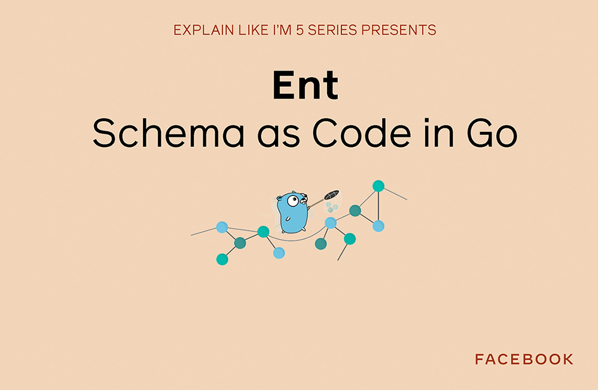

*By Dmitry Vinnik*

*Originally posted [here](https://developers.facebook.com/blog/post/2021/04/26/eli5-ent-schema-as-code-go).*

In this post, we take a closer look at an open source project called Ent, an entity framework for Go, in a way that is super simple to understand or as it's commonly known online, [ELI5](https://l.facebook.com/l.php?u=https%3A%2F%2Fwww.dictionary.com%2Fe%2Fslang%2Feli5%2F&h=AT3NrxfjK51SrTtIjUg1rrYGHTvXSfTpdWyvKBQ-aWekNO_6UozM-WOUNwxvtjXQUsjXpChPD1wzj8XGPbmDQDUPFX6q5I3v1G5SyjL0NL8RuxKYiIpDOt0hPh8yBUOFX_f59HfAVxJI9FhHdwJMJJhtknGCDn7EoDsFYhoIwnU). If you're interested in learning by watching or listening, check out a [video](https://l.facebook.com/l.php?u=https%3A%2F%2Fyoutu.be%2FRCzeYg-_dbU&h=AT1cPz-NPWpiH-c5UCdxh9Y3h7gMABhYrvz0VPC5X7t8zd7Y6vk4Y6pW5HhIzD2D-CxMiFIkqXRihl35QKvf1J8IX_YeImdYAmxM3zM0UZXQak-U4l_LnlBRzDnWt1Y2V22XfR11SfXyTzjttOq5hlHtFVbeLT1siCRSSTTGrEg) about this open source project on our [Facebook Open Source YouTube channel](https://www.youtube.com/c/FacebookOpenSource).

**Ent**

What do most applications do these days? They interact with data in one way or another. As your app's scale increases, it becomes more challenging to manage databases, schemas, queries, and constraints. These challenges are why a technique called [Object-Relational Mapping](https://l.facebook.com/l.php?u=https%3A%2F%2Fen.wikipedia.org%2Fwiki%2FObject%25E2%2580%2593relational_mapping&h=AT2XEcxEEBWrLbnvgJQAsT5qylg-wU6xB9tzkaPvT-50nhg4wWS5Xlf9lGPRQbP2UQgSR8igX5cWekcABkxKCRCGA8i_dkcBrJ1BPQvOX80DOLeLFUs4UVouXyjjLOO4N98zkFgqnlxQkFKzly5OauAENkQ54vSq4yzmA0nO19U), or ORM, was created. It vastly simplifies your app's development by limiting how much you work with raw [SQL](https://l.facebook.com/l.php?u=https%3A%2F%2Fen.wikipedia.org%2Fwiki%2FSQL&h=AT20MfR6yvvzQsc2YHnIGxhbs1osFie1RPrnZX0UlGtWwe2lYAxzMbSopefpt_Bn1ayTHLAlzXXahqj8u97k08gGJzYgQZ9HZoGBWGCUmtCfexHePHhg9NP_kMGFd9t5iWpEgTjlqHBsB4JAzwcBvUHk105-8KBjgwtZ3C_vkAE) and, therefore, keep your database more secure, your code less repetitive, and your app more robust.

At Facebook, we tend to think about data modeling in graph concepts like with [GraphQL](https://l.facebook.com/l.php?u=https%3A%2F%2Fgraphql.org%2F&h=AT3_hqzQPH3liwe8CRzNKYWQwKoVQ-r8y95dLfu-kx916FurjnSr3LQwt8YHKACzW6QSIzxgSzLFbz6xG1sW00De2wQiVkK6Ps_JR2pDfJXcqrgrf_7APrYX-Vrf6tB_CVQDP1BNq6hSRuG6SkfcjCl-F57RH_0ykCjb30kRfwE), a query language for API. As we were working with [Go-lang](https://l.facebook.com/l.php?u=https%3A%2F%2Fgolang.org%2F&h=AT0VgJ4sgA1KKSDEcn6bYT1jmifnSTEUmpqxg2LPsW72GEvv25qOX4m6lDSgs4bNwLdx2cLLUoQkM3G1wYDxdUyvckd2mr9kra138vpmWX5WDHYwmLjm0FFSwOsMt2bxjStHRNveGeU29JVunHltg4Pxcy4h5D1L54FcPw4SrQk), we had been looking for a way to get the benefits of ORM while interacting with [Graph-based data models](https://l.facebook.com/l.php?u=https%3A%2F%2Fen.wikipedia.org%2Fwiki%2FGraph_database&h=AT2Dd_JU6Fn4Ck0AQraLfPp4QXJfqgVRAL4Yt0SrflfiPKr3ZkUu7nnUy0ydFbbCITSPha1QGwzJYSIyAXL9gCbPP6_ZSFy9RQL_per8fnaGV9m0wD8z1ZbAV9FrNkoS1qFur3pIVaxkQWaoezC1ZivJ2tHI9YGL6_JFpnAtGsA). This search led us to create a new open source project, Ent.

 
<iframe width="560" height="315" src="https://www.youtube.com/embed/RCzeYg-_dbU" title="YouTube video player" frameborder="0" allow="accelerometer; autoplay; clipboard-write; encrypted-media; gyroscope; picture-in-picture" allowfullscreen></iframe>
 

[Watch the video](https://l.facebook.com/l.php?u=https%3A%2F%2Fyoutu.be%2FRCzeYg-_dbU&h=AT1l_dUBSkVsv3NBOdwT-KCBK4S15W0BfdplrxsiVtuMzrDsNQqbpP03S4kh1NXB7NPNhwCinLsvJ2oTolJ_4oz96kiVQiH7xVo0N8SH3asKHVCCrsQcl1ugHS2VYriQgNKf1Tqkutwxeo-mm15bpXa2QARY9Rx8RhYm3zPv_nU)

[Ent](https://l.facebook.com/l.php?u=https%3A%2F%2Fentgo.io%2F&h=AT3TdHKc8zuiHOO0xcEHw6fwBaWzdDZ0rTqpLzAUmIsA6kUyNwwJJEozbt7yopvB3SEOiCROOveDX6EcnBXNoT6WkCdjeFhYy3Yr7U_C8_Spau6I53UYgM_QcVV5omHgm3WI3igP3XkrNHflohPc-jKRJosZaOBXEMHJwY4OKtY) is an entity framework built for Go programming language. This framework provides developers with a Graph-based, Object Relational Mapping.

With Ent, data schemas, including types, relations and constraints, are treated as code. Ent lets developers avoid context switching and continue working with Go while using Go.

Ent's static types and explicit API make it very accessible for new developers. In return, this increased efficiency leads to more robust code.

Ent is very much declarative where operations like queries, aggregations and graph traversals are kept simple because there is no need to write raw SQL.

Lastly, Ent enforces a storage agnostic approach where its users are not bound to any particular technology. For example, during the development of Ent, the [Facebook Connectivity team](https://l.facebook.com/l.php?u=https%3A%2F%2Fconnectivity.fb.com%2F&h=AT0Hm1JpHqIkxZdbngSUcyDzG-LK_P1cyvq-EFJiooSmxBdTTmDDhDLc4kDvNbNHU87mPSWU5PH_Cg3AuV7AsGg2RbUSg8FI1nGbb8G3ZfF5GGjq91FWcCrwIXz3YHAtEDCQunXwB89w3_yfO85KagP4R7Sxh3bSGL9f3oFEC8E) was able to migrate from [AWS Neptune](https://l.facebook.com/l.php?u=https%3A%2F%2Faws.amazon.com%2Fneptune%2F&h=AT3DHyPxcKDjoO-kDLeViUkEPvwY4bjSybH4iyStPkL38mAjat-hYq9i8qqcdrV5tKJNJoiTS3dLBByEnM9Wj6hPFJcIl9RbJJ5jm89R6-oXZQAikZahgrtoKF87cL39qDEpVkd0QR98Pz1lrdkimKsFrAlMVVxDNQisMDozw_WN4Oc1F14SAFP-) to [MySQL](https://l.facebook.com/l.php?u=https%3A%2F%2Fwww.mysql.com%2F&h=AT1tOCwcMncjdqQuQoekJs8kgqoSQoAuUUK0M8CBIdKY6Dd0REh8WjNkTIp0jjBA6AxVzgJH6zMSXGoSy-A-u4NXNbt5fBnQKg9E1YZJwiNtCRNH4RvNx-q5zkWo-JMOsKD3kv85oAYsxZW1wvk1LHnRapvzvGfI0JK7h4caIEg) seamlessly.

**Where is it used?**

Ent was open source in [2019](https://l.facebook.com/l.php?u=https%3A%2F%2Fentgo.io%2Fblog%2F2019%2F10%2F03%2Fintroducing-ent&h=AT0ishekXsOpzJcXNFbjtvTrZbcyVg1KHs99apV45JuqsFXbWDqqSpDc7cKs8JJNSdLziBXXRylZIveHa2L1aDlEymGQUQnVZYEg08GEQEy3DZtUZqh23fi7-RD6FgXmhsr0a_YTV8uSg4EDwnU8PfHyBAn9hvcTV5zv0aEKlS03wqAd-mKjgwuK), and it has been actively used by the [Facebook Connectivity team](https://l.facebook.com/l.php?u=https%3A%2F%2Fconnectivity.fb.com%2F&h=AT2xAJxZhzhCwEwFYSsWCcUIjcCMKka7Ihux6xd6MYqb4poFsUUb06b8BXVD7BKlyWwW5vsDz5bEuA98uYOoeCjkPNOiAFvyErFpvAd_mhbe9nbCXIywL6nWWdjuF9oNSg3OFmLLGPNi-bGCU6fVyG7W3aD9uBYo3lscnaqjqFk) and [several external projects](https://l.facebook.com/l.php?u=https%3A%2F%2Fgithub.com%2Ffacebook%2Fent%2Fwiki%2Fent-users&h=AT1q4XJUOP0mgdEoIqowuFBsHoSwGnyQsaS7U1phc8FUhi2QK6YEQz-N25YwMx5paHWou8x289XemLqvm3bBJgAgADvPdR5xejbsmXAne5vanNQ3fdUN-upAJJ7Fcw5uYM_VFRjLlI72uAPFpNOD7BqiKexLZEkuRRW5MZBYOg4).

**Where can I learn more?**

Are you interested in learning more about Ent? The project has [excellent starter](https://l.facebook.com/l.php?u=https%3A%2F%2Fentgo.io%2Fdocs%2Fgetting-started%2F&h=AT3B0liWQ0Sn5WXYWDBtclPxwQi0HdzMa1ekKExBHoYxvgqMVUHdHGaYOyp68Ag1AiimWrmiEJa6HiNhmU0uK-K4i9thdr_DR-lEHyLlw1Owj0d048e1rsn0WTAT_9J6PNlLr6ww_PjRVw0y532E29H-p71QHuVNBRy7rIG96YM) and [advanced](https://l.facebook.com/l.php?u=https%3A%2F%2Fentgo.io%2Fdocs%2Fmigrate%2F&h=AT2VePmZl_TVVagE6bRminwH4_D0IhgnZQP0HxRNQ9fuUnYeBoF2knbiq1wxfwZtmrMHlhwyf4_lAn5TWzcqzlhXOost0UMalQcxEQ0vWr6xMonEDiJlIFMgeaVUzF7__45LRYz3m-SeB2E0_5kHDtaRFgpDUtEDAgFPMP_04RM) documentation and a growing following on [GitHub](https://l.facebook.com/l.php?u=https%3A%2F%2Fgithub.com%2Ffacebook%2Fent&h=AT3tM1qtM8gRqf7CUVn3Eh7PraxcGNVRRx4xArQFkZLDvOe82VPw-uH631p7vivNBOfRfDxmuF0gX75dU695qLCFTQ_AvU50G6xKM6TrZZnFaLQBf_If4XfaztFFm56L5r5ufQddNU3kCh0yyKY-tQucUOGlEqta6ooRaRwPscg). If you are keen on using Go, we invite you to look at [GoDoc](https://l.facebook.com/l.php?u=https%3A%2F%2Fpkg.go.dev%2Fgithub.com%2Ffacebook%2Fent&h=AT2KUwAR3A6irFkzaWRT8vP9bwf8Jj6bklcN1hQmy9DXl7bXSSGQ-SPvj-Hvtl8XZpF6MmVrHSw8uXlFQEhjrhCAeXGGv5SE_cUNbp8MxmC0oyYPd0JbPcHGYAmFiWPNLOY2xGSkDz8fHyQOn08Gge2KHNKEXM3tYnG2oLzTr9o).

If you have any thoughts or questions about [Ent](https://l.facebook.com/l.php?u=http%3A%2F%2Fentgo.io%2F&h=AT2WJOH2RvZRJbL6lEs88qQJPpl5kOwHFJxW1iJU36GUmMWnMZ4UNUWsL0MHk8HwTYw1fM4QmMpkndVG2v77hnILoZdFuCoF2qrVw1_z7xc9m0VIIleIUda40GGayjOGckIoCG6TIGGFJMOa64lAKKZdyJ09bjXghma10lnamfg), let us know on our [YouTube channel](https://l.facebook.com/l.php?u=https%3A%2F%2Fwww.youtube.com%2Fchannel%2FUCCQY962PmHabTjaHv2wJzfQ&h=AT1C4U5jADSSN2EeafU5yD6j2yNqkd_n5S0bA4DhrsVtzwS2N5paqWM6Aajs64bALBkEj4P6hPrZY_4F2GbJrA6V59mU-M9l3vKxil4pap0RtlisJvjC0-9P-_IX9CS60xXP7koWt_-6wA16KthmJM3ftLJwYCB2feCsKEXyEZs), or [tweet at us](https://l.facebook.com/l.php?u=https%3A%2F%2Ftwitter.com%2FfbOpenSource&h=AT08SIJ4o7zRsVJa9UsNeGK-dSLscx6m-s56Debdd7qF5vF60AxAIIIkdQqW7-my7gpbLlx7Zd3Mvh3daoKjdXBb7ldGGn-lI_lMMFrO-15G3HKZrAhr_vSz_9hwhaF8nEoPReJJttcc755vS-oqd-pPy1k6ke2p2p57PN-ZT-g).

**About the ELI5 series**

In a series of short videos (~1 min in length), one of our Developer Advocates on the Facebook Open Source team explains a Facebook open source project in a way that is easy to understand and use.

We will write an accompanying blog post (like the one you're reading right now) for each of these videos, which you can find on our [YouTube channel](https://l.facebook.com/l.php?u=https%3A%2F%2Fwww.youtube.com%2Fchannel%2FUCCQY962PmHabTjaHv2wJzfQ&h=AT2Focg5qX_z_DJSMhYoao1MZYUfRrw4iL-OHIgH5a78rRg7OXkk7z_GyN7TLw4YtG4ouwUPGwLIalSeFmxv1emSFgcV0BACHrsRKDUwGs7B13z8iKURQ4GGH_CVQ5uiJd9W6ewvFqhQdVijknOVxpdOoZxxPjsx6lVRIs-737Y).

To learn more about Facebook Open Source, visit our [open source site](https://opensource.facebook.com/), subscribe to our [YouTube channel](https://l.facebook.com/l.php?u=https%3A%2F%2Fwww.youtube.com%2Fchannel%2FUCCQY962PmHabTjaHv2wJzfQ&h=AT0DnCxEvk7sLIpXsrD1d7FLOHsYUq_oqLC2WHNyTcCb9k52Pkg9p9jonzgIvGBVTH2EpHdLqq6GM-6ss7uXDdFmWlc29ZML2tNoCjUHocjIngoWC1X_dP-NHMvqRZwgmwP9hON6l7VmIJWfASS_yUgRd-cH7OKBFx4lKipPhKI), or follow us on [Twitter](https://l.facebook.com/l.php?u=https%3A%2F%2Ftwitter.com%2FfbOpenSource&h=AT2055AGy7-v_JkV22NULj7R_vPr5oe6aKDdEmRgDHcmqV2zrFIY0RqpmEgTZt6RaM3lJSJ1X2_3hHYV_VYIRULDL-TLnDomurEEJB-T9Jrna2kqbKzFSklqCftqKxZ5DCSAAzDRaK9mfAuyN_lYgha9Fzfz2XACQL4Szcegh_k) and [Facebook](https://www.facebook.com/fbOpenSource/?ref=aymt_homepage_panel&eid=ARDXvVAPwnpPxsaQUtdpdrWV6jhb5mz67ET63dJme3yZIeS0ACffMtUeMkdUFwe3UjT61YNDIy_rXwdD).

Interested in working with open source at Facebook? Check out our open source-related job postings on our career page by [taking this quick survey](https://l.facebook.com/l.php?u=https%3A%2F%2Fwww.surveymonkey.com%2Fr%2FV76PRN3&h=AT186PDYgJwT6yzmd0Wp3rEl58ppuuxVqFbz2wEDjnzJWMYeCDje8YWh9ZqS6MCnfBB0HbXMFdH4lv6hqYdb456_4Wo2FUOg6PAWaMXaQzj6Dw3GBII4B9UCtZ8mM3Ep-lf8nWUeSf_F1GAblak_swV8kSb_raObWN6vPUqcDLo).