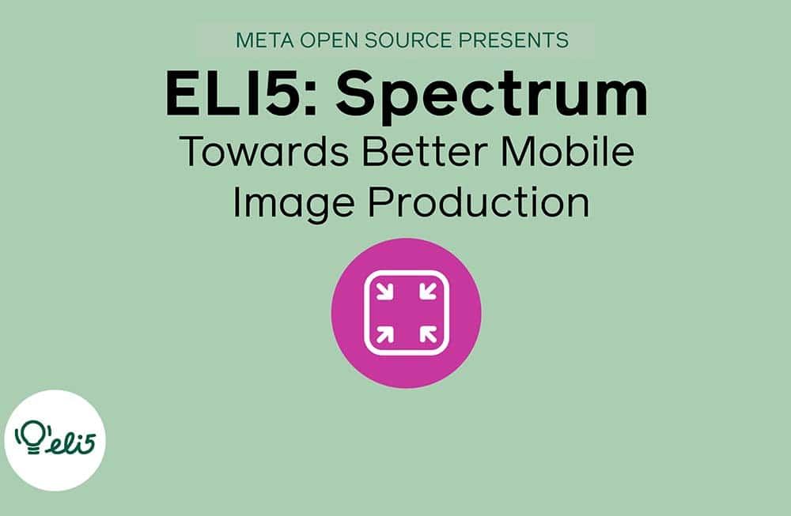

*By Dmitry Vinnik*

*Originally posted [here](https://developers.facebook.com/blog/post/2021/11/29/eli5-spectrum-towards-better-mobile-image-production/).*

In this blog post, we explore a popular open source project called Spectrum, a cross-platform image processing library. We cover this open source project using the [ELI5](https://www.dictionary.com/e/slang/eli5/) style of explaining things in simple terms in the shortest amount of time.

If you prefer to learn by watching, we also have an accompanying [video about Spectrum](https://l.facebook.com/l.php?u=https%3A%2F%2Fyoutu.be%2FkEHZJ4CvyeI&h=AT0FAVeQbGjIg494mPM6Ij2gDf9Yslyd-hjQlXDcQgTdewuyocCcDq-W476voQTy198gL4FNO5ItBfgo1hELdQHWK36J5MHtUTPP3ROitYHYshqmUgIg6XgGA4aJRhGz-B_6j-5yrD71ONvofh1aZ1HiJXwx2GVRt4KOyB4vxB8) on our [Meta Open Source YouTube channel](https://www.youtube.com/c/FacebookOpenSource).

**Why Spectrum?**

Spectrum is a client-side image transcoding library. It means developers can easily integrate Spectrum into an Android or iOS project to perform common image operations efficiently.

 
<iframe width="560" height="315" src="https://www.youtube.com/embed/kEHZJ4CvyeI" title="YouTube video player" frameborder="0" allow="accelerometer; autoplay; clipboard-write; encrypted-media; gyroscope; picture-in-picture" allowfullscreen></iframe>
 

[Watch the video](https://l.facebook.com/l.php?u=https%3A%2F%2Fyoutu.be%2FkEHZJ4CvyeI&h=AT3KPrBHgycXhvtja843-jPMUpxFPK8ZleUyPP_DEOgGL_6DdSybwpgIy0Fz7LWbzPdIF-WhCzIePqlIUJBrnhd-1vMacWDAl95GPCH7AdtrkRhs_J9s5gpkSxkT8MKiCzXOqR-kgRDtjUviHv44bl2V6e96f6VwXssI7hfRh04)

This library allows developers to upload high-quality images while reducing their size. Smaller image size means lower data consumption and improved upload reliability for you and your users.

While it might sound complex at first, Spectrum focuses on developer experience to make the learning curve less steep. Spectrum's API is declarative, so you only need to define the image's output characteristics, and Spectrum does the complicated orchestration for you!

**Where is it used?**

Spectrum was first open sourced in [early 2019](https://l.facebook.com/l.php?u=https%3A%2F%2Fengineering.fb.com%2F2019%2F01%2F17%2Fdeveloper-tools%2Fspectrum%2F&h=AT3cg-r6fImTwK96643kvs8i1H9ty7G57SM7-wUEAODuHQnRtB1Ufakvp5flJAhke7c5hc7UqjsQkaLOm6Dnmtu1kW7ISGX-FSK1g24a9b1XdbvH9gjthXvmIv4Qvn-Ckth9PbC2WspSGjcV-sxxWdgvViJNWaI7L0Ty-AKGJKo). Since Meta first implemented the project, Spectrum has significantly improved the reliability and quality of image uploads that our apps handle on a large scale.

**Where can I learn more?**

To learn more about Spectrum, visit [their website](https://l.facebook.com/l.php?u=https%3A%2F%2Flibspectrum.io%2F&h=AT042IbSiHT-XzcV-dyre1B3ssf3Cymah01uS5Ok1jO5xBRQ_yUpW5O-CHa9GjwSsIJx8YJVOMuN3syBAN4aziFtXmycSyr0mKYxogcfGX8ISBKF_dAv5ElrRCich1wUGq7CN6XLMBrY8M-mkVbAeFgxK7d9uakJEUjA65yvo_E). It has a [getting started guide](https://l.facebook.com/l.php?u=https%3A%2F%2Flibspectrum.io%2Fdocs%2Fgetting_started_android&h=AT2BS9TSNXtVN1tOhAaJjzytNxELhhPk3lHSDeGhVPx_Wxh3nBZKbnDD_4HqSD2l9cv04xTbKP7HaQQ8w_YLzMCD0X8bimjQOp0XuXCCNcw96DaHo49UWfMe0j3b_ZBXI05t4dC7c7Zi461NYKBuJy1TnhMBtXwyfANzD15lNLBQQYxKxkfprUP_), [sample apps](https://l.facebook.com/l.php?u=https%3A%2F%2Flibspectrum.io%2Fdocs%2Fsample_apps&h=AT3_sW6_53EceYVQ4K9RbN13Y-E8hYi_39oM7oGHJGPfz3c0xiwd4pFj4zW9C9z-HpcK8A7OVOi0xmRpj2VNfQBKS-s6cAKKrOFJMKIf3jaH6fut3Zs2PIwt6IqM0Vt3wo5zslfDUFkQEiTlWD89blthLmKG01EywEdJ7arK7SM) and [documentation on contributing back](https://l.facebook.com/l.php?u=https%3A%2F%2Flibspectrum.io%2Fdocs%2Fproject_structure&h=AT33SaNhChtcbN5pWcQM3lSGtvf0mIw84MEh1nzZ-2BkTUbovVdN6nYi9c4Ay-lOhFK7GeNmBtu4YBeXDU9E_SxdavNCc3AudPhLcdLrcQEayokj0_kzMe1o1eN_Dp5zX1Btuiwfa7p-p9xq3n-ma5Q-SprWpDxARottHsEKNw4) to the project. For troubleshooting, feel free to ask a question on the [project's GitHub page](https://l.facebook.com/l.php?u=https%3A%2F%2Fgithub.com%2Ffacebookincubator%2Fspectrum&h=AT3_-CZa4tbTQy4-bsDlibU4LFyPS2ipRscW5aVxOkXA7V_JlRhQ8pfcPjq_HSOtLJfJjKJyHhvF66HFGE2RABYnU5eq7rbPJvK_B1oQULSAzCPYOxEJsHXmEmFd6_JdSUgtPCq2jRfAwCS_9PzoHoiAVrbLzvhh9D2svvHBLqM).

**About the ELI5 series**

In a series of short videos (~1 min in length), one of our Developer Advocates on the Meta Open Source team explains a Meta open source project in a way that is easy to understand and use.

We will write an accompanying blog post (like the one you're reading right now) for each of these videos, which you can find on our YouTube channel.

To learn more about Meta Open Source, visit our [open source site](https://opensource.facebook.com/), subscribe to our [YouTube channel](https://l.facebook.com/l.php?u=https%3A%2F%2Fwww.youtube.com%2Fchannel%2FUCCQY962PmHabTjaHv2wJzfQ&h=AT2VJeTZrKYB0zUZuHWYdgL5OFxeARp9WcPeH5QDABMzgKNUujOuOC9Dmad9D7Y7yumPHehYZa4nwJthJY8wZPphRqzvIC1blTxz5tNJOzKrKtThHz19CdKWdoOZ1t7q50m8-NlV-p03RSmoIimayOYqHVym_Y1AzK1i57waKrg), or follow us on [Twitter](https://l.facebook.com/l.php?u=https%3A%2F%2Ftwitter.com%2FmetaOpenSource&h=AT3YrT-fr7o7oqAY9CwYiLOGqwYurtfaglOqMPjpdTCeLTGClykQmNmth_0zuA5hqttc9vnBiTrCLBmYPcVQIaNd9kC9c3SIuhTeG-EXyhNXYOh39AQNzz5dg2qwEV_c4BRePc_3Tztvp6z6wxbijsfIMfJhRp0nkEGsdICb0m8) and [Facebook](https://www.facebook.com/fbOpenSource/?ref=aymt_homepage_panel&eid=ARDXvVAPwnpPxsaQUtdpdrWV6jhb5mz67ET63dJme3yZIeS0ACffMtUeMkdUFwe3UjT61YNDIy_rXwdD).

Interested in working with open source at Meta? Check out our open source-related job postings on our career page by [taking this quick survey](https://l.facebook.com/l.php?u=https%3A%2F%2Fwww.surveymonkey.com%2Fr%2FV76PRN3&h=AT0lrsy26WpmW1Hxfg3tpLkLfwLNnEGBgSvcftzTRfvuUDZpuFPwGV4rovNf-7f1OlBnMXfUrtNvJ3HQfZ0cfHI1BecL8It4j5GTLCsMkNtzh_ZSrrjm0wHqlFx0wxo6CH5hSWKnN9c7L22vZ_iAdc40LdYcKB8YE4vRtV_Ax9I).