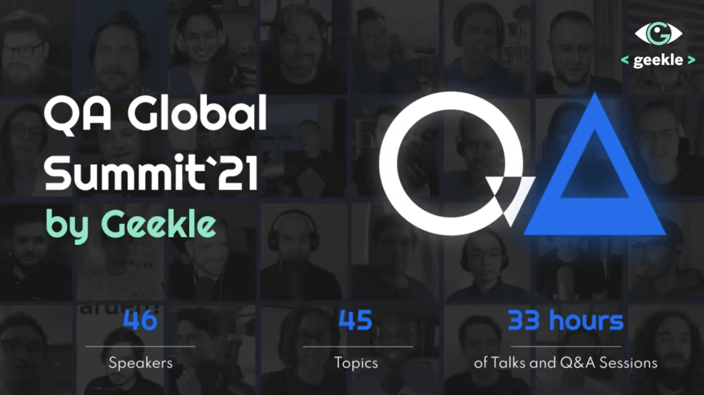

**Title**

Career Path and Development in Testing

**Recording**

 

<iframe width="560" height="315" src="https://www.youtube.com/embed/ySRc-juTbrc?start=23955" title="YouTube video player" frameborder="0" allow="accelerometer; autoplay; clipboard-write; encrypted-media; gyroscope; picture-in-picture" allowfullscreen></iframe>

 

**Overview**

In this speaking panel, we discuss future of testing, shifting left approach and how to grow as a testing professional in tech.

**Location**

Virtual

**About the Engagement**

Geekle has the unique experience to gather huge tech summits with 5'000+ attendees in different tech domains. Now we hope to make something the world has never seen before for the QA Community.

Read more [here](https://dvinnik.dev/events/2021/qa-global-summit).
