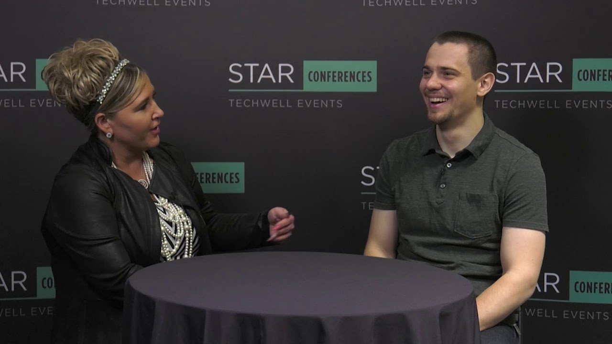

**Title**

Overcoming the Challenges Facing Remote Employees

**Recording**

 

<iframe width="560" height="315" src="https://www.youtube.com/embed/o_ZSiD5ZteI" title="YouTube video player" frameborder="0" allow="accelerometer; autoplay; clipboard-write; encrypted-media; gyroscope; picture-in-picture" allowfullscreen></iframe>

 

**Overview**

In this interview, Dmitry Vinnik, lead software engineer at Salesforce, discusses the value of attending conferences in person as opposed to just taking advantage of the online presentations. He also addresses the challenges of being a remote employee and methods of overcoming those challenges.

[Link to the post](https://www.stickyminds.com/interview/overcoming-challenges-facing-remote-employees-interview-dmitry-vinnik).

**Location**

Orlando, FL, USA

**About the Engagement**

TechWell Corporation is the leader in software conferences, training, and certification covering Agile, DevOps, Test/QA, Requirements, and more.

Read more [here]().

**Recording**

 

<iframe width="560" height="315" src="https://www.youtube.com/embed/o_ZSiD5ZteI" title="YouTube video player" frameborder="0" allow="accelerometer; autoplay; clipboard-write; encrypted-media; gyroscope; picture-in-picture" allowfullscreen></iframe>

 