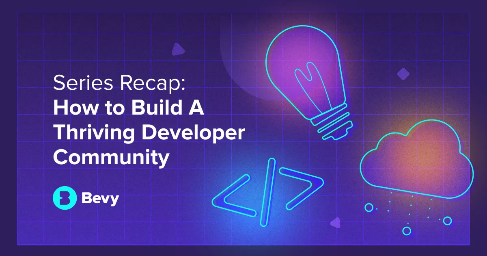

**Title**

How To Build A Thriving Developer Community

**Recording**

 

<iframe src="https://player.vimeo.com/video/564373209?h=d114aa26a7" width="640" height="360" frameborder="0" allow="autoplay; fullscreen; picture-in-picture" allowfullscreen></iframe>

<a href="https://vimeo.com/564373209">How To Build A Thriving Developer Community - Vol I</a> from <a href="https://vimeo.com/bevyhq">Bevy</a> on <a href="https://vimeo.com">Vimeo</a>.

 

**Overview**

What makes a strong developer community? How can we create authentic experiences? How can we unlock the insights of the developer community? How are leading DevRel professionals measuring the success of their programs? As the world shifts into hybrid and in-person experiences, what does the future of developer community events look like? Join us for an expert panel where we'll discuss these topics and share wins and challenges. Following the panel discussion, we'll jump into breakout rooms to connect with other DevRel leaders across the world.

[Link to the webinar](https://events.bevy.com/events/details/bevy-events-devrel-open-source-presents-how-to-build-a-thriving-developer-community/).

**Location**

Virtual

**About the Engagement**

Developer Relations professionals act as a liaison between their company and technical communities. They communicate feedback, advocate for the community’s needs, and make their experience with their product as smooth as possible.

As people seek new opportunities to meet and collaborate with like-minded developers locally and globally, community-led developer events are becoming more important than ever. The impact of today’s leading DevRel programs are driven by the grassroots, passionate community organizers.

What makes a strong developer community? How can we create authentic experiences? How can we unlock the insights of the developer community? How are leading DevRel professionals measuring the success of their programs? As the world shifts into hybrid and in-person experiences, what does the future of developer community events look like?

Watch this expert panel where we discussed these topics and more!

Featuring:

Jennifer Sable Lopez: Senior Director, Community & Advocacy at OutSystems

Tessa Mero: Senior Developer Advocate/MDE Program Lead at Cloudinary

Dmitry Vinnik: Developer Advocate at Facebook, Open Source Developer, ex-Tech Lead at Salesforce
