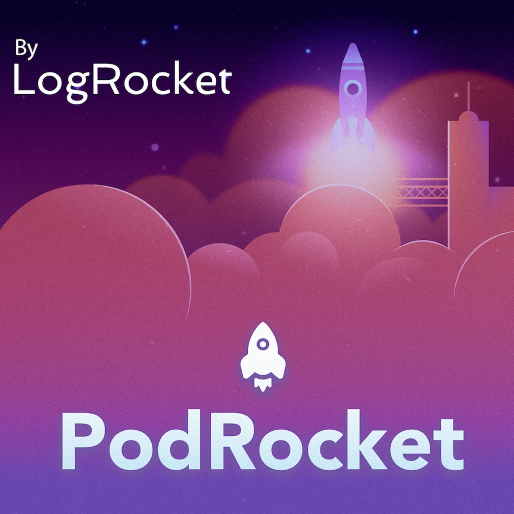

**Title**

Open Source Developer Advocacy at Facebook with Dmitry Vinnik

**Recording**

 

<iframe src="https://player.fireside.fm/v2/XHXVzqW5+ItXfveto?theme=dark" width="740" height="200" frameborder="0" scrolling="no"></iframe>

 

**Overview**

Facebook Open Source now has over 600 publicly available projects in its portfolio including some well-known projects like React, React Native, PyTorch, Docusaurus, GraphQL, Jest, and more.

Listen to this episode of PodRocket to hear Dmitry Vinnick, a Developer Advocate at Facebook Open Source, talk about what it means to be open source at Facebook, how to manage such a large portfolio, and what it has been like to engage with a community remotely.

[Link to the podcast](https://podrocket.logrocket.com/facebook).

**Location**

Virtual

**About the Engagement**

Are you a frontend developer? We made a podcast for you. Every week, PodRocket gets you up to speed on everything happening in frontend web development through in-depth interviews with experienced engineers. We discuss the best, worst, and newest aspects of all your favorite libraries and frameworks. We also give you a fresh look at the most pressing tech industry issues through the eyes of your peers.