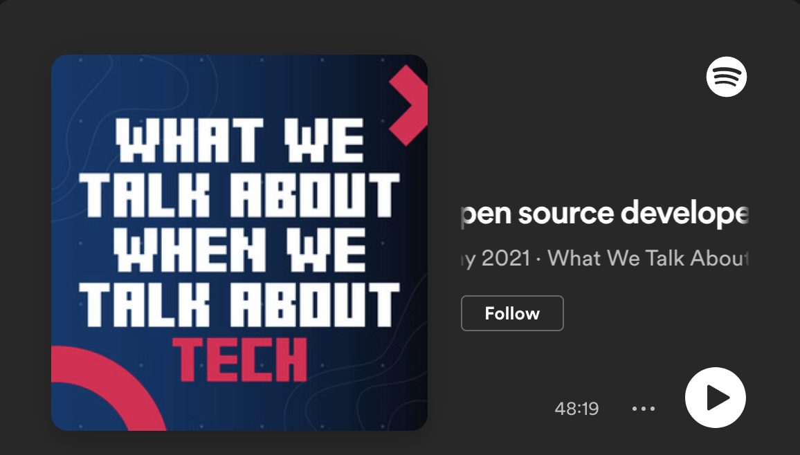

**Title**

Open Source Developer Advocacy at Facebook with Dmitry Vinnik

**Recording**

 

<iframe style="border-radius:12px" src="https://open.spotify.com/embed/episode/6CkzG0tDo8uJ0L7LGSHLTW?utm_source=generator&theme=0" width="100%" height="352" frameBorder="0" allowfullscreen="" allow="autoplay; clipboard-write; encrypted-media; fullscreen; picture-in-picture" loading="lazy"></iframe>

 

**Overview**

*Open source developer advocacy at Facebook: Dmitry Vinnik on supporting and growing Facebook's 700 open source projects*

Rich Gall (@richggall) and Jennifer Riggins (@jkriggins) talk to Dmitry Vinnik, an Open Source Developer Advocate at Facebook, about how he helps to enable developers around the world make use of the social media company's hundreds of open source projects. 

In the episode Dmitry discusses how Covid has impacted his work as a developer advocate, including what he misses about in-person events and what he prefers about remote conferences, and explains how he puts together content that's relevant to the needs of different audiences. He touches on his brilliant 'Explain Like I'm 5' series, in which members of the open source developer advocate team explain complex technologies in a simple and accessible way.

He also talks about how the team manages to provide support across hundreds of open source projects, and discusses the importance of building narratives to enable clarity and set priorities. 

Dmitry also explains why developer advocates need to be platform agnostic and meet communities where they exist (rather than forcing them into new platforms and tools), and tells us about the role that open source plays more generally in Facebook's work.

[Link to the podcast](https://www.talkabouttechpodcast.com/1712587/8506173).

**Location**

Virtual

**About the Engagement**

What We Talk About When We Talk About Tech is a podcast about tech storytelling. Jennifer Riggins and Rich Gall explore the way words and narratives shape the technology landscape with the people who define, explain, and sell it.
