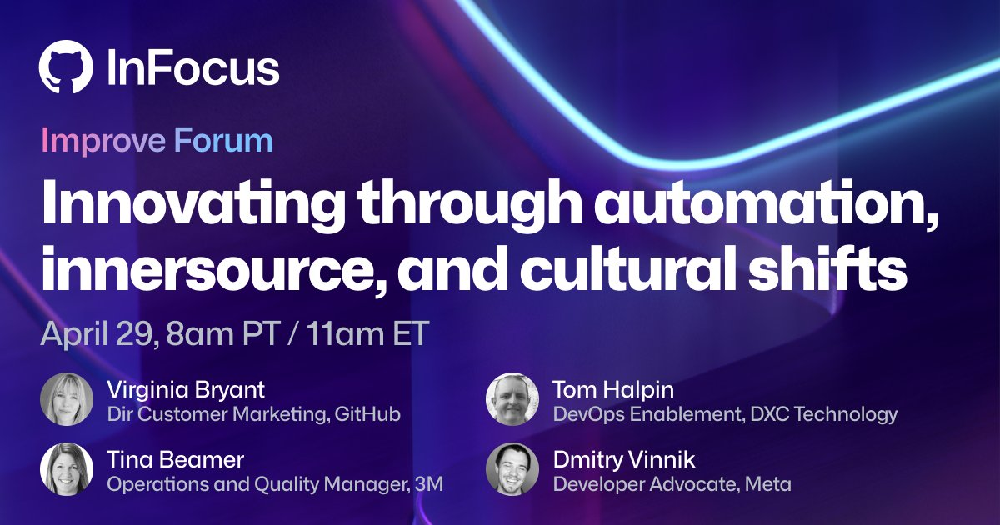

**Title**

Innovating Through Automation, Innersource and Cultural Shifts

**Recording**

 

<iframe width="560" height="315" src="https://www.youtube.com/embed/Y8c7U4quV8g" title="YouTube video player" frameborder="0" allow="accelerometer; autoplay; clipboard-write; encrypted-media; gyroscope; picture-in-picture" allowfullscreen></iframe>

 

**Overview**

Improving organizational efficiency is not an easy feat. While automation and innersource are important, it also requires strong collaboration, goals, and clarity—in essence, a cultural shift.

Join Virginia Bryant, Director of Customer Marketing at GitHub, as she hears from Meta’s Developer Advocate, Dmitry Vinnik, DXC Technology’s Distinguished Engineer, DevOps Enablement, Tom Halpin, and 3M’s Operations and Quality Manager, Tina Beamer. We’re excited to discuss how they’re leveraging innersource to encourage strong collaboration and deliver high-quality code.

[Link to the post](https://infocus.github.com/sessions/innovating-through-automation-innersource-and-cultural-shifts-with-meta-dxc-technology-and-3m/).

**Location**

Virtual

**About the Engagement**

*Build fast, build effectively, build securely*

Grow your business alongside industry experts during GitHub InFocus. Enjoy curated sessions on the most top-of-mind business questions for enterprises, along with a special broadcast featuring GitHub CEO, Thomas Dohmke. Join us as we focus on accelerating, securing, and operationally improving the way your software development teams work—for good.

Read more [here]().