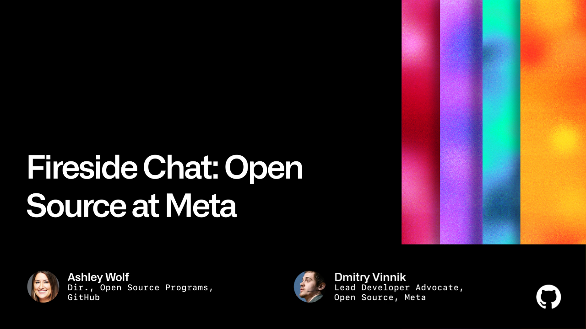

**Title**

Fireside Chat: Open Source at Meta

**Recording**

 

 

**Overview**

Meta is built on open source technology, and strives to empower communities through open source. In a conversation with GitHub, Meta’s Lead Developer Advocate, Dmitry, will share their learnings on open source at Meta.

[Link to the post](https://githubuniverse.com/events/detail/virtual-schedule/956326c3-2f7b-44b7-a).

**Location**

San Francisco, CA, USA

**About the Engagement**

Fifteen years ago, the first line of code was committed to build GitHub. Since then, our purpose has been to equip developers with everything they need to be their best. This mission has remained the same through every iteration of the GitHub platform. But as software continues to advance in all aspects of our work and life, running, maintaining, and building software for a global population creates immense complexity for developers.

Read more [here]().