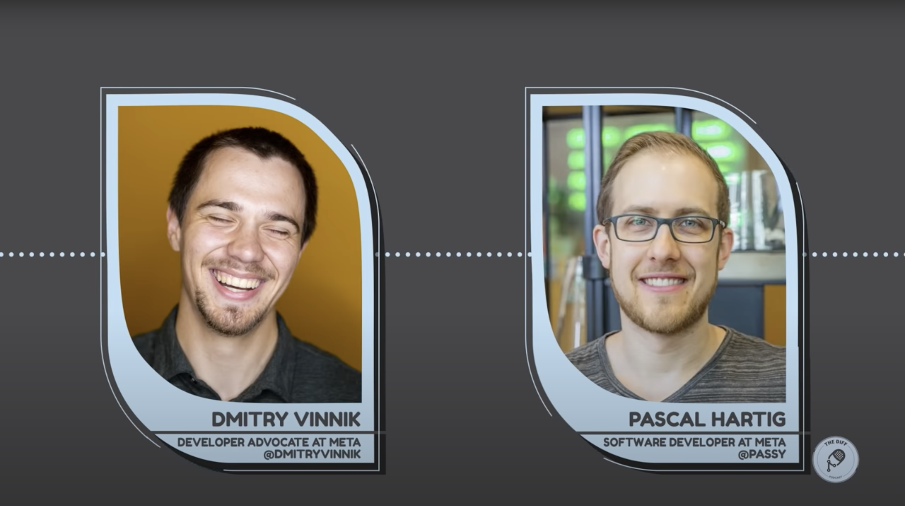

**Title**

The Diff: Talking Mobile Open Source with Pascal Hartig

**Recording**

 

<iframe src="https://anchor.fm/thediff/embed/episodes/Episode-11-Talking-Mobile-Open-Source-with-Pascal-Hartig-e1ed34j/a-a7de9jt" height="102px" width="400px" frameborder="0" scrolling="no"></iframe>

*Full Audio Version*

 

 

<iframe width="560" height="315" src="https://www.youtube.com/embed/S5ajSULISrA" title="YouTube video player" frameborder="0" allow="accelerometer; autoplay; clipboard-write; encrypted-media; gyroscope; picture-in-picture" allowfullscreen></iframe>

*10-mins Cut*

 
 

<iframe width="560" height="315" src="https://www.youtube.com/embed/TJo3I8SpTAk" title="YouTube video player" frameborder="0" allow="accelerometer; autoplay; clipboard-write; encrypted-media; gyroscope; picture-in-picture" allowfullscreen></iframe>

*Clip - The Diff: Litho and the Power of Open Source*
 
 

<iframe width="560" height="315" src="https://www.youtube.com/embed/-Frt2s3qH9k" title="YouTube video player" frameborder="0" allow="accelerometer; autoplay; clipboard-write; encrypted-media; gyroscope; picture-in-picture" allowfullscreen></iframe>

*Clip - The Diff: Navigating a Work-Life Balance*
 

**Overview**

Dmitry Vinnik, a Developer Advocate at Meta Open Source, chats with Meta Software Engineer Pascal Hartig, about mobile open source projects like Litho and Flipper, and the importance of building an open source community.

[Link to the podcast](https://thediffpodcast.com/docs/episode-11/).

**Location**

Virtual

**About the Engagement**

The Diff is a podcast from Meta Open Source where Dmitry Vinnik appears as a host and as a guest.