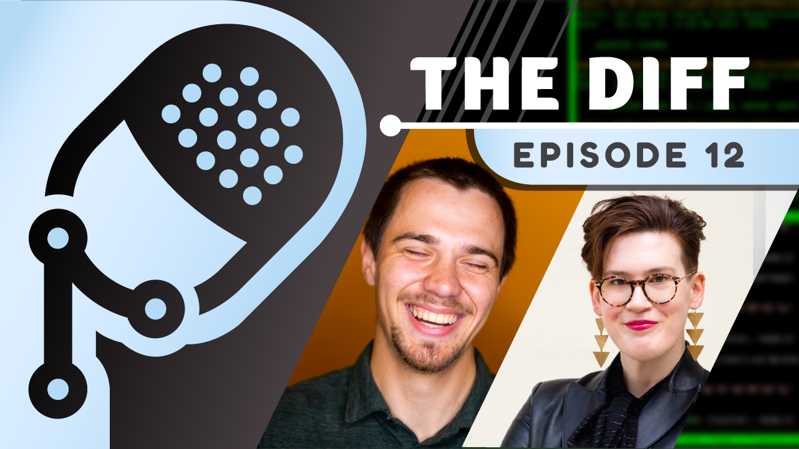

**Title**

The Diff: Talking about All Things React with Rachel Nabors

**Recording**

 

<iframe src="https://anchor.fm/thediff/embed/episodes/Episode-12-Talking-about-All-Things-React-with-Rachel-Nabors-e1h5dq1/a-a7oi6ug" height="102px" width="400px" frameborder="0" scrolling="no"></iframe>

*Full Audio Version*

 

 

<iframe width="560" height="315" src="https://www.youtube.com/embed/0eC1zfxELOQ" title="YouTube video player" frameborder="0" allow="accelerometer; autoplay; clipboard-write; encrypted-media; gyroscope; picture-in-picture" allowfullscreen></iframe>

*10-mins Cut*

 
 

<iframe width="560" height="315" src="https://www.youtube.com/embed/uxdbcWJYIFw" title="YouTube video player" frameborder="0" allow="accelerometer; autoplay; clipboard-write; encrypted-media; gyroscope; picture-in-picture" allowfullscreen></iframe>

*Clip - The Diff: How Impactful the Open Source Community Is*
 
 

<iframe width="560" height="315" src="https://www.youtube.com/embed/gKbiddWhgsU" title="YouTube video player" frameborder="0" allow="accelerometer; autoplay; clipboard-write; encrypted-media; gyroscope; picture-in-picture" allowfullscreen></iframe>

*Clip - The Diff: Finding Your Passion + Getting Real about Open Source*
 
 

<iframe width="560" height="315" src="https://www.youtube.com/embed/0bM-BVi-gIg" title="YouTube video player" frameborder="0" allow="accelerometer; autoplay; clipboard-write; encrypted-media; gyroscope; picture-in-picture" allowfullscreen></iframe>

*Clip - The Diff: The Power of the Open Source Community*
 

**Overview**

Dmitry Vinnik, a Developer Advocate at Meta Open Source, chats with Meta Documentation Engineer Rachel Nabors about their journey to front-end development, their work on React and React Native documentation and how virtual conferences have opened the door for the open source community.

[Link to the podcast](https://thediffpodcast.com/docs/episode-12/).

**Location**

Virtual

**About the Engagement**

The Diff is a podcast from Meta Open Source where Dmitry Vinnik appears as a host and as a guest.