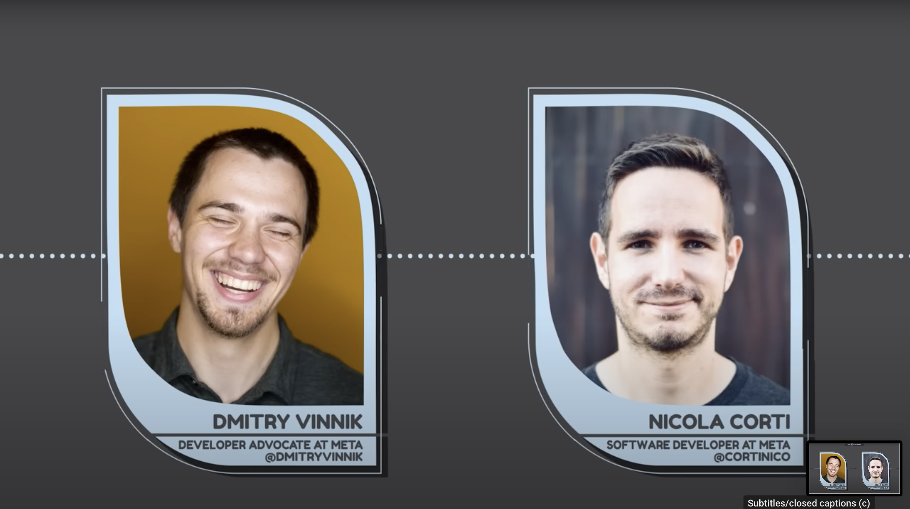

**Title**

The Diff: From Linux to React Native with Nicola Corti

**Recording**

 

<iframe src="https://anchor.fm/thediff/embed/episodes/Episode-13-From-Linux-to-React-Native-with-Nicola-Corti-e1k4ng7/a-a84nbva" height="102px" width="400px" frameborder="0" scrolling="no"></iframe>

*Full Audio Version*

 

 

<iframe width="560" height="315" src="https://www.youtube.com/embed/EG_FTirrK-c" title="YouTube video player" frameborder="0" allow="accelerometer; autoplay; clipboard-write; encrypted-media; gyroscope; picture-in-picture" allowfullscreen></iframe>

*10-mins Cut*

 
 

<iframe width="560" height="315" src="https://www.youtube.com/embed/zSSSsPsDzOY" title="YouTube video player" frameborder="0" allow="accelerometer; autoplay; clipboard-write; encrypted-media; gyroscope; picture-in-picture" allowfullscreen></iframe>

*Clip - The Diff: Valuing Community Work within Open Source*
 
 

<iframe width="560" height="315" src="https://www.youtube.com/embed/yZs88wRo9T0" title="YouTube video player" frameborder="0" allow="accelerometer; autoplay; clipboard-write; encrypted-media; gyroscope; picture-in-picture" allowfullscreen></iframe>

*Clip - The Diff: Why React Native Is Important for Mobile Applications*
 
 

<iframe width="560" height="315" src="https://www.youtube.com/embed/nVIHFbsDblw" title="YouTube video player" frameborder="0" allow="accelerometer; autoplay; clipboard-write; encrypted-media; gyroscope; picture-in-picture" allowfullscreen></iframe>

*Clip - The Diff: Nicola’s Journey in Mobile Development*
 

**Overview**

Dmitry Vinnik, a Developer Advocate at Meta Open Source, chats Meta Software Developer Nicola Corti about his journey to mobile development, his work with React Native and how podcasting helped Nicola stay connected with the community.

[Link to the podcast](https://thediffpodcast.com/docs/episode-13/).

**Location**

Virtual

**About the Engagement**

The Diff is a podcast from Meta Open Source where Dmitry Vinnik appears as a host and as a guest.