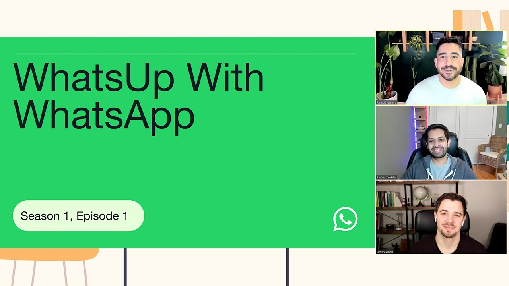

**Title**

Introducing WhatsUp with WhatsApp, our new developer show!

**Recording**

 

<iframe width="560" height="315" src="https://www.youtube.com/embed/iwSRDKi3nQQ" title="YouTube video player" frameborder="0" allow="accelerometer; autoplay; clipboard-write; encrypted-media; gyroscope; picture-in-picture" allowfullscreen></iframe>

 

**Overview**

WhatsUp with WhatsApp: Episode 001

The first episode of WhatsUp with WhatsApp lays out all the tools you need to get started with the WhatsApp Business Platform. Here’s what you can expect:

- Learn where to find the latest developer resources.
- See details on our new course launch.
- Ask about the latest product news and roadmaps.

**Location**

Virtual