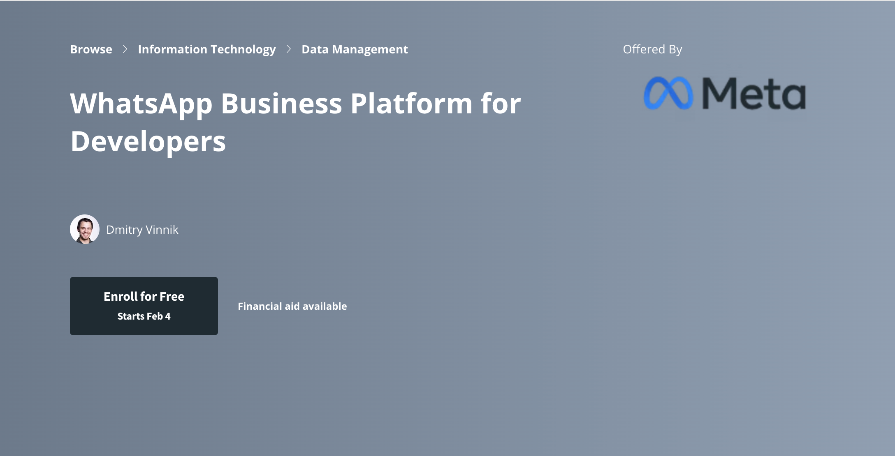

**Platform**

[Coursera](https://www.coursera.org/learn/whatsapp-business-platform-for-developers)

**Course Description**

Are you interested in learning how the WhatsApp Business Platform can help businesses achieve better audience engagement and customer support? Designed for developers and engineers responsible for the implementation of APIs, this course will teach you to set up and configure the WhatsApp Business Platform and the WhatsApp Business Management API.