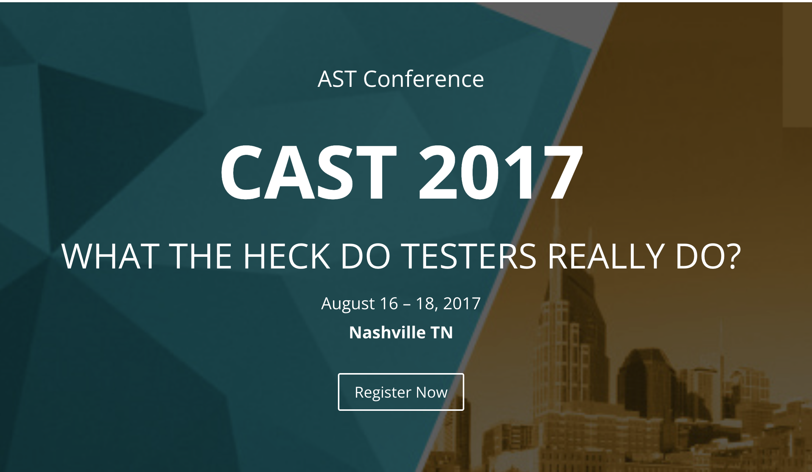

**Presence**

[Building Tests to Build Websites](https://dvinnik.dev/presentations/2017/building-tests-to-build-websites/)

**Location**

Nashville, TN, USA

**Event Information**

AST 2017 is taking a deep look at the practice of software testing. We want to help testers become so good they cannot be ignored. CAST 2017 focuses on the actual tactical work required to perform excellent, effective and influential testing.

Today, testers are challenged to identify important product risks in turbulent contexts. Business focus follows a fickle consumer market, harshly driven by demanding investors. Organizational frameworks are evolving and changing, often within a product’s lifetime. Solution technology frantically advances moving from tiered architectures to micro services among a hyper distributed internet of things.

Emerging practices sometimes shuffle testing activities earlier, or later in the life cycle. Some development approaches may even obscure testing. CAST 2017 will focus on the tactical work testers do in a variety of contexts with different tools and techniques.

[Original Talk Link](https://associationforsoftwaretesting.org/conference/cast-2017/)