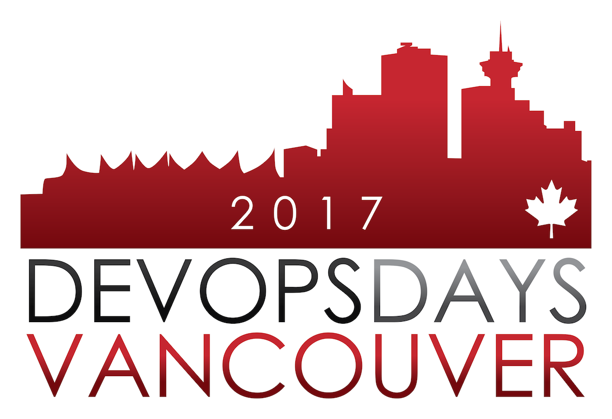

**Presence**

[Companies Which Need DevOps But Don’t Know About It]()

**Location**

Vancouver, BC, Canada

**Event Information**

DevOpsDays is a worldwide series of technical conferences covering topics of software development, IT infrastructure operations, and the intersection between them. Each event is run by volunteers from the local area.

[Original Talk Link](https://devopsdays.org/events/2017-vancouver/program)

**Recording**

 

<iframe width="560" height="315" src="https://www.youtube.com/embed/0rqwn4oXRMw" title="YouTube video player" frameborder="0" allow="accelerometer; autoplay; clipboard-write; encrypted-media; gyroscope; picture-in-picture" allowfullscreen></iframe>

 