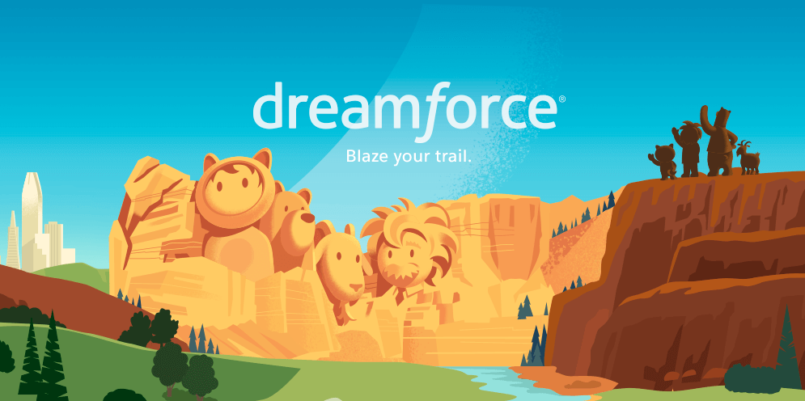

**Presence**

[Tips and Tricks for Developing Components for Communities]()

**Location**

San Francisco, CA, USA

**Event Information**

Dreamforce is an annual event that brings together the global Salesforce community for learning, fun, community building, and philanthropy. Trailblazers from all over the world gather to share their insights, successes, and learn the latest in industry innovations. 

Started in 2003, Dreamforce has grown into far more than just a conference — it’s a can’t-miss, immersive experience. From inspiring keynotes and sessions, to visionary thinking and the future of technology, to learning how business can be the greatest platform for change, attendees will be empowered to grow their organization and careers. 

**Recording**

 

<iframe width="560" height="315" src="https://www.youtube.com/embed/rjz-vKGb7DA" title="YouTube video player" frameborder="0" allow="accelerometer; autoplay; clipboard-write; encrypted-media; gyroscope; picture-in-picture" allowfullscreen></iframe>

 