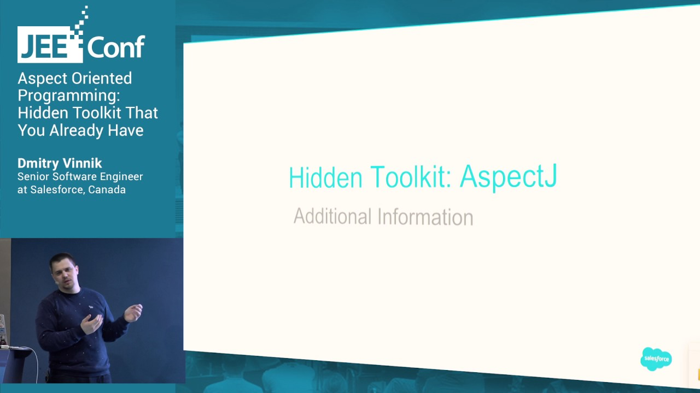

**Presence**

[Aspect Oriented Programming: Hidden Toolkit That You Already Have](https://dvinnik.dev/presentations/2017/aspect-oriented-programming)

**Location**

Kyiv, Ukraine

**Event Information**

*Java — one language, endless possibilities*

We minimize the number of “dry” theoretical talks, and emphasis will be placed on practical experience and development of real projects. We plan to gather different speakers from different countries at the conference. We invite developers, architects, testers, managers and team leaders to participate in the conference. If your work is related to Java, you should join JEEConf!

[Original Talk Link](https://jeeconf.com/program/aspect-oriented-programming-hidden-toolkit-that-you-already-have/)

**Recording**

 

<iframe width="560" height="315" src="https://www.youtube.com/embed/XmuwLYdYDAk" title="YouTube video player" frameborder="0" allow="accelerometer; autoplay; clipboard-write; encrypted-media; gyroscope; picture-in-picture" allowfullscreen></iframe>

 