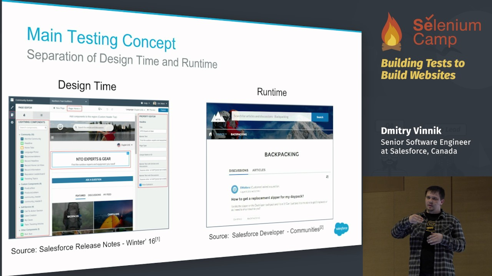

**Presence**

[Building tests to build websites]() 
[Selenium/WebDriver Q&A panel](ttps://seleniumcamp.com/talk/seleniumwebdriver-qa-panel/))

**Location**

Kyiv, Ukraine

**Event Information**

Selenium Camp has been founded in 2011 as the first international conference completely devoted to Selenium/WebDriver. Now it is leading test automation conference in Eastern Europe with 2 days full of conference talks and master-classes running in 3+ parallel tracks. In addition to web testing with Selenium/WebDriver wide spectrum of additional topics is covered every year: visual testing, test automation metrics and dashboards, reliable test infrastructure, scaling solutions and practices, testing of legacy systems, desktop and mobile applications, microservices, design patterns and best practices... Selenium Camp is equally interesting for beginners and professionals, because it is 2 days of pure knowledge, sharing experience and fun. Join us to move forward in your career!

[Original Talk Link](https://seleniumcamp.com/talk/building-tests-to-build-websites/)

**Recording**

 

<iframe width="560" height="315" src="https://www.youtube.com/embed/6opoooLdonI" title="YouTube video player" frameborder="0" allow="accelerometer; autoplay; clipboard-write; encrypted-media; gyroscope; picture-in-picture" allowfullscreen></iframe>

 