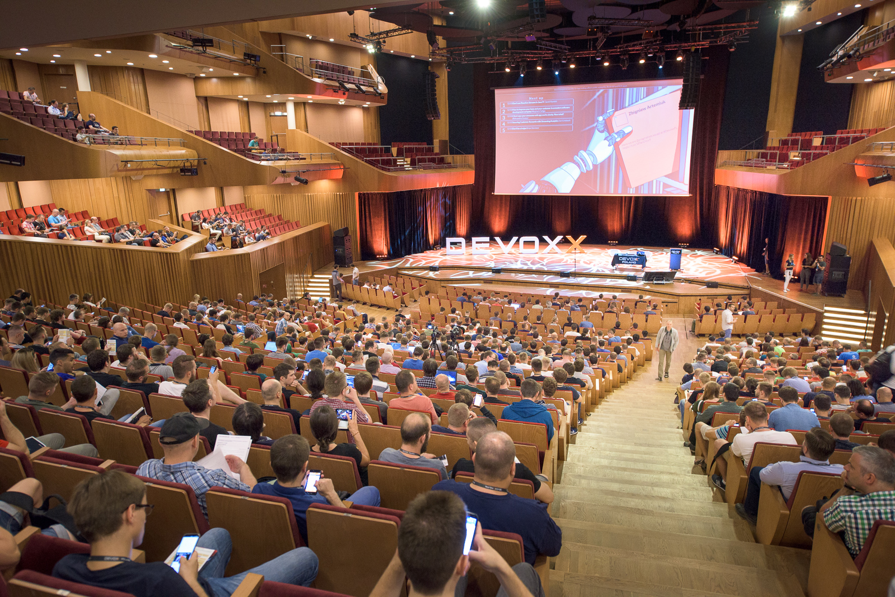

**Presence**

[Back to the CompletableFuture: Concurrency in Action](https://dvinnik.dev/presentations/2018/back-to-the-completable-future) 

**Location**

Kraków, Poland

**Event Information**

Devoxx is the biggest Java conference in Poland and is a great way to learn about new things that are being developed in the Java world.
 
**Recording**

 

<iframe width="560" height="315" src="https://www.youtube.com/embed/tM11P8dkcHk" title="YouTube video player" frameborder="0" allow="accelerometer; autoplay; clipboard-write; encrypted-media; gyroscope; picture-in-picture" allowfullscreen></iframe>

 
