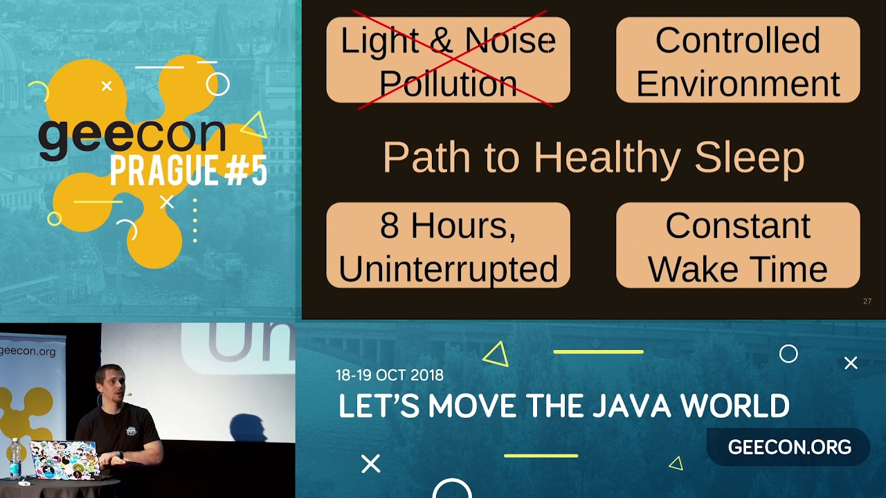

**Presence**

[Stress Driven Development, and How to Avoid It](https://dvinnik.dev/presentations/2018/stress-driven-development) 

**Location**

Prague, Czech Republic

**Event Information**

Java and JVM based technologies, dynamic languages, enterprise architectures, patterns, distributed computing, software craftsmanship, mobile and much more.
 
[Original Talk Link](https://2018.geecon.cz/speakers/#bio)

**Recording**

 

<iframe width="560" height="315" src="https://www.youtube.com/embed/nRisoHAnhnA" title="YouTube video player" frameborder="0" allow="accelerometer; autoplay; clipboard-write; encrypted-media; gyroscope; picture-in-picture" allowfullscreen></iframe>

 