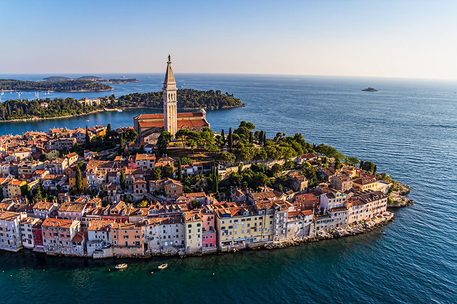

**Presence**

[Back to the CompletableFuture: Concurrency in Action](https://dvinnik.dev/presentations/2018/back-to-the-completable-future) 

**Location**

Rovinj, Croatia

**Event Information**

These were the main topic categories at JavaCro conference:

- Trends & the Future of Java
- Business Technologies & Case Studies
- Java platforms, programming Frameworks and Servers
- Methodologies and Tools
- Web & Mobile
- Java community
 
[Original Talk Link](https://2018.javacro.hr/Program/Back-to-the-CompletableFuture-Concurrency-in-Action)

