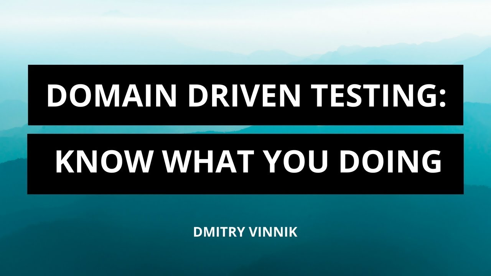

**Presence**

[Domain Driven Testing: Know What You’re Doing](https://dvinnik.dev/presentations/2018/domain-driven-testing) 

**Location**

Istanbul, Turkey

**Event Information**

Java Day Istanbul is one of the most effective international community driven software conference of Turkey supported by Istanbul Java User Group. The conference helps developers to learn the newest technologies about Java, Web, Mobile, Big DATA, Cloud, DevOps, Agile and Future. Java Day Istanbul also helps developers, tech companies, and startups to establish a good network among them.

**Recording**

 

<iframe width="560" height="315" src="https://www.youtube.com/embed/UIycEOBxMpA" title="YouTube video player" frameborder="0" allow="accelerometer; autoplay; clipboard-write; encrypted-media; gyroscope; picture-in-picture" allowfullscreen></iframe>

 
