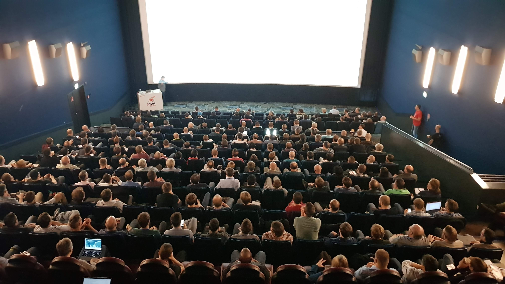

**Presence**

[Back to the CompletableFuture: Concurrency in Action]() 

**Location**

Duesseldorf, Germany

**Event Information**

JCon is the in-person Java community conference in Germany organized by the Java User Group Oberpfalz in cooperation with JAVAPRO Magazine. Java is our profession and JCON is our passion and a lot of fun. We love to provide Java developers with a spectacular 100% live conference open to the entire Java-User-Group communities.

