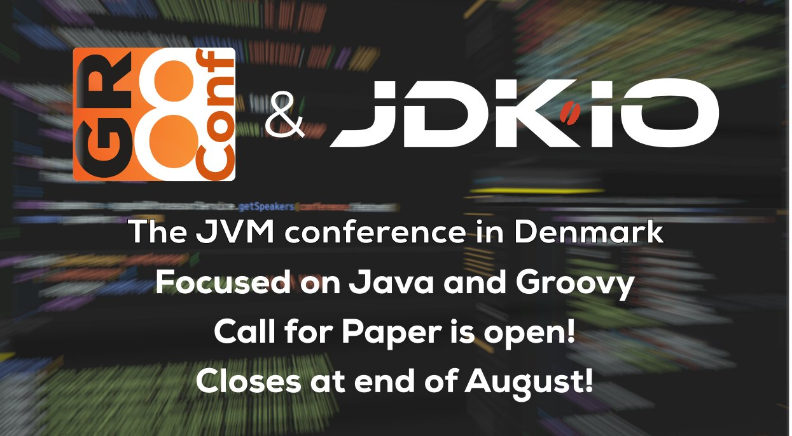

**Presence**

[Back to the CompletableFuture: Concurrency in Action]() 

**Location**

Copenhagen, Denmark

**Event Information**

In a galaxy far far away… in 2009, Søren invited Guillaume to speak about the Groovy programming language at a conference in Denmark. Discussing together, they started brainstorming about a short event to cover the various aspects of the language, the project and its ecosystem. This idea sparkle quickly overflowed into a more solid plant to create a dedicated conference fully dedicated to this ecosystem, as it was clear that there was way too much to cover than during a simple day workshop. This is how this idea of talking about “great” technologies, based off the Apache Groovy programming language turned into a full-blown conference named GR8Conf.

For the past 11 years (not taking into account two years of corona lockdown), GR8Conf has provided a high-quality conference experience for the tight-knit Apache Groovy programming language community. This year, we are joining forces with JDK.io - an annual conference run by the Danish Java user group covering technologies relevant to the entire JVM. The combined conference will be known as GR8Conf & JDK.io and will focus on All Things Groovy and Java, with DevOps, Microservices and Frontend Technologies sprinkled in.

**Recording**

 

<iframe width="560" height="315" src="https://www.youtube.com/embed/XK0QL6qSkFM" title="YouTube video player" frameborder="0" allow="accelerometer; autoplay; clipboard-write; encrypted-media; gyroscope; picture-in-picture" allowfullscreen></iframe>

 