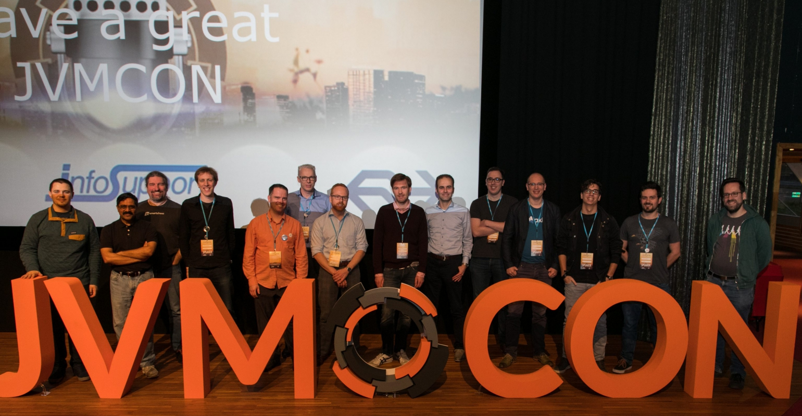

**Presence**

[Back to the CompletableFuture: Concurrency in Action](https://dvinnik.dev/presentations/2018/back-to-the-completable-future) 

**Location**

Ede, Netherlands

**Event Information**

*The JVM (Java, Scala and all other JVM languages) conference where you create the program!*

JVMCON will take place January 30th 2018 in Cinemec, Ede, The Netherlands. We hope to see a wide range of subjects, from language features to flying drones, project reports or anything else that involves a JVM. 
