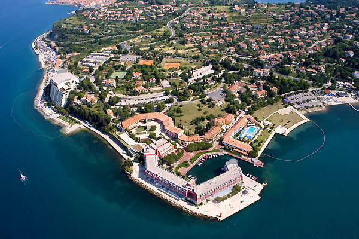

**Presence**

[Back to the CompletableFuture: Concurrency in Action](https://dvinnik.dev/presentations/2018/back-to-the-completable-future) 

**Location**

Portorož, Slovenia

**Event Information**

The conference sessions will be held in Portorož on 15th and 16th of October in four tracks. The tracks are:  
- Database
- Java
- Methodologies
- Database Development
- Big Data & AI,
- Cloud, Containers, Platform and Infrastructure
- Business Analytics