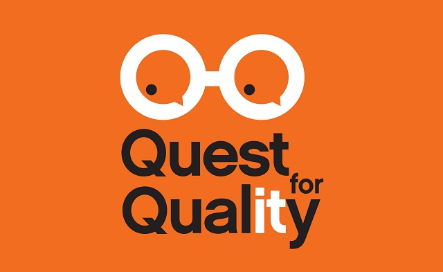

**Presence**

[Domain Driven Testing: Know What You Are Doing](https://dvinnik.dev/presentations/2018/domain-driven-testing) 

**Location**

Dublin, Ireland

**Event Information**

This is a cutting-edge software testing conference that will focus on the challenges that Quality
Assurance in the IT industry faces within the digital transformation. The Conference will be hosted by
Comtrade Digital Services in association with our conference partner Advantage PCO. Further details
on the event are available at the following website: http://questforquality.eu/