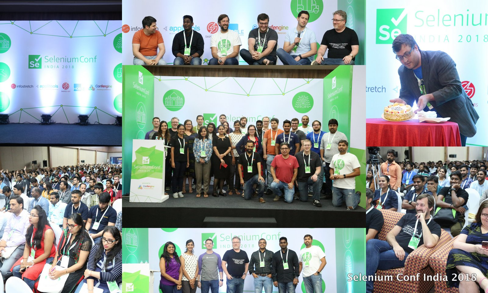

**Presence**

[Uphill Battle Of Mobile Visual Regression](https://dvinnik.dev/presentations/2018/uphill-battle-of-mobile-testing) 

**Location**

Bangalore, India

**Event Information**

The Selenium Conference is a non-profit, volunteer-run event presented by members of the Selenium Community. The goal of the conference is to bring together Selenium developers & enthusiasts from around the world to share ideas, socialize, and work together on advancing the present and future success of the project.

This year the conference will be held in Bangalore, India beginning with all-day paid workshops on Thursday, June 28th, followed by two-days of presentations by Selenium Experts and Practitioners from around the world. The conference will include keynotes and parallel tracks on both Friday and Saturday. There will also be pair-coding sessions throughout the day, as well as opportunities to get Selenium advice and tutorials from experts.

[Original Talk Link](https://confengine.com/user/dmitry-vinnik)

**Recording**

 

<iframe width="560" height="315" src="https://www.youtube.com/embed/HRkGNtt_bbM" title="YouTube video player" frameborder="0" allow="accelerometer; autoplay; clipboard-write; encrypted-media; gyroscope; picture-in-picture" allowfullscreen></iframe>

 
