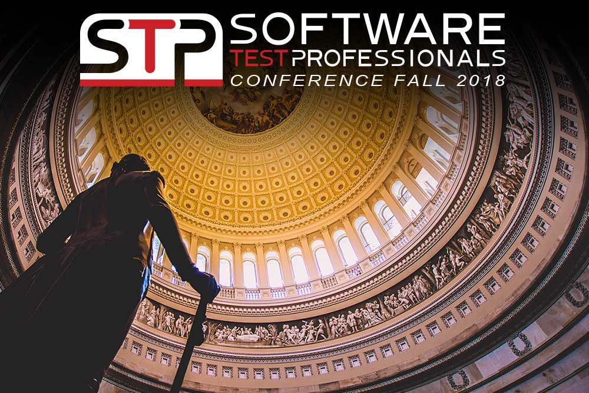

**Presence**

[Fixing Broken Windows: Dealing with Legacy Systems, Poor Quality and Gaps](https://dvinnik.dev/presentations/2018/dealing-with-legacy-systems)

**Location**

Arlignton, VA, USA

**Event Information**

The Software Test Professionals Conference is the leading event where test leadership, management, and strategy converge. The hottest topics in the industry are covered including agile testing, performance testing, test automation, AI, machine learning, mobile application testing, and test team leadership and management. Attending this conference will help you meet your professional career goals and give you the opportunity to improve your software testing techniques; find the latest tools; discover emerging trends; develop new or improve existing processes; network and gather with other high-level professionals, and gain industry insight you won’t find anywhere else.