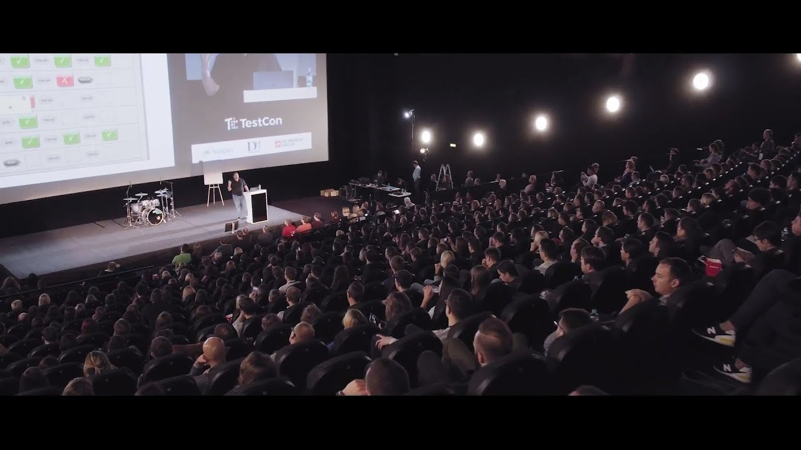

**Presence**

[Modern Web Testing: Going Beyond Selenium]() 

**Location**

Vilnius, Lithuania

**Event Information**

TestCon Vilnius is the leading conference for everyone willing to learn testing trends, best practices and make their contribution to the smoother software development cycle and quality.

The event provides an excellent platform to keep up-to-date with the latest industry trends, exchange experiences, discuss and deliberate ideas and benefit from networking opportunities.

The event features the hottest topics in industry covering: Test Management, Testing Techniques and Methodologies, Test Automation, Performance Testing, Testing the Internet of Things (IoT), Testing Metrics, Agile Testing, Test Team Leadership and Soft Skills.

[Original Talk Link](https://www.testcon.lt/2018/Dmitry-Vinnik/index.html)

**Recording**

 

<iframe width="560" height="315" src="https://www.youtube.com/embed/wy4Jdb9zo-k" title="YouTube video player" frameborder="0" allow="accelerometer; autoplay; clipboard-write; encrypted-media; gyroscope; picture-in-picture" allowfullscreen></iframe>

 
