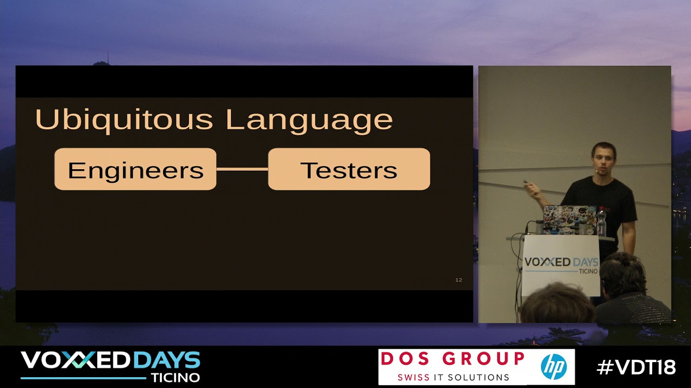

**Presence**

[Domain Driven Testing: Know What You're Doing](https://dvinnik.dev/presentations/2018/domain-driven-testing) 

**Location**

Lugano, Switzerland

**Event Information**

This year we are excited to announce a three rooms BIG return to the Palazzo dei Congressi in Lugano in hybrid version! You will have the chance to share knowledge and learn about some fascinating new ideas from some of the best local and global speakers of the development world.

**Recording**

 

<iframe width="560" height="315" src="https://www.youtube.com/embed/82bVGCLZQCo" title="YouTube video player" frameborder="0" allow="accelerometer; autoplay; clipboard-write; encrypted-media; gyroscope; picture-in-picture" allowfullscreen></iframe>

 
