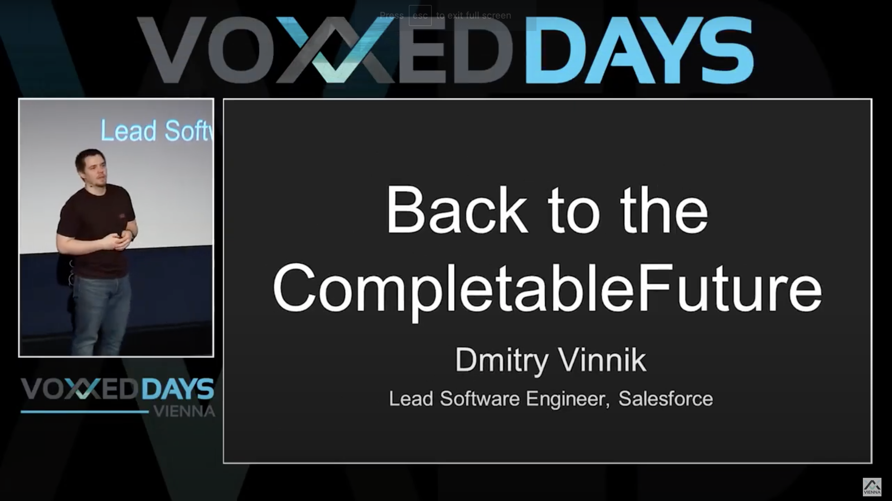

**Presence**

[Back to the CompletableFuture Concurrency in Action](https://dvinnik.dev/presentations/2018/back-to-the-completable-future) 

**Location**

Vienna, Austria

**Event Information**

Voxxed Days is a series of tech events organised by local community groups and supported by the Voxxed team. Sharing the Devoxx philosophy that content comes first, these events see both internationally renowned and local speakers converge at a wide range of locations around the world.

[Original Talk Link](https://voxxeddaysvienna2018.sched.com/)

**Recording**

 

<iframe width="560" height="315" src="https://www.youtube.com/embed/xm_ROh6X_Cg" title="YouTube video player" frameborder="0" allow="accelerometer; autoplay; clipboard-write; encrypted-media; gyroscope; picture-in-picture" allowfullscreen></iframe>

 
