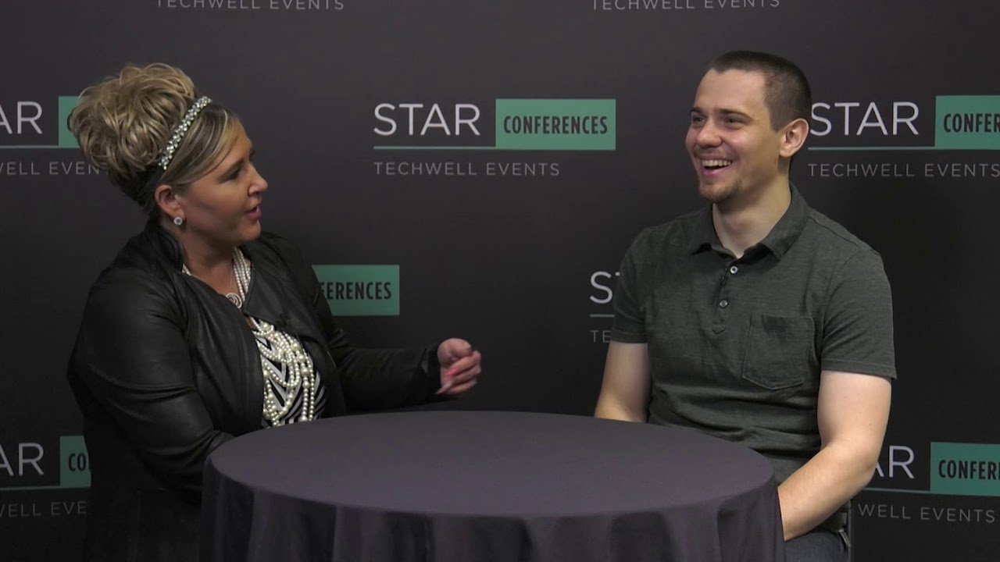

**Presence**

- [Uphill Battle of Mobile Visual Regression](https://dvinnik.dev/presentations/2018/uphill-battle-of-mobile-testing) 
- [Interview: Overcoming the Challenges Facing Remote Employees: An Interview with Dmitry Vinnik](https://dvinnik.dev/conversations/2019/overcoming-challenges-of-remote-work)

**Location**

Orlando, FL, USA

**Event Information**

TechWell delivers training, support, research, and publications to software managers, developers, test professionals, and quality engineers worldwide. Since 1986, we have been at the forefront of software quality improvement technology and were instrumental in setting the stage for the software industry to view testing as a distinct discipline. Today, TechWell produces several of the most respected conferences in the software testing and development industry including the STAR, Agile + DevOps, and EPIC Experience conference series. TechWell hosts international gatherings of software professionals and experts focused on building better software. Our events feature real-world techniques and strategies from leading software organizations, practical insight from industry experts, as well as the knowledge and support gained through peer-based networking.

[Original Talk Link](https://stareast.techwell.com/program/concurrent-sessions/visual-regression-testing-critical-part-mobile-testing-strategy-stareast-2019)