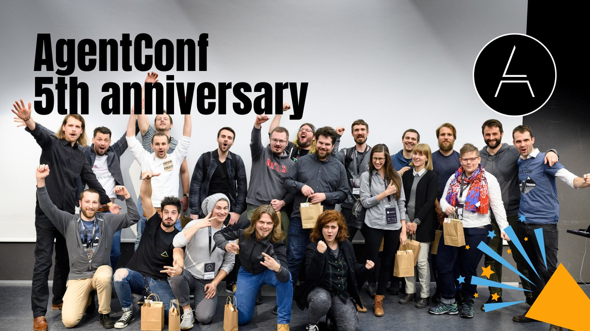

**Presence**

[Stress Driven Development, and How to Avoid It](https://dvinnik.dev/presentations/2018/stress-driven-development) 

**Location**

Dornbirn, Austria

**Event Information**

The event started with two days of quality talks followed by two days of winter activities in Lech.

In Dornbirn we had very high level talks about current and future technologies. Participants talked a lot with each other and especially with the speakers during the breaks. It was so warm that many people enjoyed the sun outside between the talks.

**Recording**

 

<iframe width="560" height="315" src="https://www.youtube.com/embed/IVHI5uSgLFc" title="YouTube video player" frameborder="0" allow="accelerometer; autoplay; clipboard-write; encrypted-media; gyroscope; picture-in-picture" allowfullscreen></iframe>

 
