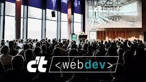

**Presence**

[Modern Web Testing: Going Beyond Selenium](https://dvinnik.dev/presentations/2018/modern-web-testing_going-beyond-selenium)

**Location**

Köln, Germany

**Event Information**

The conference offers a good opportunity for the frontend community to meet, exchange ideas and above all to get insights into software technology, best practices and technology trends with many great talks.